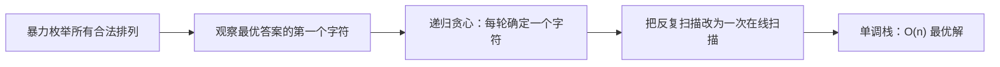
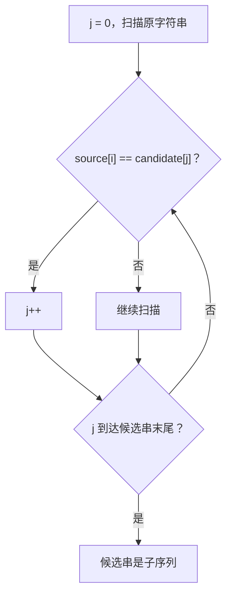
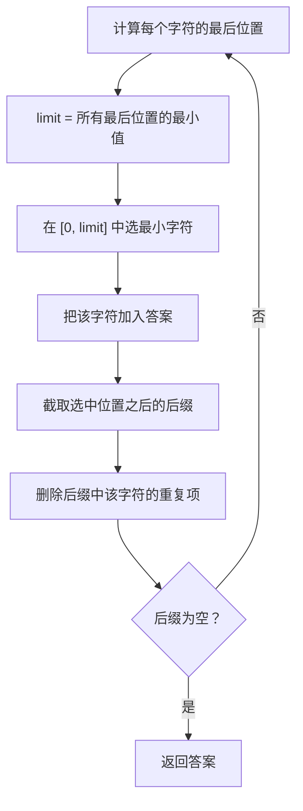
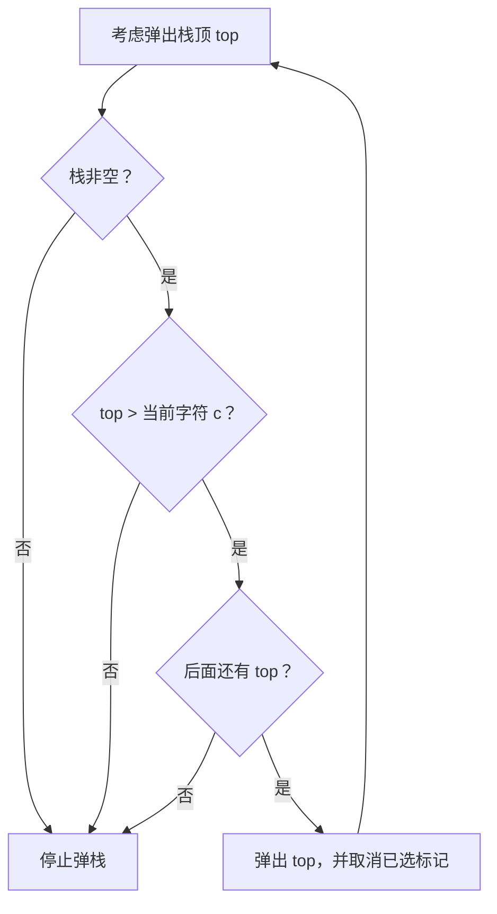
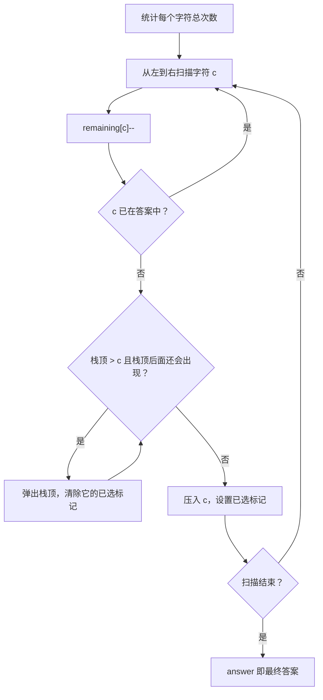

# 1081. 不同字符的最小子序列

> 难度：中等
> 推荐方法：贪心 + 单调栈
> LeetCode 接口：`string smallestSubsequence(string s)`

## 1. 题目描述

给定一个字符串 `s`，返回 `s` 的一个子序列，使它满足：

1. `s` 中出现过的每一种字符，在答案中都要出现；
2. 每一种字符在答案中恰好出现一次；
3. 在所有满足前两条的子序列中，答案的字典序最小。

题目链接：[LeetCode 1081](https://leetcode.cn/problems/smallest-subsequence-of-distinct-characters/)

### 示例 1

```text
输入：s = "bcabc"
输出："abc"
```

解释：`s` 中有 `a、b、c` 三种字符。`"abc"` 是原字符串的子序列，并且比其他合法答案的字典序更小。

### 示例 2

```text
输入：s = "cbacdcbc"
输出："acdb"
```

### 数据范围

- `1 <= s.length <= 1000`；
- `s` 只包含小写英文字母。

---

## 2. 读题时最容易混淆的三个概念

### 2.1 子序列不是子串

子序列只要求字符的相对顺序不变，不要求所选字符连续。

例如，`"abc"` 是 `"a_x_b_y_c"` 的子序列，因为可以删去 `x、y`；但它不是这个字符串的连续子串。

```text
原字符串：b c a b c
下标：    0 1 2 3 4
选择：        a b c
            2 3 4
```

### 2.2 “不同字符”决定了答案长度

假设 `s` 一共有 `k` 种不同字符，那么合法答案的长度一定是 `k`。
答案不是任选几个字符，而是每一种字符都必须保留一次。

### 2.3 字典序最小不等于直接排序

把所有不同字符排序，得到的字符串不一定是 `s` 的子序列。

例如：

```text
s = "ecbacba"
不同字符排序后是 "abce"
```

但是 `e` 只在开头出现，`"abce"` 不可能是原字符串的子序列。正确答案是 `"eacb"`。

所以本题要同时满足两个目标：

- 尽量让较小字符靠前；
- 不能破坏“以后仍能补齐所有字符”的可行性。

---

## 3. 核心矛盾：小字符应该尽量靠前，但不能把唯一机会丢掉

扫描到当前字符 `c` 时，如果答案末尾是一个更大的字符，就会产生如下选择：

```text
当前答案末尾较大： ... x
当前字符较小：       c
并且 x > c
```

直觉上希望删掉 `x`，让 `c` 提前，从而使字典序变小。
但只有在后面还能再次遇到 `x` 时，才能安全删除它。

例如在 `"cbacdcbc"` 中：

- 扫描到 `b` 时，可以删除前面的 `c`，因为后面还有 `c`；
- 扫描到后面的 `b` 时，不能删除 `d`，因为后面已经没有 `d`。

这就是本题最重要的贪心约束：

> 只有当一个较大字符以后还能重新选择时，才允许把它从答案末尾弹出。

---

## 4. 三种方法总览

| 方法               | 核心思想                                   |        时间复杂度 |       空间复杂度 | 用途                   |
| ------------------ | ------------------------------------------ | ----------------: | ---------------: | ---------------------- |
| 方法一：全排列暴力 | 按字典序枚举所有不同字符的排列             | `O(k! \cdot n)` |         `O(k)` | 理解题意、充当对拍基准 |
| 方法二：递归贪心   | 在“必须选首字符”的安全前缀中选择最小字符 |  `O(k \cdot n)` | `O(k \cdot n)` | 理解贪心选择的来源     |
| 方法三：单调栈     | 扫描时不断撤销可替换的较大字符             |          `O(n)` |        `O(26)` | 推荐提交               |

其中 `n` 是字符串长度，`k` 是不同字符的数量，且 `k <= 26`。

三种方法的关系可以概括为：



---

## 5. 方法一：按字典序枚举全排列

### 5.1 思路

先取出 `s` 中所有不同字符，按升序排列。然后使用 `next_permutation` 按字典序枚举这些字符的所有排列。

对每一个排列，检查它是不是 `s` 的子序列。第一个可行排列就是字典序最小答案。

以 `s = "bcabc"` 为例，不同字符是 `abc`：

```text
排列顺序    是否为 "bcabc" 的子序列
abc         是  ← 第一个合法排列，立即返回
acb         无需继续
bac         无需继续
...
```

### 5.2 如何判断一个字符串是否为子序列

使用一个指针 `j` 指向候选串中尚未匹配的字符，然后从左到右扫描原字符串：



### 5.3 C++ 代码

```cpp
#include <bits/stdc++.h>
using namespace std;

class SolutionBruteForce {
private:
    bool isSubsequence(const string& candidate, const string& source) {
        int j = 0;

        for (char c : source) {
            if (j < static_cast<int>(candidate.size()) &&
                candidate[j] == c) {
                ++j;
            }
        }

        return j == static_cast<int>(candidate.size());
    }

public:
    string smallestSubsequence(string s) {
        array<bool, 26> exists{};

        for (char c : s) {
            exists[c - 'a'] = true;
        }

        // 初始排列按升序排列，next_permutation 会按字典序枚举。
        string candidate;
        for (int i = 0; i < 26; ++i) {
            if (exists[i]) {
                candidate.push_back(static_cast<char>('a' + i));
            }
        }

        do {
            if (isSubsequence(candidate, s)) {
                return candidate;
            }
        } while (next_permutation(candidate.begin(), candidate.end()));

        return "";  // 按题意一定可以找到，此行不会执行。
    }
};
```

### 5.4 正确性说明

1. 每个候选排列都恰好包含全部不同字符一次；
2. `isSubsequence` 保证返回的候选串确实是 `s` 的子序列；
3. `next_permutation` 按字典序从小到大枚举；
4. 因此，第一个合法排列一定是所有合法答案中字典序最小的一个。

### 5.5 复杂度

如果有 `k` 种不同字符：

- 最多有 `k!` 个排列；
- 每次检查子序列需要 `O(n)`；
- 总时间复杂度为 `O(k! \cdot n)`；
- 额外空间复杂度为 `O(k)`。

当 `k = 26` 时，`26!` 极其巨大，因此该方法不能通过正式数据。它的主要价值是：

- 帮助理解“合法答案”的定义；
- 在小字符集上作为可信的暴力答案，与优化算法做随机或穷举对拍。

---

## 6. 方法二：递归贪心

### 6.1 关键问题：答案的第一个字符最晚要在哪里选

假设当前字符串中每个字符的最后出现位置如下：

```text
s = c b a c d c b c
    0 1 2 3 4 5 6 7

last[a] = 2
last[b] = 6
last[c] = 7
last[d] = 4
```

这些最后位置中的最小值是 `2`，对应字符 `a`。

这意味着，答案的第一个字符必须从区间 `[0, 2]` 中选择。
如果跳过整个区间再开始选择，就永远错过唯一的 `a`，无法补齐所有字符。

因此定义：

```text
limit = 当前所有不同字符的最后出现位置的最小值
```

然后在 `s[0 ... limit]` 中选择字典序最小的字符，作为答案的第一个字符。

### 6.2 为什么选择后仍然可行

设选择位置为 `pos`，显然 `pos <= limit`。

对任何还没有选择的字符 `x`：

```text
last[x] >= limit >= pos
```

如果 `x` 不是当前选中的字符，那么它在 `pos` 后面仍然至少出现一次。因此选择当前字符后，剩余字符仍可从后缀中补齐。

选中字符只允许出现一次，所以递归前要删除后缀中它的全部重复项。

### 6.3 递归过程图



### 6.4 示例：`"cbacdcbc"`

第一轮：

```text
字符串：c b a c d c b c
下标：  0 1 2 3 4 5 6 7
limit：2
候选：  c b a
最小：      a
```

选择 `a` 后，处理它右侧的 `"cdcbc"`。

第二轮：

```text
字符串：c d c b c
下标：  0 1 2 3 4
last[c] = 4
last[d] = 1  ← 最小
last[b] = 3

limit = 1
候选区间 = "cd"
选择其中较小的 c
```

不能直接选择更靠后的 `b`，因为一旦越过下标 1，就会错过只在下标 1 出现的 `d`。

所以完整递归选择为：

```text
"cbacdcbc"  -> 选 a
"cdcbc"     -> 选 c
"db"        -> 选 d
"b"         -> 选 b

答案："acdb"
```

### 6.5 C++ 代码

```cpp
#include <bits/stdc++.h>
using namespace std;

class SolutionRecursiveGreedy {
private:
    string solve(const string& s) {
        if (s.empty()) {
            return "";
        }

        array<int, 26> last;
        last.fill(-1);

        for (int i = 0; i < static_cast<int>(s.size()); ++i) {
            last[s[i] - 'a'] = i;
        }

        // 答案的下一个字符必须在 [0, limit] 中选出。
        int limit = static_cast<int>(s.size()) - 1;
        for (int position : last) {
            if (position != -1) {
                limit = min(limit, position);
            }
        }

        // 在安全前缀中选字典序最小的字符。
        // 使用严格小于，可以自然保留该字符最早的出现位置。
        int chosenPosition = 0;
        for (int i = 1; i <= limit; ++i) {
            if (s[i] < s[chosenPosition]) {
                chosenPosition = i;
            }
        }

        const char chosen = s[chosenPosition];

        // 只保留选中位置右侧的字符，并删除 chosen 的重复项。
        string suffix;
        for (int i = chosenPosition + 1;
             i < static_cast<int>(s.size());
             ++i) {
            if (s[i] != chosen) {
                suffix.push_back(s[i]);
            }
        }

        return string(1, chosen) + solve(suffix);
    }

public:
    string smallestSubsequence(string s) {
        return solve(s);
    }
};
```

### 6.6 正确性证明

对递归层数进行归纳。

**贪心选择性质：**

设当前所有字符最后出现位置的最小值为 `limit`。任何合法答案的下一个字符都必须从 `[0, limit]` 中选择，否则对应的“最早耗尽字符”将永远无法被选中。

算法在这个安全前缀中选择最小字符 `c`。如果某个最优答案选择了更大的首字符，那么将其首字符替换为 `c`：

- 字典序会严格变小；
- 因为 `c` 的选择位置不晚于 `limit`，其他尚需字符在它后面仍有出现机会；
- 所以替换后仍可完成合法答案。

这与原答案最优矛盾，因此某个最优答案一定以 `c` 开头。

**最优子结构：**

确定 `c` 后，只能继续使用其位置右侧的字符。删除后缀中 `c` 的重复项，剩余问题与原问题完全同型。若递归结果不是剩余问题的最优解，就可以替换成更优后缀，从而使完整答案更优，产生矛盾。

因此，递归贪心返回全局最优答案。

### 6.7 复杂度

递归深度最多为不同字符数量 `k <= 26`。每一层扫描当前字符串，并构造下一层后缀：

- 时间复杂度：`O(k \cdot n)`；
- 由于字符串复制和递归保存，最坏额外空间：`O(k \cdot n)`；
- 因为字母表固定为 26 个小写字母，也可以把它们视为 `O(n)` 时间和 `O(n)` 空间。

这种方法可以通过本题，但下一种单调栈写法更直接、常数更小。

---

## 7. 方法三：贪心 + 单调栈（推荐）

### 7.1 维护哪些信息

使用三个状态：

1. `remaining[x]`：当前位置之后还剩多少个字符 `x`；
2. `inAnswer[x]`：字符 `x` 当前是否已经在答案中；
3. `answer`：用字符串模拟栈，`answer.back()` 是栈顶。

扫描每个字符 `c` 时：

1. 先执行 `--remaining[c]`；
2. 如果 `c` 已经在答案中，跳过；
3. 尝试弹出答案末尾那些“更大且以后还能找到”的字符；
4. 把 `c` 压入答案。

### 7.2 弹栈的三个条件

只有三个条件同时成立，才允许弹出栈顶：

```cpp
while (!answer.empty() &&
       answer.back() > c &&
       remaining[answer.back() - 'a'] > 0) {
    // 弹出
}
```



三个条件分别保证：

- 栈非空：有字符可以比较；
- `top > c`：弹出后让更小字符提前，字典序才会改善；
- `remaining[top] > 0`：后面还可以重新选择 `top`，不会永久丢失它。

### 7.3 为什么要先减少 `remaining[c]`

`remaining` 的含义必须始终是“当前扫描位置之后”的剩余次数。

因此处理当前字符时，正确顺序是：

```cpp
--remaining[c - 'a'];  // 先把当前位置排除
// 再判断某个栈顶字符在后面是否存在
```

如果先弹栈、后减少次数，那么当当前字符恰好也是某字符的最后一次出现时，数组会错误地认为“后面还有一次”。

### 7.4 示例 `"bcabc"` 的动态图解

```text
扫描 b：答案为空，压入 b             answer = "b"
扫描 c：b < c，不弹，压入 c          answer = "bc"
扫描 a：c > a，且后面还有 c，弹出 c   answer = "b"
        b > a，且后面还有 b，弹出 b   answer = ""
        压入 a                         answer = "a"
扫描 b：压入 b                         answer = "ab"
扫描 c：压入 c                         answer = "abc"
```

最关键的一步是：

```text
原答案候选："bc..."
遇到 a 后：  "a..."

因为 b、c 都还能在后面补回来，所以可以把更小的 a 提到最前面。
```

### 7.5 完整示例 `"cbacdcbc"`

初始计数：

```text
a: 1 次，b: 2 次，c: 4 次，d: 1 次
```

| 扫描位置 | 当前字符 | 减一后的剩余次数 | 操作                                         | answer   |
| -------: | :------: | ---------------- | -------------------------------------------- | -------- |
|        0 |  `c`  | `c: 3`         | 栈空，压入`c`                              | `c`    |
|        1 |  `b`  | `b: 1`         | `c > b` 且后面有 `c`，弹 `c`；压 `b` | `b`    |
|        2 |  `a`  | `a: 0`         | `b > a` 且后面有 `b`，弹 `b`；压 `a` | `a`    |
|        3 |  `c`  | `c: 2`         | `a < c`，压 `c`                          | `ac`   |
|        4 |  `d`  | `d: 0`         | `c < d`，压 `d`                          | `acd`  |
|        5 |  `c`  | `c: 1`         | `c` 已在答案中，跳过                       | `acd`  |
|        6 |  `b`  | `b: 0`         | `d > b`，但后面无 `d`，不能弹；压 `b`  | `acdb` |
|        7 |  `c`  | `c: 0`         | `c` 已在答案中，跳过                       | `acdb` |

注意位置 6：

```text
当前 answer = "acd"
当前字符 b 比 d 小

但 d 的剩余次数为 0：
如果弹出 d，就再也无法补回 d，答案会变得不合法。
```

所以这里必须保留 `d`，最终答案是 `"acdb"`，而不是看似更小但缺少字符的结果。

### 7.6 完整流程



### 7.7 正确性证明

可以从“合法性”和“最优性”两部分证明。

#### 合法性

**每个字符至多出现一次：**

字符入栈后，`inAnswer` 被设置为 `true`。后面再次遇到同一字符时会直接跳过。只有它被弹出后，标记才恢复为 `false`，允许未来重新入栈。因此最终答案中不会有重复字符。

**每个不同字符至少出现一次：**

算法只在 `remaining[top] > 0` 时弹出 `top`，即弹出的字符后面一定还会再次出现。若它之后尚未入栈，扫描到它最后一次出现时，因为此后剩余次数为 0，其他字符不可能再把它安全弹出。故每个字符最终都会保留一次。

#### 字典序最优性

当栈顶 `top > c` 且后面还有 `top` 时，用当前较小字符 `c` 替代前面的 `top`：

- 第一个发生变化的位置从 `top` 变成 `c`，字典序严格变小；
- `top` 以后还能重新选，不影响最终字符集合；
- 因而保留 `top` 在前面不可能优于弹出它。

`while` 循环不断执行这种安全的局部改进，直到：

- 栈顶不大于 `c`，继续弹出不会改善字典序；或
- 栈顶以后不再出现，继续弹出会使答案不合法。

所以每一步都在不破坏可行性的前提下，获得当前能够做到的最小前缀。由贪心交换论证，最终答案就是全局字典序最小的合法子序列。

### 7.8 复杂度分析

每个输入位置的字符至多入栈一次、出栈一次：

- 时间复杂度：`O(n)`；
- `remaining` 和 `inAnswer` 都只有 26 个位置，额外空间复杂度：`O(26) = O(1)`；
- 若把返回答案本身也计算在内，答案长度最多为 26。

---

## 8. 推荐提交代码

`solution.cpp` 中保存的就是下面这份代码：

```cpp
#include <bits/stdc++.h>
using namespace std;

class Solution {
public:
    string smallestSubsequence(string s) {
        // remaining[x]：当前扫描位置之后，还剩多少个字符 x。
        array<int, 26> remaining{};
        for (char c : s) {
            ++remaining[c - 'a'];
        }

        // inAnswer[x]：字符 x 当前是否已经在答案中。
        array<bool, 26> inAnswer{};
        string answer;

        for (char c : s) {
            const int current = c - 'a';
            --remaining[current];

            // 已经选过的字符不能再次加入，否则会破坏“恰好一次”。
            if (inAnswer[current]) {
                continue;
            }

            // 若栈顶比 c 大，并且后面还能重新找到栈顶字符，
            // 就先弹出栈顶，让较小的 c 尽量靠前。
            while (!answer.empty() &&
                   answer.back() > c &&
                   remaining[answer.back() - 'a'] > 0) {
                inAnswer[answer.back() - 'a'] = false;
                answer.pop_back();
            }

            answer.push_back(c);
            inAnswer[current] = true;
        }

        return answer;
    }
};
```

---

## 9. 常见错误与反例

### 错误 1：直接把所有不同字符排序

```text
s = "ecbacba"
排序得到 "abce"，但它不是 s 的子序列。
```

修正：选择小字符时，必须同时维护原字符串的相对顺序和后续可行性。

### 错误 2：只要栈顶更大就弹出

错误条件：

```cpp
while (!answer.empty() && answer.back() > c) {
    answer.pop_back();
}
```

反例 `"cbacdcbc"`：扫描到 `b` 时，如果弹出已经没有后继的 `d`，最终答案将缺少 `d`。

修正：必须增加 `remaining[answer.back() - 'a'] > 0`。

### 错误 3：忘记去重

如果没有 `inAnswer`，相同字符可能多次压入答案，违反“每个不同字符恰好一次”。

### 错误 4：弹栈后没有清除标记

错误写法：

```cpp
answer.pop_back();
// 忘记把对应字符的 inAnswer 设为 false
```

这样以后再次遇到被弹出的字符时，算法会误以为它仍在答案中并跳过它。

正确顺序：

```cpp
inAnswer[answer.back() - 'a'] = false;
answer.pop_back();
```

### 错误 5：在弹栈判断后才减少当前字符计数

`remaining` 应表示“当前位置之后”的次数，所以必须先减一再判断。
变量语义一旦不统一，就很容易在最后一次出现的位置产生边界错误。

### 错误 6：把 `>` 写成 `>=`

本题相同字符由 `inAnswer` 统一处理。弹栈的目的只是在当前字符严格更小时改善字典序，因此比较条件应是 `answer.back() > c`。

---

## 10. 测试与验证

### 10.1 定向样例

| 输入           | 期望输出     | 覆盖点                         |
| -------------- | ------------ | ------------------------------ |
| `"bcabc"`    | `"abc"`    | 连续弹出两个较大字符           |
| `"cbacdcbc"` | `"acdb"`   | 既要弹栈，也要保护最后一次出现 |
| `"a"`        | `"a"`      | 最短输入                       |
| `"aaaaa"`    | `"a"`      | 全部字符相同                   |
| `"ecbacba"`  | `"eacb"`   | 最小字符排序结果不可行         |
| `"leetcode"` | `"letcod"` | 多个重复字符混合               |
| `"bbcaac"`   | `"bac"`    | 不能越过已经耗尽的`b`        |
| `"abacb"`    | `"abc"`    | 已选字符应跳过                 |

### 10.2 穷举对拍

为了避免只凭几个样例判断正确性，可以把方法一当作暴力标准答案：

```text
字符集：{a, b, c, d}
长度：  1 到 9
总数：  4^1 + 4^2 + ... + 4^9
      = 349,524
```

对每个字符串分别运行：

- 全排列暴力；
- 递归贪心；
- 单调栈。

三种算法的结果全部一致。

### 10.3 边界测试

还验证了：

1. 26 个字母各出现一次；
2. 长度 1000，全部为 `a`；
3. 长度 1000，包含大量重复 `z` 和完整字母表。

这些测试覆盖了题目允许的最大长度。

---

## 11. 从这道题可以学到什么

### 11.1 单调栈不只用于“下一个更大元素”

很多人最初只在柱状图、每日温度等问题中使用单调栈。本题展示了另一种用途：

> 用栈保存当前最优前缀，并在发现更优选择时撤销之前的决定。

这里的栈不一定全局严格递增，因为某些较大字符如果已经没有后继，就不能弹出。更准确地说，它是“带可行性约束的单调栈”。

### 11.2 贪心需要证明“局部改进不会破坏未来”

只看到 `top > c` 还不够。真正使贪心成立的是：

```text
top > c                    → 弹出能改善字典序
remaining[top] > 0         → 弹出后仍能补回 top
```

这是很通用的解题模式：

> 当前选择更优 + 未来仍然可行 = 可以安全贪心。

### 11.3 学会使用交换论证

本题的证明方法是典型交换论证：

1. 假设某个最优答案保留了较大的前置字符；
2. 用当前更小字符替换它；
3. 因为被替换字符以后还能出现，替换不破坏合法性；
4. 新答案字典序更小，与原答案最优矛盾。

这种证明方式常见于区间调度、排序贪心、最小字典序构造等问题。

### 11.4 “剩余信息”能让在线决策变得安全

扫描到当前位置时，只看过去无法判断一个字符能否删除。
提前统计频次或最后出现位置，相当于给算法提供了有限的未来信息。

常见的两种写法是：

- 剩余次数：`remaining[x] > 0`；
- 最后位置：`last[x] > currentIndex`。

两者本质相同。

### 11.5 状态变量必须有精确定义

`remaining` 到底包含不包含当前字符，会直接影响判断结果。
先明确“它表示当前位置之后的次数”，代码顺序自然就是先减一、再使用。

这是编写可靠算法代码的重要习惯：

- 给状态一个没有歧义的定义；
- 让每一行更新都维护该定义；
- 在循环开始或结束处保持不变量。

### 11.6 用暴力算法给优化算法做对拍

暴力法虽然不能通过大数据，却很适合验证优化算法：

1. 限制到很小的字符集和长度；
2. 穷举所有输入；
3. 用明显正确的慢算法计算标准答案；
4. 与快算法逐个比较。

这种技能对于验证复杂贪心、动态规划和数据结构算法非常实用。

---

## 12. 一页速记

```text
目标：
  每种字符恰好一次，并使子序列字典序最小。

状态：
  remaining[x] = 当前扫描位置之后还剩多少个 x
  inAnswer[x]  = x 是否已经在答案中
  answer       = 当前答案，同时作为栈

扫描字符 c：
  1. remaining[c]--
  2. c 已在答案中 → 跳过
  3. 当 栈顶 > c 且后面还有栈顶：
       清除栈顶的已选标记
       弹出栈顶
  4. 压入 c，设置已选标记

复杂度：
  时间 O(n)
  额外空间 O(1)

最关键条件：
  answer.back() > c
  && remaining[answer.back() - 'a'] > 0
```

只记住一句话：

> 遇到更小字符时，弹出所有“比它大而且以后还能补回来”的栈顶字符。
