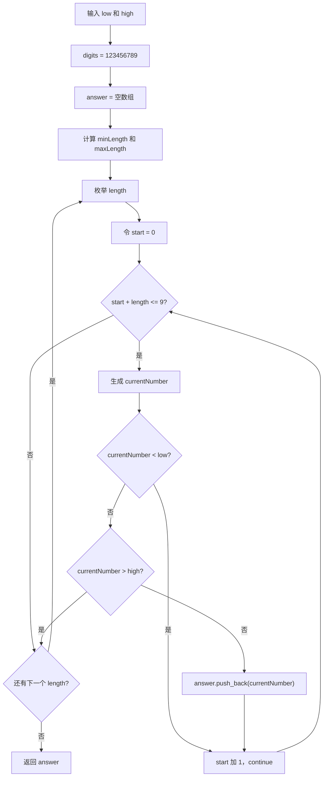
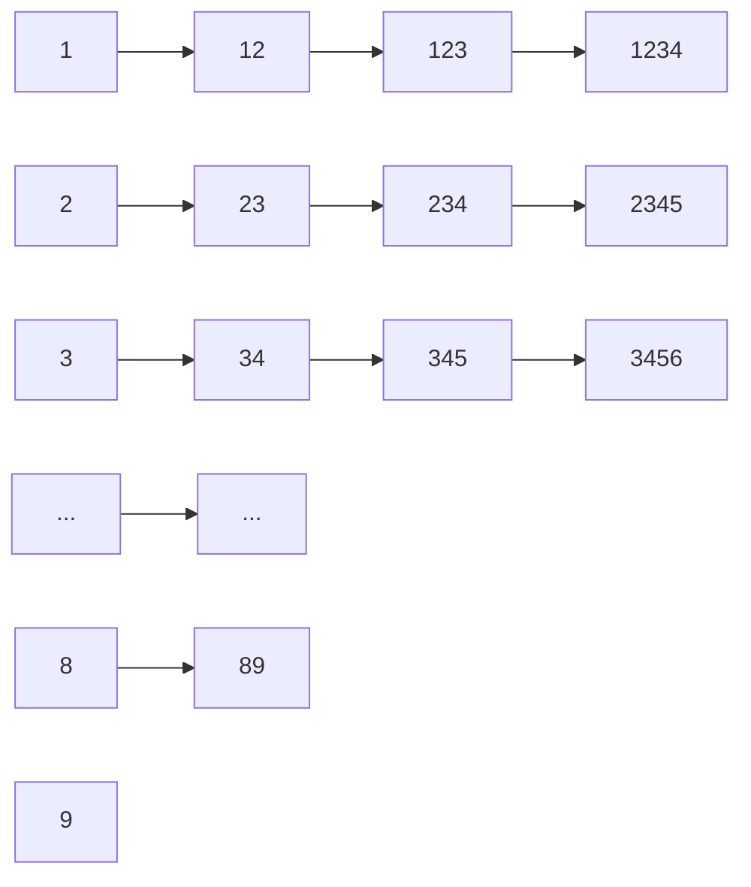

# 1291. 顺次数

题目链接：[LeetCode 1291. 顺次数](https://leetcode.cn/problems/sequential-digits/)

## 一、题目在说什么

给定两个整数 `low` 和 `high`，找出闭区间 `[low, high]` 中的所有“顺次数”，并按从小到大的顺序返回。

如果一个整数的每一位数字，都比它前一位数字恰好大 `1`，那么它就是顺次数。

例如：

```text
123   是顺次数，因为 2 = 1 + 1，3 = 2 + 1
4567  是顺次数，因为 5 = 4 + 1，6 = 5 + 1，7 = 6 + 1
12    是顺次数
89    是顺次数

124   不是顺次数，因为 4 != 2 + 1
122   不是顺次数，因为最后一个 2 没有比前一个 2 大 1
135   不是顺次数，因为相邻数字每次增加了 2
90    不是顺次数，因为 0 不等于 9 + 1
```

题目要求的区间是闭区间，所以：

```text
low <= 顺次数 <= high
```

当顺次数刚好等于 `low` 或 `high` 时，也要放进答案。

---

## 二、最重要的观察

十进制的一位数字只有：

```text
0, 1, 2, 3, 4, 5, 6, 7, 8, 9
```

顺次数要求后一位比前一位大 `1`，因此多位顺次数只能由下面这条连续数字链产生：

```text
1 -> 2 -> 3 -> 4 -> 5 -> 6 -> 7 -> 8 -> 9
```

把它写成字符串，就是代码中的：

```cpp
const string digits = "123456789";
```

所有顺次数，都是 `digits` 的某个连续子串：

```text
digits = 1 2 3 4 5 6 7 8 9

长度为 2：12、23、34、45、56、67、78、89
长度为 3：123、234、345、456、567、678、789
长度为 4：1234、2345、3456、4567、5678、6789
长度为 5：12345、23456、34567、45678、56789
长度为 6：123456、234567、345678、456789
长度为 7：1234567、2345678、3456789
长度为 8：12345678、23456789
长度为 9：123456789
```

因此，这道题不需要在 `[low, high]` 之间逐个检查每一个整数。我们只需要生成数量非常少的候选顺次数，再判断它们是否落在区间中。

---

## 三、为什么没有包含数字 0 的顺次数

可能会产生一个疑问：为什么 `digits` 是 `"123456789"`，而不是 `"0123456789"`？

原因有两个：

1. 整数不能用前导零表示。比如字符串 `"012"` 转成整数后只是 `12`。
2. 如果某一位是 `9`，下一位必须是 `10`，但 `10` 不是一个十进制数位，所以顺次数不能从 `9` 继续到 `0`。

因此，合法的多位顺次数只可能来自 `123456789` 的连续片段。

---

## 四、三种可行思路对比

| 方法           | 核心做法                                          | 优点                     | 需要注意的地方           |
| -------------- | ------------------------------------------------- | ------------------------ | ------------------------ |
| 固定数字串枚举 | 从`"123456789"` 中截取连续子串                  | 最直观，代码短，容易证明 | 要处理区间边界和截取范围 |
| BFS 逐位生成   | 从`1` 到 `9` 出发，每次在末尾追加“末位 + 1” | 能练习队列和状态生成     | 对本题来说代码稍多       |
| 预处理所有答案 | 预先写出全部顺次数，再筛选区间                    | 查询时非常简单           | 手写常量容易漏数或写错   |

本文主代码采用第一种“固定数字串枚举法”。它和题目的结构最贴合，也最适合观察代码变量的变化过程。

---

## 五、主算法：固定数字串 + 滑动窗口

### 5.1 算法步骤

1. 用 `digits = "123456789"` 保存完整的递增数字链。
2. 计算 `low` 的位数，保存为 `minLength`。
3. 计算 `high` 的位数，保存为 `maxLength`。
4. 用外层循环枚举顺次数的位数 `length`。
5. 用内层循环枚举截取起点 `start`。
6. 截取 `digits.substr(start, length)`，转为整数 `currentNumber`。
7. 如果 `currentNumber < low`，执行 `continue`，继续寻找更大的候选数。
8. 如果 `currentNumber > high`，执行 `break`，结束当前位数的枚举。
9. 否则把 `currentNumber` 加入 `answer`。
10. 返回 `answer`。

### 5.2 代码变量一览

| 代码变量          | 类型            | 含义                                    | 示例值                    |
| ----------------- | --------------- | --------------------------------------- | ------------------------- |
| `low`           | `int`         | 区间左端点                              | `100`                   |
| `high`          | `int`         | 区间右端点                              | `300`                   |
| `digits`        | `string`      | 所有顺次数的数字来源                    | `"123456789"`           |
| `answer`        | `vector<int>` | 保存符合区间要求的顺次数                | `[123, 234]`            |
| `minLength`     | `int`         | `low` 的十进制位数                    | `3`                     |
| `maxLength`     | `int`         | `high` 的十进制位数，最大不超过 `9` | `3`                     |
| `length`        | `int`         | 当前枚举的顺次数位数                    | `3`                     |
| `start`         | `int`         | 当前子串在`digits` 中的起始下标       | `0`、`1`、`2`       |
| `currentNumber` | `int`         | 当前生成的候选顺次数                    | `123`、`234`、`345` |

这些变量名会在后面的每个例子中保持不变，方便把手工推演和代码逐行对应起来。

---

## 六、图解：窗口怎样生成顺次数

假设当前：

```text
length = 3
```

长度为 `3` 的窗口在 `digits` 上从左向右移动：

```text
digits 下标:   0 1 2 3 4 5 6 7 8
digits 数字:   1 2 3 4 5 6 7 8 9

start = 0:    [1 2 3] 4 5 6 7 8 9   -> currentNumber = 123
start = 1:     1[2 3 4]5 6 7 8 9     -> currentNumber = 234
start = 2:     1 2[3 4 5]6 7 8 9     -> currentNumber = 345
start = 3:     1 2 3[4 5 6]7 8 9     -> currentNumber = 456
start = 4:     1 2 3 4[5 6 7]8 9     -> currentNumber = 567
start = 5:     1 2 3 4 5[6 7 8]9     -> currentNumber = 678
start = 6:     1 2 3 4 5 6[7 8 9]    -> currentNumber = 789
```

`start = 6` 是长度为 `3` 时最后一个合法起点，因为：

```text
start + length = 6 + 3 = 9
digits.size()  = 9
```

这正好满足代码中的条件：

```cpp
start + length <= static_cast<int>(digits.size())
```

如果再让 `start = 7`，就只剩下 `8、9` 两位，无法截取长度为 `3` 的子串。

---

## 七、算法流程图



---

## 八、为什么先根据位数缩小枚举范围

代码中没有固定从 `length = 2` 开始枚举，而是计算：

```cpp
const int minLength = static_cast<int>(to_string(low).size());
const int maxLength = min(9, static_cast<int>(to_string(high).size()));
```

例如：

```text
low  = 1000   -> minLength = 4
high = 13000  -> maxLength = 5
```

所有两位数和三位数都小于 `1000`，所以没有必要枚举长度 `2` 和长度 `3`。

所有六位数都大于 `13000`，所以也没有必要枚举长度 `6` 及以上。

最终只需要枚举：

```text
length = 4
length = 5
```

这不是本题性能的关键，因为候选数本来就很少，但它能让代码中的范围与题目给出的 `[low, high]` 更紧密地对应。

---

## 九、例子 1：`low = 100, high = 300`

### 9.1 初始化变量

```text
low       = 100
high      = 300
digits    = "123456789"
answer    = []

minLength = to_string(100).size() = 3
maxLength = to_string(300).size() = 3
```

所以外层循环只执行一次：

```text
length = 3
```

### 9.2 内层循环逐步变化

| `length` | `start` | `digits.substr(start, length)` | `currentNumber` | 与区间比较            | 执行的代码                | `answer`     |
| ---------: | --------: | -------------------------------- | ----------------: | --------------------- | ------------------------- | -------------- |
|          3 |         0 | `"123"`                        |               123 | `100 <= 123 <= 300` | `answer.push_back(123)` | `[123]`      |
|          3 |         1 | `"234"`                        |               234 | `100 <= 234 <= 300` | `answer.push_back(234)` | `[123, 234]` |
|          3 |         2 | `"345"`                        |               345 | `345 > high`        | `break`                 | `[123, 234]` |

当 `currentNumber = 345` 时执行 `break`。为什么可以直接结束？

因为同一个 `length = 3` 下，后面还可能生成的数字是：

```text
456、567、678、789
```

它们都比 `345` 更大，也必然大于 `high = 300`，继续循环没有意义。

最终：

```text
answer = [123, 234]
```

---

## 十、例子 2：`low = 1000, high = 13000`

### 10.1 初始化变量

```text
low       = 1000
high      = 13000
digits    = "123456789"
answer    = []

minLength = 4
maxLength = 5
```

所以外层循环依次枚举：

```text
length = 4
length = 5
```

### 10.2 当 `length = 4`

| `length` | `start` | 子串       | `currentNumber` | 操作 | `answer`                               |
| ---------: | --------: | ---------- | ----------------: | ---- | ---------------------------------------- |
|          4 |         0 | `"1234"` |              1234 | 加入 | `[1234]`                               |
|          4 |         1 | `"2345"` |              2345 | 加入 | `[1234, 2345]`                         |
|          4 |         2 | `"3456"` |              3456 | 加入 | `[1234, 2345, 3456]`                   |
|          4 |         3 | `"4567"` |              4567 | 加入 | `[1234, 2345, 3456, 4567]`             |
|          4 |         4 | `"5678"` |              5678 | 加入 | `[1234, 2345, 3456, 4567, 5678]`       |
|          4 |         5 | `"6789"` |              6789 | 加入 | `[1234, 2345, 3456, 4567, 5678, 6789]` |

此时 `start + length` 再也不能满足 `<= 9`，内层循环自然结束。

### 10.3 当 `length = 5`

| `length` | `start` | 子串        | `currentNumber` | 与区间比较                 | 操作      | `answer`                                      |
| ---------: | --------: | ----------- | ----------------: | -------------------------- | --------- | ----------------------------------------------- |
|          5 |         0 | `"12345"` |             12345 | `1000 <= 12345 <= 13000` | 加入      | `[1234, 2345, 3456, 4567, 5678, 6789, 12345]` |
|          5 |         1 | `"23456"` |             23456 | `23456 > 13000`          | `break` | 保持不变                                        |

最终：

```text
answer = [1234, 2345, 3456, 4567, 5678, 6789, 12345]
```

这个例子说明：外层 `length` 增大后，内层 `start` 会重新从 `0` 开始。

---

## 十一、例子 3：同时观察 `continue` 和 `break`

设：

```text
low  = 58
high = 155
```

初始化：

```text
minLength = 2
maxLength = 3
answer = []
```

### 11.1 当 `length = 2`

| `start` | `currentNumber` | 判断         | 控制语句     | `answer`       |
| --------: | ----------------: | ------------ | ------------ | ---------------- |
|         0 |                12 | `12 < low` | `continue` | `[]`           |
|         1 |                23 | `23 < low` | `continue` | `[]`           |
|         2 |                34 | `34 < low` | `continue` | `[]`           |
|         3 |                45 | `45 < low` | `continue` | `[]`           |
|         4 |                56 | `56 < low` | `continue` | `[]`           |
|         5 |                67 | 在区间内     | 加入         | `[67]`         |
|         6 |                78 | 在区间内     | 加入         | `[67, 78]`     |
|         7 |                89 | 在区间内     | 加入         | `[67, 78, 89]` |

当数字小于 `low` 时不能 `break`，因为后面生成的数字会越来越大，可能进入合法区间。因此要用 `continue`。

### 11.2 当 `length = 3`

| `start` | `currentNumber` | 判断           | 控制语句  | `answer`            |
| --------: | ----------------: | -------------- | --------- | --------------------- |
|         0 |               123 | 在区间内       | 加入      | `[67, 78, 89, 123]` |
|         1 |               234 | `234 > high` | `break` | `[67, 78, 89, 123]` |

最终答案：

```text
[67, 78, 89, 123]
```

这个例子揭示了两条很重要的循环控制规律：

```text
currentNumber < low  -> 当前太小，后面可能合法 -> continue
currentNumber > high -> 当前太大，后面只会更大 -> break
```

---

## 十二、例子 4：区间中没有顺次数

设：

```text
low  = 10
high = 11
```

变量初始化：

```text
minLength = 2
maxLength = 2
length = 2
start = 0
currentNumber = 12
answer = []
```

第一次生成的最小两位顺次数就是 `12`，但是：

```text
12 > high
```

所以立即执行 `break`，最后返回：

```text
answer = []
```

算法不需要特殊判断“无答案”，因为空的 `answer` 本身就是正确结果。

---

## 十三、例子 5：端点也要被包含

设：

```text
low  = 123
high = 345
```

| `start` | `currentNumber` | 判断                            | `answer`          |
| --------: | ----------------: | ------------------------------- | ------------------- |
|         0 |               123 | `currentNumber == low`，合法  | `[123]`           |
|         1 |               234 | 位于区间中间，合法              | `[123, 234]`      |
|         2 |               345 | `currentNumber == high`，合法 | `[123, 234, 345]` |
|         3 |               456 | 大于`high`，`break`         | `[123, 234, 345]` |

代码只有在严格小于 `low` 或严格大于 `high` 时才排除数字：

```cpp
if (currentNumber < low) {
    continue;
}

if (currentNumber > high) {
    break;
}
```

所以等于左右端点的数字都会被正确保留。

---

## 十四、代码逐段解释

### 14.1 准备数字来源和答案数组

```cpp
const string digits = "123456789";
vector<int> answer;
```

- `digits` 提供全部可能的连续递增数位。
- `answer` 保存落在 `[low, high]` 中的候选数。

### 14.2 确定需要枚举的位数

```cpp
const int minLength = static_cast<int>(to_string(low).size());
const int maxLength = min(9, static_cast<int>(to_string(high).size()));
```

`to_string(low).size()` 得到 `low` 的位数。这里用 `static_cast<int>`，是为了把字符串长度类型明确转换成 `int`，便于和循环变量比较。

### 14.3 两层循环枚举窗口

```cpp
for (int length = minLength; length <= maxLength; ++length) {
    for (int start = 0;
         start + length <= static_cast<int>(digits.size());
         ++start) {
```

- 外层循环改变窗口长度。
- 内层循环移动窗口起点。
- `start + length <= digits.size()` 保证窗口不会越界。

### 14.4 生成当前候选数

```cpp
const int currentNumber = stoi(digits.substr(start, length));
```

这个表达式分为两步理解：

```text
digits.substr(start, length) -> 截取字符串
stoi(...)                    -> 把字符串转成整数
```

例如：

```text
start = 3
length = 4

digits.substr(3, 4) = "4567"
stoi("4567") = 4567
currentNumber = 4567
```

### 14.5 判断是否落在区间中

```cpp
if (currentNumber < low) {
    continue;
}

if (currentNumber > high) {
    break;
}

answer.push_back(currentNumber);
```

这里把候选数分成三个互斥情况：

| 条件                     | 含义               | 动作             |
| ------------------------ | ------------------ | ---------------- |
| `currentNumber < low`  | 太小               | 跳过当前候选数   |
| `currentNumber > high` | 太大，后面也会太大 | 结束当前内层循环 |
| 其他情况                 | 位于闭区间内       | 加入`answer`   |

---

## 十五、为什么答案天然有序

题目要求按从小到大返回。代码没有调用 `sort(answer.begin(), answer.end())`，但结果仍然有序。

原因分成两层：

### 15.1 相同位数内部有序

固定 `length` 时，`start` 从小到大变化：

```text
length = 3
start:          0    1    2    3    4    5    6
currentNumber: 123  234  345  456  567  678  789
```

所以同一位数的候选数严格递增。

### 15.2 不同位数之间有序

所有 `length` 位的正整数，都小于任何 `length + 1` 位的正整数。

例如最大的两位顺次数 `89` 仍然小于最小的三位顺次数 `123`：

```text
89 < 123
```

而外层循环让 `length` 从小到大变化，所以后加入的更长顺次数一定更大。

因此 `answer` 天然递增，无需额外排序。

---

## 十六、正确性证明

要证明算法正确，需要证明四件事。

### 16.1 生成的每个候选数一定是顺次数

`currentNumber` 来自：

```cpp
digits.substr(start, length)
```

`digits = "123456789"` 中任意相邻两个字符，后一个都比前一个大 `1`。连续子串不会改变这种相邻关系。

所以每个 `currentNumber` 都满足顺次数定义。

### 16.2 所有可能的顺次数都会被生成

任意多位顺次数的第一位只能是 `1` 到 `8` 中的某个数字。确定第一位和总位数后，后续每一位都被“比前一位大 1”唯一确定。

因此它一定是 `"123456789"` 的某个连续子串。

代码枚举了所有合法的 `length`，并对每个 `length` 枚举所有满足 `start + length <= 9` 的 `start`，所以不会漏掉任何可能的顺次数。

### 16.3 加入答案的数字一定在闭区间中

只有当下面两个排除条件都不成立时，才会执行 `push_back`：

```text
currentNumber < low   不成立
currentNumber > high  不成立
```

所以此时必然有：

```text
low <= currentNumber <= high
```

因此加入 `answer` 的数字都在要求的闭区间中。

### 16.4 返回顺序一定从小到大

同一 `length` 下，`start` 增大使候选数增大；不同 `length` 之间，位数更多的正整数一定更大。

所以 `answer` 中的数字按照严格递增顺序加入。

综合以上四点，算法会且只会返回 `[low, high]` 中的全部顺次数，并且顺序正确，因此算法正确。

---

## 十七、复杂度分析

长度为 `length` 的连续子串数量是：

```text
9 - length + 1 = 10 - length
```

题目中 `low >= 10`，所以只考虑长度 `2` 到 `9`：

```text
长度 2：8 个
长度 3：7 个
长度 4：6 个
长度 5：5 个
长度 6：4 个
长度 7：3 个
长度 8：2 个
长度 9：1 个

总数 = 8 + 7 + 6 + 5 + 4 + 3 + 2 + 1 = 36
```

也就是说，无论 `[low, high]` 看起来有多大，算法最多只需要检查 36 个多位顺次数。

### 时间复杂度

在本题十进制和整数范围固定的条件下：

```text
O(1)
```

因为候选数最多只有 36 个，每个子串长度最多为 9，都是固定上限。

如果把输出答案的写入次数单独记为 `k`，也可以写成 `O(1 + k)`；由于 `k <= 36`，最终仍然是常数复杂度。

### 空间复杂度

不计算返回结果 `answer` 时：

```text
O(1)
```

如果计算返回数组，则是：

```text
O(k)
```

其中 `k` 是答案中顺次数的数量，并且 `k <= 36`。

---

## 十八、完整代码

```cpp
#include <bits/stdc++.h>
using namespace std;

class Solution {
public:
    vector<int> sequentialDigits(int low, int high) {
        const string digits = "123456789";
        vector<int> answer;

        const int minLength = static_cast<int>(to_string(low).size());
        const int maxLength = min(9, static_cast<int>(to_string(high).size()));

        for (int length = minLength; length <= maxLength; ++length) {
            for (int start = 0;
                 start + length <= static_cast<int>(digits.size());
                 ++start) {
                const int currentNumber = stoi(digits.substr(start, length));

                if (currentNumber < low) {
                    continue;
                }

                if (currentNumber > high) {
                    break;
                }

                answer.push_back(currentNumber);
            }
        }

        return answer;
    }
};
```

详细行内注释请查看同目录下的 `solution.cpp`。

---

## 十九、扩展方法一：BFS 逐位生成

BFS 的思路不是截取字符串，而是把每个数字看作一个状态。

先把 `1` 到 `9` 放入队列：

```text
queue = [1, 2, 3, 4, 5, 6, 7, 8, 9]
```

每次取出队首数字 `currentNumber`，查看它的最后一位：

```cpp
lastDigit = currentNumber % 10;
```

如果 `lastDigit < 9`，就能在末尾追加 `lastDigit + 1`：

```cpp
nextNumber = currentNumber * 10 + lastDigit + 1;
```

例如：

```text
currentNumber = 12
lastDigit = 2
nextNumber = 12 * 10 + 2 + 1 = 123

currentNumber = 123
lastDigit = 3
nextNumber = 123 * 10 + 3 + 1 = 1234
```

BFS 状态扩展图：



BFS 参考代码：

```cpp
vector<int> sequentialDigitsBFS(int low, int high) {
    queue<int> numbers;
    vector<int> answer;

    for (int firstDigit = 1; firstDigit <= 9; ++firstDigit) {
        numbers.push(firstDigit);
    }

    while (!numbers.empty()) {
        int currentNumber = numbers.front();
        numbers.pop();

        if (currentNumber >= low && currentNumber <= high) {
            answer.push_back(currentNumber);
        }

        int lastDigit = currentNumber % 10;

        if (lastDigit < 9) {
            int nextNumber = currentNumber * 10 + lastDigit + 1;

            if (nextNumber <= high) {
                numbers.push(nextNumber);
            }
        }
    }

    sort(answer.begin(), answer.end());
    return answer;
}
```

这里最后调用 `sort`，是因为 BFS 会先处理所有一位数，再处理由它们扩展出的两位数；虽然通常能按层得到较整齐的顺序，但显式排序能让返回顺序的正确性更直观、更稳妥。

这个方法可以帮助理解：

- 如何用队列保存“等待处理的状态”。
- 如何从当前状态生成下一个状态。
- 如何通过限制 `lastDigit < 9` 防止生成非法数字。
- 如何使用 `nextNumber <= high` 剪枝。

---

## 二十、扩展方法二：预处理全部顺次数

因为多位顺次数总共只有 36 个，可以直接预先保存：

```cpp
vector<int> allNumbers = {
    12, 23, 34, 45, 56, 67, 78, 89,
    123, 234, 345, 456, 567, 678, 789,
    1234, 2345, 3456, 4567, 5678, 6789,
    12345, 23456, 34567, 45678, 56789,
    123456, 234567, 345678, 456789,
    1234567, 2345678, 3456789,
    12345678, 23456789,
    123456789
};
```

然后筛选：

```cpp
vector<int> answer;

for (int currentNumber : allNumbers) {
    if (currentNumber >= low && currentNumber <= high) {
        answer.push_back(currentNumber);
    }
}
```

这种方法查询过程最简单，但不推荐作为学习时的主解，因为：

- 手写 36 个数字容易遗漏。
- 不容易体现顺次数的生成规律。
- 如果规则稍有变化，常量表就要全部重写。

不过它能帮助理解“预处理”的思想：当答案全集很小、规则固定、查询很多次时，可以先计算一次，以后快速筛选。

---

## 二十一、常见错误

### 错误 1：遍历 `[low, high]` 中的每一个整数

这种做法可以判断每个数是否为顺次数，但区间可能非常大，会进行大量无意义检查。

更好的思考方式是：

```text
不要从整个区间中寻找少量特殊数字，
而要先生成所有特殊数字，再检查它们是否在区间中。
```

### 错误 2：把小于 `low` 的情况写成 `break`

错误代码：

```cpp
if (currentNumber < low) {
    break;
}
```

例如 `low = 58`，当前候选数 `12` 虽然太小，但后面还有 `67、78、89`。如果直接 `break`，就会漏掉答案。

这里必须使用 `continue`。

### 错误 3：窗口边界写成 `<`

错误条件：

```cpp
start + length < digits.size()
```

当 `start + length == digits.size()` 时，窗口刚好到达字符串末尾，仍然是合法的。

例如 `start = 6, length = 3` 可以得到 `789`。因此正确条件是 `<=`。

### 错误 4：忘记闭区间端点

如果写成：

```cpp
currentNumber > low && currentNumber < high
```

就会错误排除刚好等于 `low` 或 `high` 的顺次数。正确条件必须包含等号。

### 错误 5：认为顺次数可以从 9 回到 0

`90` 不是顺次数，因为 `0` 并不等于 `9 + 1`。十进制数位不能把 `10` 当成一个单独数位。

---

## 二十二、你可以从这道题学到什么

### 22.1 从“枚举所有普通数字”转向“生成特殊候选”

这是本题最重要的思维转换。

当合法答案具有很强的结构规律，而且数量远少于搜索区间时，应优先直接生成合法候选。

类似题目包括：

- 生成回文数。
- 生成只有特定数字组成的数。
- 生成满足固定递推关系的状态。
- 生成合法括号序列。

### 22.2 学会使用滑动窗口截取连续结构

这里的窗口由两个变量描述：

```text
start  -> 窗口从哪里开始
length -> 窗口有多长
```

这和很多字符串、数组问题中的滑动窗口思想相通。虽然本题窗口不是为了维护区间统计信息，但“起点 + 长度”的建模方式完全一致。

### 22.3 理解 `continue` 与 `break` 的差别

```text
continue -> 只跳过本轮，循环还会继续
break    -> 直接结束当前这一层循环
```

是否能使用 `break`，取决于后面的候选是否具有单调性。本题同一 `length` 下的 `currentNumber` 递增，所以当前值超过 `high` 后，可以安全 `break`。

### 22.4 利用生成顺序省掉排序

如果能够控制元素按递增顺序生成，就没有必要“先乱序生成，再排序”。

这能减少代码，也能帮助形成一个重要习惯：写完生成算法后，主动分析它是否已经具有顺序性质。

### 22.5 学会把题目约束变成程序边界

“数位最多到 9”对应：

```cpp
start + length <= digits.size()
```

“只枚举可能落入区间的位数”对应：

```cpp
length = minLength ... maxLength
```

把自然语言约束准确翻译成循环边界，是算法实现中非常关键的能力。

---

## 二十三、还可以继续学习什么知识

### 23.1 BFS 和状态空间搜索

把 `12 -> 123 -> 1234` 看作状态扩展链，可以练习：

- 队列。
- 按层遍历。
- 状态生成。
- 剪枝。
- 搜索空间边界。

### 23.2 预处理与多次查询

如果系统需要回答很多组不同的 `[low, high]` 查询，可以预先生成并排序全部顺次数，然后对每次查询使用二分查找：

```cpp
lower_bound(allNumbers.begin(), allNumbers.end(), low);
upper_bound(allNumbers.begin(), allNumbers.end(), high);
```

这会进一步联系到：

- 离线预处理。
- 二分查找。
- 有序数组区间查询。

### 23.3 单调性与剪枝

本题能够在 `currentNumber > high` 时执行 `break`，依赖的是候选数随 `start` 增大而增大的单调性。

以后看到有序或单调结构时，可以继续思考：

- 是否能够提前停止？
- 是否能够使用二分查找？
- 是否可以跳过一整段不可能的状态？

### 23.4 字符串与整数之间的转换

本题使用了：

```cpp
to_string(number)
stoi(text)
substr(start, length)
```

它们分别完成：

- 整数转字符串。
- 字符串转整数。
- 截取子串。

也可以尝试完全不用字符串，通过数学运算逐位构造顺次数，从而练习 `% 10`、`/ 10` 和 `* 10 + digit`。

### 23.5 输出敏感复杂度

有些算法即使寻找答案很快，也必须花时间把所有答案写入返回数组。

因此复杂度有时会写为：

```text
O(搜索成本 + 答案数量)
```

这就是输出敏感复杂度的基本思想。本题答案上限很小，所以最终仍可视为 `O(1)`。

---

## 二十四、复习问题

学完后，可以尝试独立回答下面的问题：

1. 为什么所有顺次数都是 `"123456789"` 的连续子串？
2. `start + length <= digits.size()` 中为什么必须有等号？
3. 为什么 `currentNumber < low` 时用 `continue`？
4. 为什么 `currentNumber > high` 时可以用 `break`？
5. 为什么最终结果不需要再排序？
6. 如果改用 BFS，当前状态如何生成下一个状态？
7. 如果要处理一万次区间查询，怎样结合预处理和二分查找？

如果能够不看代码清楚解释这些问题，就已经真正掌握了这道题，而不只是记住了写法。
