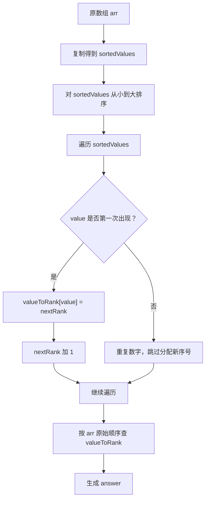

# 1331. 数组序号转换

题目链接：[LeetCode 1331](https://leetcode.cn/problems/rank-transform-of-an-array/)

## 题意重述

给你一个整数数组 `arr`，要把数组中的每个数字转换成它的“序号”。

序号规则如下：

1. 最小的数字序号是 `1`。
2. 第二小的不同数字序号是 `2`。
3. 第三小的不同数字序号是 `3`。
4. 如果两个数字相同，它们的序号也必须相同。
5. 原数组中数字的位置不能改变，只是把每个数字替换成对应序号。

例如：

```text
arr = [40, 10, 20, 30]
```

从小到大看：

```text
10 < 20 < 30 < 40
```

所以：

```text
10 的序号是 1
20 的序号是 2
30 的序号是 3
40 的序号是 4
```

按照原数组顺序替换：

```text
[40, 10, 20, 30]
  4   1   2   3
```

答案是：

```text
[4, 1, 2, 3]
```

## 核心思路

这道题的关键是：序号只和数字大小有关，和数字在原数组中的位置无关。

所以我们可以这样做：

1. 复制一份原数组，得到 `sortedValues`。
2. 对 `sortedValues` 排序。
3. 从小到大遍历 `sortedValues`，给每个第一次出现的数字分配序号。
4. 用哈希表 `valueToRank` 保存“数字 -> 序号”的对应关系。
5. 再按原数组 `arr` 的顺序，把每个数字替换成它的序号，得到 `answer`。

## 为什么要复制数组

不能直接排序 `arr`。

因为最终答案要保持原数组的位置关系。

例如：

```text
arr = [40, 10, 20, 30]
```

如果直接把 `arr` 排序成：

```text
[10, 20, 30, 40]
```

原来 `40` 在第 `0` 个位置、`10` 在第 `1` 个位置的信息就丢失了。

所以代码中使用：

```cpp
vector<int> sortedValues = arr;
```

让 `sortedValues` 负责排序和分配序号，让 `arr` 负责保持原始顺序。

## 变量说明

| 变量 | 含义 |
|---|---|
| `arr` | 原数组，保存原始顺序 |
| `sortedValues` | `arr` 的副本，用来排序 |
| `valueToRank` | 哈希表，记录每个数字对应的序号 |
| `nextRank` | 下一个新数字应该分配的序号 |
| `value` | 当前正在遍历的数字 |
| `answer` | 最终答案数组 |

## 图解流程



## 图解：排序和映射

```text
原数组 arr:
下标:    0   1   2   3
数值:   40  10  20  30

复制并排序 sortedValues:
下标:    0   1   2   3
数值:   10  20  30  40

建立映射 valueToRank:
10 -> 1
20 -> 2
30 -> 3
40 -> 4

按原数组顺序转换:
40 -> 4
10 -> 1
20 -> 2
30 -> 3

answer = [4, 1, 2, 3]
```

## 例子 1：没有重复数字

```text
arr = [40, 10, 20, 30]
```

### 第一步：复制数组

代码变量：

```text
sortedValues = arr
```

此时：

```text
arr          = [40, 10, 20, 30]
sortedValues = [40, 10, 20, 30]
```

### 第二步：排序

执行：

```cpp
sort(sortedValues.begin(), sortedValues.end());
```

排序后：

```text
arr          = [40, 10, 20, 30]
sortedValues = [10, 20, 30, 40]
```

注意：`arr` 没有被改变。

### 第三步：建立 `valueToRank`

初始：

```text
valueToRank = {}
nextRank = 1
```

遍历 `sortedValues`：

| 当前 `value` | 是否第一次出现 | 操作 | `valueToRank` | `nextRank` |
|---:|---|---|---|---:|
| 10 | 是 | `valueToRank[10] = 1` | `{10:1}` | 2 |
| 20 | 是 | `valueToRank[20] = 2` | `{10:1, 20:2}` | 3 |
| 30 | 是 | `valueToRank[30] = 3` | `{10:1, 20:2, 30:3}` | 4 |
| 40 | 是 | `valueToRank[40] = 4` | `{10:1, 20:2, 30:3, 40:4}` | 5 |

最终：

```text
valueToRank = {
  10: 1,
  20: 2,
  30: 3,
  40: 4
}
```

### 第四步：按原数组顺序生成答案

初始：

```text
answer = []
```

遍历 `arr`：

| 当前 `value` | 查询 `valueToRank[value]` | `answer.push_back(...)` 后 |
|---:|---:|---|
| 40 | 4 | `[4]` |
| 10 | 1 | `[4, 1]` |
| 20 | 2 | `[4, 1, 2]` |
| 30 | 3 | `[4, 1, 2, 3]` |

最终答案：

```text
[4, 1, 2, 3]
```

## 例子 2：有重复数字

```text
arr = [100, 100, 100]
```

### 复制并排序

```text
arr          = [100, 100, 100]
sortedValues = [100, 100, 100]
```

### 建立映射

初始：

```text
valueToRank = {}
nextRank = 1
```

遍历 `sortedValues`：

| 当前 `value` | `valueToRank.count(value)` | 操作 | `valueToRank` | `nextRank` |
|---:|---:|---|---|---:|
| 100 | 0 | 第一次出现，分配 rank 1 | `{100:1}` | 2 |
| 100 | 1 | 已出现，跳过 | `{100:1}` | 2 |
| 100 | 1 | 已出现，跳过 | `{100:1}` | 2 |

为什么后两个 `100` 不分配新序号？

因为题目要求：

```text
相同数字的序号必须相同。
```

### 生成答案

| 当前 `value` | 查询 rank | `answer` |
|---:|---:|---|
| 100 | 1 | `[1]` |
| 100 | 1 | `[1, 1]` |
| 100 | 1 | `[1, 1, 1]` |

最终答案：

```text
[1, 1, 1]
```

## 例子 3：有负数和重复数字

```text
arr = [-5, 0, -5, 10]
```

### 复制并排序

```text
arr          = [-5, 0, -5, 10]
sortedValues = [-5, 0, -5, 10]
```

排序后：

```text
sortedValues = [-5, -5, 0, 10]
```

### 建立映射

初始：

```text
valueToRank = {}
nextRank = 1
```

| 当前 `value` | 是否第一次出现 | 操作 | `valueToRank` | `nextRank` |
|---:|---|---|---|---:|
| -5 | 是 | `valueToRank[-5] = 1` | `{-5:1}` | 2 |
| -5 | 否 | 跳过 | `{-5:1}` | 2 |
| 0 | 是 | `valueToRank[0] = 2` | `{-5:1, 0:2}` | 3 |
| 10 | 是 | `valueToRank[10] = 3` | `{-5:1, 0:2, 10:3}` | 4 |

### 生成答案

| 当前 `value` | 查询 rank | `answer` |
|---:|---:|---|
| -5 | 1 | `[1]` |
| 0 | 2 | `[1, 2]` |
| -5 | 1 | `[1, 2, 1]` |
| 10 | 3 | `[1, 2, 1, 3]` |

最终答案：

```text
[1, 2, 1, 3]
```

## 例子 4：大小顺序和原位置差别很大

```text
arr = [37, 12, 28, 9, 100, 56, 80, 5, 12]
```

排序副本：

```text
sortedValues = [5, 9, 12, 12, 28, 37, 56, 80, 100]
```

去重后的大小顺序：

```text
5 < 9 < 12 < 28 < 37 < 56 < 80 < 100
```

对应映射：

```text
5   -> 1
9   -> 2
12  -> 3
28  -> 4
37  -> 5
56  -> 6
80  -> 7
100 -> 8
```

按原数组顺序转换：

| 原下标 | `arr[i]` | `valueToRank[arr[i]]` | `answer[i]` |
|---:|---:|---:|---:|
| 0 | 37 | 5 | 5 |
| 1 | 12 | 3 | 3 |
| 2 | 28 | 4 | 4 |
| 3 | 9 | 2 | 2 |
| 4 | 100 | 8 | 8 |
| 5 | 56 | 6 | 6 |
| 6 | 80 | 7 | 7 |
| 7 | 5 | 1 | 1 |
| 8 | 12 | 3 | 3 |

最终答案：

```text
[5, 3, 4, 2, 8, 6, 7, 1, 3]
```

## 正确性证明

### 1. `sortedValues` 能得到数字从小到大的顺序

`sortedValues` 是 `arr` 的副本。

对 `sortedValues` 排序后，所有数字会按照从小到大的顺序排列。

题目中的序号正是由数字大小决定的，所以排序后的顺序可以用来分配 rank。

### 2. `valueToRank` 能保证相同数字序号相同

代码中只有在：

```cpp
if (!valueToRank.count(value))
```

成立时，才给 `value` 分配新序号。

如果一个数字已经出现过，说明它已经有 rank，后续重复出现时会跳过。

所以相同数字一定得到相同序号。

### 3. `nextRank` 能保证不同数字序号连续递增

每遇到一个从未出现过的新数字，就执行：

```cpp
valueToRank[value] = nextRank;
++nextRank;
```

由于 `sortedValues` 已经从小到大排序，所以先出现的不同数字一定更小。

因此更小的数字会得到更小的 rank，rank 从 `1` 开始连续递增。

### 4. `answer` 保持了原数组顺序

最终生成答案时，代码遍历的是原数组：

```cpp
for (int value : arr)
```

所以 `answer` 中元素的顺序和 `arr` 完全一致。

每个位置只是从原来的数字替换成对应 rank。

因此算法正确。

## 复杂度分析

设数组长度为 `n`。

### 时间复杂度

```text
O(n log n)
```

原因：

- 复制数组需要 `O(n)`。
- 排序需要 `O(n log n)`。
- 遍历 `sortedValues` 建映射需要 `O(n)`。
- 遍历 `arr` 生成答案需要 `O(n)`。

整体由排序主导，所以是：

```text
O(n log n)
```

### 空间复杂度

```text
O(n)
```

主要来自：

- `sortedValues`
- `valueToRank`
- `answer`

## 你可以从这道题学到什么

### 1. 学会“排序后建立映射”

很多题目都需要把原始数值转换成更小、更连续的编号。

常见步骤是：

```text
复制 -> 排序 -> 去重 -> 建立映射 -> 回填答案
```

这种技巧也叫“离散化”或“坐标压缩”。

### 2. 学会处理重复元素

重复元素不能拿到不同 rank。

所以建映射时必须判断：

```cpp
if (!valueToRank.count(value))
```

这一步就是在做“去重”。

### 3. 学会保护原始顺序

题目要求按原数组位置返回答案，所以不能直接把 `arr` 排序后返回。

复制副本 `sortedValues` 是一个很重要的习惯：

```text
需要排序来分析大小关系，但又不能破坏原顺序时，就复制一份。
```

### 4. 学会使用哈希表快速查询

建立好：

```text
数字 -> rank
```

之后，每个数字都可以通过哈希表快速找到序号。

这样生成答案时不用每次再去排序数组里查找。

### 5. 学会理解“值”和“位置”的区别

这道题中：

- rank 由数字的值决定。
- answer 的位置由原数组位置决定。

把“值的大小关系”和“原来的位置关系”分开处理，是这道题最重要的思想。

## 代码

```cpp
#include <bits/stdc++.h>
using namespace std;

class Solution {
public:
    vector<int> arrayRankTransform(vector<int>& arr) {
        vector<int> sortedValues = arr;

        sort(sortedValues.begin(), sortedValues.end());

        unordered_map<int, int> valueToRank;
        int nextRank = 1;

        for (int value : sortedValues) {
            if (!valueToRank.count(value)) {
                valueToRank[value] = nextRank;
                ++nextRank;
            }
        }

        vector<int> answer;
        answer.reserve(arr.size());

        for (int value : arr) {
            answer.push_back(valueToRank[value]);
        }

        return answer;
    }
};
```
