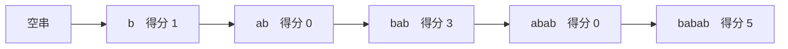
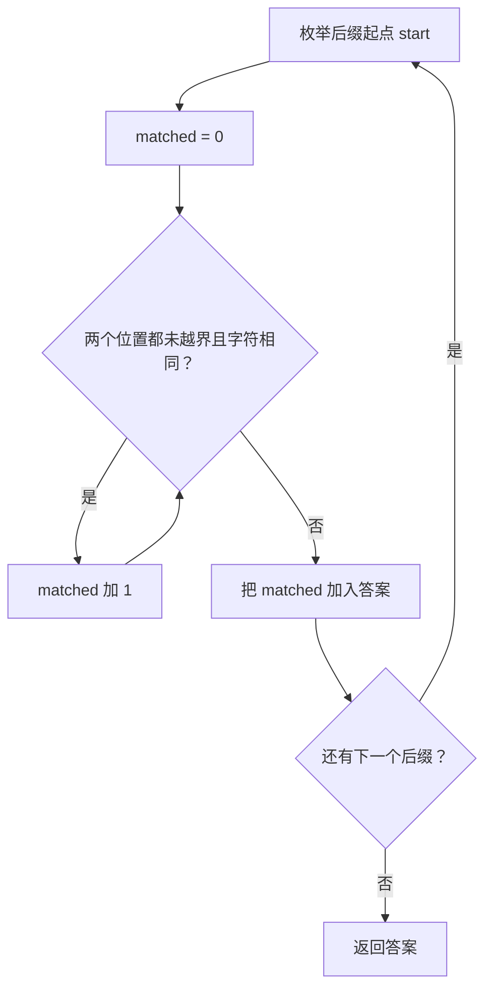
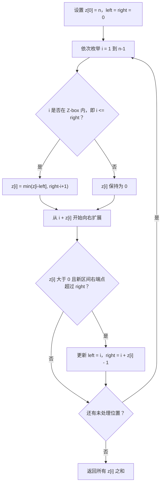

# 2223. 构造字符串的总得分和

题目链接：[LeetCode 2223. 构造字符串的总得分和](https://leetcode.cn/problems/sum-of-scores-of-built-strings/)

## 一、题目到底在说什么

给定一个非空字符串 `s`。最开始有一个空字符串，每次可以在当前字符串的**最前面**添加一个字符，经过若干次操作后得到 `s`。

对构造过程中出现的每个非空字符串，定义它的得分为：

> 当前字符串与最终字符串 `s` 的最长公共前缀长度。

要求计算构造过程中所有非空字符串的得分之和。

题目约束：

```text
1 <= s.length <= 10^5
s 只包含小写英文字母
```

### 示例 1

```text
输入：s = "babab"
输出：9
```

### 示例 2

```text
输入：s = "azbazbzaz"
输出：14
```

---

## 二、最关键的题意转化：构造过程就是枚举所有后缀

这道题看起来在描述一个“动态构造过程”，但真正需要计算的对象其实完全确定。

为了最终得到：

```text
babab
```

必须按照从右向左的顺序，把字符添加到字符串最前面：



这些非空字符串分别是：

```text
s[4..] = "b"
s[3..] = "ab"
s[2..] = "bab"
s[1..] = "abab"
s[0..] = "babab"
```

也就是说，构造过程中出现的字符串，恰好是 `s` 的全部非空后缀，只不过出现顺序是从短到长。

求和与顺序无关，所以可以直接按照起点 `i = 0, 1, ..., n - 1` 枚举所有后缀：

```text
s[i..n-1]
```

每个后缀的得分就是：

```text
LCP(s, s[i..n-1])
```

其中 `LCP` 是 Longest Common Prefix，即最长公共前缀。

因此原问题被转化为：

> 对 `s` 的每一个后缀，求它与整个字符串 `s` 的最长公共前缀长度，然后累加。

写成公式就是：

$$
\text{answer}=\sum_{i=0}^{n-1}\operatorname{LCP}(s, s[i..n-1])
$$

这个转化是整道题最重要的一步。后面的三种方法，只是在用不同速度计算这些 LCP。

---

## 三、用 `babab` 完整理解得分

最终字符串为：

```text
s = b a b a b
    0 1 2 3 4
```

逐个后缀和 `s` 对齐：

```text
i = 0
s:       b a b a b
suffix:  b a b a b
         └───────┘ 5 个字符相同，得分 5

i = 1
s:       b a b a b
suffix:  a b a b
         ×          第一个字符就不同，得分 0

i = 2
s:       b a b a b
suffix:  b a b
         └───┘      3 个字符相同，得分 3

i = 3
s:       b a b a b
suffix:  a b
         ×          第一个字符就不同，得分 0

i = 4
s:       b a b a b
suffix:  b
         └┘         1 个字符相同，得分 1
```

汇总如下：

| 后缀起点`i` | 后缀`s[i..]` | 与`s` 的最长公共前缀 | 得分 |
| ------------: | -------------- | ---------------------- | ---: |
|             0 | `babab`      | `babab`              |    5 |
|             1 | `abab`       | 空串                   |    0 |
|             2 | `bab`        | `bab`                |    3 |
|             3 | `ab`         | 空串                   |    0 |
|             4 | `b`          | `b`                  |    1 |

所以：

```text
answer = 5 + 0 + 3 + 0 + 1 = 9
```

---

## 方法一：暴力枚举并逐字符匹配

### 四、思路

最直接的方法是枚举每个后缀起点 `start`，然后从头比较：

```text
s[0]       和 s[start]
s[1]       和 s[start + 1]
s[2]       和 s[start + 2]
...
```

遇到第一个不同字符，或者后缀已经结束，就得到了当前后缀的得分。

#### 暴力算法流程



### 五、暴力法 C++ 代码

```cpp
#include <bits/stdc++.h>
using namespace std;

class Solution {
public:
    long long sumScores(string s) {
        const int n = static_cast<int>(s.size());
        long long answer = 0;

        // 枚举后缀 s[start..n-1]。
        for (int start = 0; start < n; ++start) {
            int matched = 0;

            // 比较 s[matched] 与 s[start + matched]。
            while (start + matched < n &&
                   s[matched] == s[start + matched]) {
                ++matched;
            }

            answer += matched;
        }

        return answer;
    }
};
```

### 六、暴力法正确性

对于固定的后缀起点 `start`：

1. `matched` 从 `0` 开始递增；
2. 每次递增前，都确认 `s[matched] == s[start + matched]`；
3. 循环停止时，要么后缀结束，要么下一对字符不同；
4. 因此前 `matched` 个字符完全相同，并且不可能再多匹配一个字符。

所以 `matched` 恰好是 `s` 与 `s[start..]` 的最长公共前缀长度。枚举所有 `start` 并累加，就得到所有后缀得分之和。

### 七、暴力法复杂度

后缀长度依次为：

```text
n, n - 1, n - 2, ..., 1
```

最坏情况是所有字符都相同，例如 `aaaaa...`，每个后缀都会一直匹配到结尾：

$$
n+(n-1)+\cdots+1=\frac{n(n+1)}{2}=O(n^2)
$$

- 时间复杂度：`O(n²)`；
- 额外空间复杂度：`O(1)`。

当 `n = 10^5` 时，最坏情况下比较次数约为 `5 × 10^9`，会超时。因此暴力法主要用于理解题意，以及在测试中充当小规模“正确答案生成器”。

---

## 方法二：双哈希 + 二分最长公共前缀

### 八、为什么可以二分答案

对于后缀 `s[start..]`，它的得分范围是：

```text
0 <= score <= n - start
```

定义一个判断：

```text
check(length)：
s[0..length-1] 是否等于 s[start..start+length-1]
```

它具有单调性：

- 如果长度 `length` 能匹配，那么所有更短长度也一定能匹配；
- 如果长度 `length` 不能匹配，那么所有更长长度也一定不能匹配。

状态形如：

```text
长度：  0  1  2  3  4  5 ...
结果：  T  T  T  T  F  F ...
```

所以可以二分查找“最后一个能够匹配的长度”。

问题变成：如何快速判断两个等长子串是否相等？

### 九、滚动哈希

设字符对应一个正整数，使用如下前缀哈希：

$$
H[i+1]=(H[i]\times BASE+value(s[i]))\bmod MOD
$$

同时预处理：

$$
P[i]=BASE^i\bmod MOD
$$

半开区间 `[left, right)` 的哈希为：

$$
hash(left,right)=H[right]-H[left]\times P[right-left]
$$

结果需要对 `MOD` 取模并调整到非负数。

预处理完成后，任意子串哈希都能在 `O(1)` 时间内获得，于是一次二分需要 `O(log n)` 次哈希比较。

单模哈希存在碰撞可能：不同字符串可能得到相同哈希。下面的代码同时使用两个不同质数模数，只有两组哈希都相等时才认为子串相等，可以把碰撞概率降得极低。

> 哈希仍然属于概率型方法。需要完全确定性的线性解时，应使用后面的 Z 函数。

### 十、二分边界图解

以 `s = "babab"`、`start = 2` 为例，后缀是 `"bab"`，最大可能长度为 `3`：

```text
搜索区间：[0, 3]

检查长度 2：
前缀    "ba"
后缀前2位 "ba"   相等，所以答案至少为 2

检查长度 3：
前缀    "bab"
后缀前3位 "bab"  相等，所以答案至少为 3

区间结束，LCP = 3
```

使用“向上取整”的中点：

```cpp
mid = (low + high + 1) / 2;
```

是为了在 `low + 1 == high` 且 `mid` 可行时，能够令 `low = high`，避免死循环。

### 十一、双哈希 + 二分 C++ 代码

```cpp
#include <bits/stdc++.h>
using namespace std;

class Solution {
public:
    long long sumScores(string s) {
        static constexpr long long MOD1 = 1'000'000'007LL;
        static constexpr long long MOD2 = 1'000'000'009LL;
        static constexpr long long BASE = 131LL;

        const int n = static_cast<int>(s.size());
        vector<long long> hash1(n + 1, 0);
        vector<long long> hash2(n + 1, 0);
        vector<long long> power1(n + 1, 1);
        vector<long long> power2(n + 1, 1);

        for (int i = 0; i < n; ++i) {
            const int value = s[i] - 'a' + 1;

            hash1[i + 1] = (hash1[i] * BASE + value) % MOD1;
            hash2[i + 1] = (hash2[i] * BASE + value) % MOD2;
            power1[i + 1] = power1[i] * BASE % MOD1;
            power2[i + 1] = power2[i] * BASE % MOD2;
        }

        // 返回半开区间 s[left..right) 的双哈希值。
        auto getHash = [&](int left, int right) {
            const int length = right - left;

            long long first =
                (hash1[right] - hash1[left] * power1[length]) % MOD1;
            long long second =
                (hash2[right] - hash2[left] * power2[length]) % MOD2;

            if (first < 0) {
                first += MOD1;
            }
            if (second < 0) {
                second += MOD2;
            }

            return pair<long long, long long>{first, second};
        };

        long long answer = 0;

        for (int start = 0; start < n; ++start) {
            int low = 0;
            int high = n - start;

            // 二分最大的可匹配长度。
            while (low < high) {
                const int mid = low + (high - low + 1) / 2;

                if (getHash(0, mid) == getHash(start, start + mid)) {
                    low = mid;
                } else {
                    high = mid - 1;
                }
            }

            answer += low;
        }

        return answer;
    }
};
```

### 十二、哈希法正确性

在没有发生哈希碰撞的前提下：

1. `getHash(0, length) == getHash(start, start + length)` 当且仅当两个长度为 `length` 的子串相等；
2. `check(length)` 满足“前真后假”的单调性；
3. 二分结束时，`low` 是最大的可行长度；
4. 因而 `low` 正是 `s` 与后缀 `s[start..]` 的 LCP；
5. 枚举所有后缀并累加，得到总得分。

### 十三、哈希法复杂度

- 预处理哈希和幂：`O(n)`；
- 每个后缀二分：`O(log n)`；
- 一共有 `n` 个后缀。

因此：

- 时间复杂度：`O(n log n)`；
- 额外空间复杂度：`O(n)`。

这个方法通常能够通过，但还没有利用不同后缀的 LCP 之间存在大量重复信息。

---

## 方法三：Z 函数——线性最优解

### 十四、Z 函数的定义

对于字符串 `s`，定义：

```text
z[i] = s 与后缀 s[i..n-1] 的最长公共前缀长度
```

也就是：

$$
z[i]=\operatorname{LCP}(s,s[i..n-1])
$$

这与题目中每个后缀的得分完全相同，所以答案就是：

$$
\text{answer}=\sum_{i=0}^{n-1}z[i]
$$

有些 Z 函数模板把 `z[0]` 定义为 `0`，因为整个字符串和自身的匹配没有多少分析价值。但这道题必须计算完整字符串自身的得分，因此这里直接令：

```text
z[0] = n
```

### 十五、`babab` 的 Z 数组

```text
s = b a b a b
i = 0 1 2 3 4
z = 5 0 3 0 1
```

| `i` | 后缀      | 与原串相同的前缀 | `z[i]` |
| ----: | --------- | ---------------- | -------: |
|     0 | `babab` | `babab`        |        5 |
|     1 | `abab`  | 空串             |        0 |
|     2 | `bab`   | `bab`          |        3 |
|     3 | `ab`    | 空串             |        0 |
|     4 | `b`     | `b`            |        1 |

所以：

```text
sum(z) = 5 + 0 + 3 + 0 + 1 = 9
```

如果仍然对每个位置从头比较，计算 Z 数组还是 `O(n²)`。Z 算法真正的价值在于维护一个可以复用的匹配区间。

### 十六、什么是 Z-box

维护一个闭区间：

```text
[left, right]
```

它满足：

```text
s[left..right] == s[0..right-left]
```

并且在已经处理过的位置中，这个区间的 `right` 最大。

这个匹配区间通常叫作 **Z-box**。

```text
字符串前缀：  s[0] s[1] s[2] ... s[right-left]
                 |    |    |              |
Z-box：       s[left] ................. s[right]
```

例如 `s = "babab"`，处理 `i = 2` 后：

```text
下标：       0 1 2 3 4
字符串：     b a b a b
前缀：       b a b
                 | | |
匹配区间：       b a b
             [left=2, right=4]
```

这表示：

```text
s[2..4] == s[0..2] == "bab"
```

### 十七、计算 `z[i]` 的两种大情况

#### 情况 1：`i > right`，当前位置在 Z-box 外

已有区间无法提供任何信息，只能从 `z[i] = 0` 开始向右比较：

```text
s[0]        与 s[i]
s[1]        与 s[i+1]
s[2]        与 s[i+2]
...
```

匹配完成后，如果 `z[i] > 0` 且新区间伸得更远，就更新：

```text
left  = i
right = i + z[i] - 1
```

#### 情况 2：`i <= right`，当前位置在 Z-box 内

因为：

```text
s[left..right] == s[0..right-left]
```

位置 `i` 在 Z-box 中对应的前缀位置是：

```text
k = i - left
```

图示：

```text
前缀位置：    0 1 2 3 4 ...
              | | | |
Z-box：     left ... i ... right
                     ↑
               k = i - left
```

已经知道前缀位置 `k` 的匹配长度是 `z[k]`。同时，从 `i` 到 Z-box 右端点还剩：

```text
right - i + 1
```

因此至少可以直接复用：

```cpp
z[i] = min(z[i - left], right - i + 1);
```

为什么必须取最小值？

- `z[i-left]` 表示前缀中对应位置本来可以匹配多远；
- `right-i+1` 表示当前 Z-box 已经证明的范围有多长；
- 超出 `right` 的部分还没有得到当前区间的保证，不能直接认为相等。

完成复用后，再从 `i + z[i]` 开始尝试向右扩展，不需要重新比较已经确认相等的字符。

### 十八、Z-box 内部还可以细分为两种情况

令：

```text
k = i - left
remain = right - i + 1
```

#### 18.1 `z[k] < remain`

对应的匹配在 Z-box 内部就已经遇到了不同字符：

```text
z[i] = z[k]
```

并且不可能继续扩展，因为那一对不同字符也被 Z-box 的相等关系复制到了当前位置。

#### 18.2 `z[k] >= remain`

可以确定 Z-box 内剩余的 `remain` 个字符都相等：

```text
z[i] 至少为 remain
```

但是 `right + 1` 以后的内容尚未比较，必须从边界外继续扩展。

标准模板把两种情况统一写成：

```cpp
if (i <= right) {
    z[i] = min(z[i - left], right - i + 1);
}

while (i + z[i] < n && s[z[i]] == s[i + z[i]]) {
    ++z[i];
}
```

即使第一种情况进入 `while`，第一次检查也会立刻失败，不影响总复杂度。

### 十九、`babab` 的 Z 算法逐轮模拟

初始化：

```text
z[0] = 5
left = 0
right = 0
```

#### `i = 1`

```text
i = 1 > right = 0
```

当前位置在 Z-box 外，从头比较：

```text
s[0] = 'b'
s[1] = 'a'
```

不同，所以：

```text
z[1] = 0
[left, right] 仍为 [0, 0]
```

#### `i = 2`

```text
i = 2 > right = 0
```

从头比较：

```text
s[0] == s[2]  -> 'b' == 'b'
s[1] == s[3]  -> 'a' == 'a'
s[2] == s[4]  -> 'b' == 'b'
```

后缀到达末尾，因此：

```text
z[2] = 3
left = 2
right = 4
```

#### `i = 3`

```text
i = 3 <= right = 4
k = i - left = 1
remain = right - i + 1 = 2
```

已经算出 `z[1] = 0`，所以：

```text
z[3] = min(z[1], 2) = 0
```

第一次扩展比较：

```text
s[0] = 'b'
s[3] = 'a'
```

不同，`z[3]` 仍为 `0`。

#### `i = 4`

```text
i = 4 <= right = 4
k = i - left = 2
remain = right - i + 1 = 1
```

已知 `z[2] = 3`，但当前 Z-box 只保证剩余 `1` 个字符：

```text
z[4] = min(3, 1) = 1
```

此时后缀已经结束，不再扩展。

最终：

| `i` | 进入本轮前`[left,right]` |        初始复用值 | 扩展后`z[i]` | 本轮结束后`[left,right]` |
| ----: | -------------------------- | ----------------: | -------------: | -------------------------- |
|     1 | `[0,0]`                  |                 0 |              0 | `[0,0]`                  |
|     2 | `[0,0]`                  |                 0 |              3 | `[2,4]`                  |
|     3 | `[2,4]`                  | `min(z[1],2)=0` |              0 | `[2,4]`                  |
|     4 | `[2,4]`                  | `min(z[2],1)=1` |              1 | `[2,4]`                  |

得到：

```text
z = [5, 0, 3, 0, 1]
answer = 9
```

### 二十、Z 算法完整流程



### 二十一、Z 函数最优解 C++ 代码

这份代码与目录中的 `solution.cpp` 一致，可直接提交到 LeetCode。

```cpp
#include <bits/stdc++.h>
using namespace std;

class Solution {
public:
    long long sumScores(string s) {
        const int n = static_cast<int>(s.size());
        vector<int> z(n);

        // 整个字符串与自身的最长公共前缀长度就是 n。
        z[0] = n;

        // [left, right] 是当前右端点最靠右的 Z-box：
        // s[left..right] == s[0..right-left]。
        int left = 0;
        int right = 0;

        for (int i = 1; i < n; ++i) {
            // i 在已有 Z-box 内时，先复用已经计算过的匹配信息。
            if (i <= right) {
                z[i] = min(z[i - left], right - i + 1);
            }

            // 只有尚未确定的部分才需要继续逐字符比较。
            while (i + z[i] < n && s[z[i]] == s[i + z[i]]) {
                ++z[i];
            }

            // 产生正长度匹配且区间伸得更远时，更新最右 Z-box。
            // z[i] == 0 时没有匹配区间，不能把空区间当成 Z-box。
            if (z[i] > 0 && i + z[i] - 1 > right) {
                left = i;
                right = i + z[i] - 1;
            }
        }

        long long answer = 0;
        for (int length : z) {
            answer += length;
        }
        return answer;
    }
};
```

### 二十二、为什么 Z 算法是正确的

可以分成三个层次证明。

#### 引理 1：构造过程中的字符串恰好是所有非空后缀

每次只能向当前字符串的最前面添加字符。要最终得到 `s`，添加顺序只能是：

```text
s[n-1], s[n-2], ..., s[1], s[0]
```

添加到 `s[i]` 后，当前字符串就是 `s[i..n-1]`。因此所有中间字符串与全部非空后缀一一对应。

#### 引理 2：算法算出的 `z[i]` 是正确的 LCP

处理位置 `i` 时：

- 如果 `i > right`，算法从 `0` 开始逐字符比较，直到第一次失配或到达末尾，所以得到准确 LCP；
- 如果 `i <= right`，Z-box 保证 `s[left..right]` 与相同长度的前缀完全相等，因此可以安全复用 `min(z[i-left], right-i+1)` 个字符；
- Z-box 之外的字符没有被复用，算法继续逐字符比较，直到第一次失配或到达末尾。

因此，不会把不相等的字符算入，也不会漏掉仍然相等的字符，最终 `z[i]` 恰好是 LCP。

#### 定理：返回值等于题目要求的总得分

由引理 1，每个构造字符串对应一个后缀；由引理 2，该后缀的得分等于对应的 `z[i]`。所以所有 `z[i]` 的总和，就是所有构造字符串的总得分。

### 二十三、为什么总时间复杂度是 `O(n)`

看到代码中的嵌套结构：

```cpp
for (...) {
    while (...) {
        ...
    }
}
```

容易误以为它是 `O(n²)`，但这里要做摊还分析。

关键是 `right` 只会向右移动，不会向左退：

```text
0 <= right < n
```

在已有 Z-box 内的匹配直接通过 `z[i-left]` 复用，不会逐字符重复扫描。`while` 中真正成功越过已有边界的比较，会让最右边界继续向右扩展。

最右边界从开头到结尾最多向右移动 `n - 1` 次；另外，每个 `i` 最多产生一次使扩展停止的失败比较。因此总字符比较次数是线性的。

- 计算 Z 数组：`O(n)`；
- 求和：`O(n)`；
- 总时间复杂度：`O(n)`；
- Z 数组占用空间：`O(n)`。

### 二十四、能不能把额外空间优化到 `O(1)`

不能直接丢掉整个 Z 数组，因为在 `i <= right` 时需要访问：

```text
z[i - left]
```

它可能是之前任意位置的结果。因此标准 Z 算法保留长度为 `n` 的数组，额外空间为 `O(n)`。

---

## 二十五、三种方法对比

| 方法          | 核心思想                        |     时间复杂度 | 空间复杂度 | 是否有碰撞风险 | 适用场景                       |
| ------------- | ------------------------------- | -------------: | ---------: | -------------- | ------------------------------ |
| 暴力匹配      | 每个后缀从头比较                |     `O(n²)` |   `O(1)` | 无             | 理解题意、小数据对拍           |
| 双哈希 + 二分 | `O(1)` 判断子串相等，二分 LCP | `O(n log n)` |   `O(n)` | 极低但理论存在 | 通用子串比较、容易迁移         |
| Z 函数        | 复用最右匹配区间                |       `O(n)` |   `O(n)` | 无             | 本题最优、所有后缀与前缀的 LCP |

推荐顺序：

1. 先写暴力，确认题意；
2. 学习阶段可以实现哈希 + 二分，掌握通用技巧；
3. 正式提交使用 Z 函数。

---

## 二十六、更多例子

### 例 1：只有一个字符

```text
s = "a"
z = [1]
answer = 1
```

### 例 2：所有字符都不同

```text
s = "abcde"
```

除完整字符串外，其他后缀的首字符都不是 `'a'`：

```text
z = [5, 0, 0, 0, 0]
answer = 5
```

### 例 3：所有字符都相同

```text
s = "aaaaa"
```

每个后缀都会匹配到自身末尾：

```text
z = [5, 4, 3, 2, 1]
answer = 15
```

这也是暴力算法的最坏情况。

### 例 4：周期字符串

```text
s = "babab"
z = [5, 0, 3, 0, 1]
answer = 9
```

周期结构使多个后缀与前缀产生较长匹配，正适合观察 Z-box 的复用。

### 例 5：题目第二个示例

```text
s = "azbazbzaz"
```

非零位置为：

```text
z[0] = 9   // 整个字符串
z[3] = 3   // "azb"
z[7] = 2   // "az"
```

因此：

```text
z = [9, 0, 0, 3, 0, 0, 0, 2, 0]
answer = 9 + 3 + 2 = 14
```

---

## 二十七、常见错误

### 1. 忘记完整字符串本身的得分

很多 Z 函数模板默认：

```text
z[0] = 0
```

但本题中完整字符串也是一个构造结果，它与自身的 LCP 是 `n`。可以令 `z[0] = n`，也可以最后单独把 `n` 加入答案。

### 2. 把 Z-box 写成半开区间，却使用闭区间公式

本文使用闭区间 `[left, right]`，因此：

```text
区间长度 = right - left + 1
从 i 到 right 的长度 = right - i + 1
```

如果使用半开区间 `[left, right)`，相关公式会不同。不要混用模板。

### 3. 复用时忘记取最小值

错误写法：

```cpp
z[i] = z[i - left];
```

`z[i-left]` 可能越过当前 `right`，但 Z-box 只证明了区间内部相等。正确写法是：

```cpp
z[i] = min(z[i - left], right - i + 1);
```

### 4. 更新右端点时少减 `1`

`z[i]` 是长度，闭区间右端点应为：

```text
i + z[i] - 1
```

不是 `i + z[i]`。

### 5. 答案使用 `int`

当所有字符相同时，答案达到：

$$
\frac{n(n+1)}{2}
$$

`n = 100000` 时：

```text
answer = 5,000,050,000
```

它超过 32 位有符号整数上限 `2,147,483,647`，所以答案必须使用 `long long`。

`z[i]` 本身最大只有 `n`，使用 `int` 足够。

### 6. 用哈希时写错区间长度

对于半开区间 `[left, right)`：

```text
length = right - left
```

取哈希时的幂也必须使用这个长度。

### 7. 二分中点不向上取整

查找最大可行值并使用 `low = mid` 时，中点要写成：

```cpp
mid = low + (high - low + 1) / 2;
```

否则可能死循环。

---

## 二十八、为什么这道题最适合 Z 函数，而不是 KMP

KMP 的前缀函数 `pi[i]` 表示：

> 子串 `s[0..i]` 的最长真前缀与真后缀的公共长度。

Z 函数 `z[i]` 表示：

> 整个字符串前缀与后缀 `s[i..]` 的最长公共前缀长度。

本题直接要求每一个后缀和整个字符串前缀的 LCP，这与 Z 函数的定义一模一样。因此使用 Z 函数最自然。

不是说 KMP 完全不能间接解决，而是它计算的信息并不直接对应题目要求，转换会更绕。

---

## 二十九、可以从这道题学到哪些具体知识和技能

### 1. 把动态过程转化为静态集合

题目描述的是“不断在前面添加字符”，但真正出现的对象只是所有后缀。

以后遇到构造、删除、逐步变化的问题，可以先问：

> 中间状态能不能用前缀、后缀、子数组或子序列统一表示？

一旦完成这种转化，问题往往会从模拟题变成经典算法题。

### 2. 熟练掌握 LCP 的含义

LCP 不只出现在字符串题中，也常和以下算法组合：

- Z 函数；
- 字符串哈希；
- 后缀数组；
- 字典树；
- KMP 与字符串周期。

### 3. 学会 Z 函数，也叫扩展 KMP 的核心思想

Z 函数非常适合处理：

- 每个后缀与前缀的匹配长度；
- 字符串模式匹配；
- 字符串周期；
- 前缀出现次数；
- 前缀和后缀关系；
- 多模式拼接后的匹配问题。

### 4. 学会“区间复用”

Z 算法不是依赖神秘公式，而是在维护一个已经证明相等的区间。当前位置落在区间内部时，把前缀中对应位置的答案复制过来。

类似思想还会出现在：

- Manacher 回文算法；
- 滑动窗口；
- 双指针；
- 单调队列；
- 各类维护最远边界的线性扫描。

### 5. 学会摊还复杂度分析

代码中存在嵌套 `while`，不代表一定是 `O(n²)`。如果某个指针在整个程序中只单向移动 `O(n)` 次，总复杂度仍可能是线性的。

判断时不要只看循环嵌套层数，要看同一份工作是否被反复执行。

### 6. 学会字符串哈希 + 二分答案

即使 Z 函数是本题最优解，哈希方案仍然很有价值。它展示了一个通用套路：

```text
子串相等判断 O(1)
        +
答案具有单调性
        =
二分最长公共前缀
```

当问题不是统一和整个字符串前缀比较，而是任意两个子串之间进行 LCP 查询时，这种方法更容易迁移。

### 7. 学会用正确的数据类型估算答案上界

写代码前先计算答案的最大可能值，可以快速判断是否需要 `long long`。

本题最大值是等差数列之和，不是单个 `z[i]` 的最大值。

### 8. 学会使用暴力解进行随机或穷举对拍

高效算法较难证明和调试时，可以同时写一个只适用于小数据的暴力算法：

```text
生成大量小输入
分别运行暴力解和最优解
比较两者结果
```

这比只运行几个手写样例更容易发现边界错误。本题的最终实现已经在字母表 `{a,b,c}` 上，对长度 `1..8` 的全部 `9840` 个字符串与暴力算法进行了对拍。

---

## 三十、测试记录

### 固定用例

| 输入                               |      期望输出 | 覆盖场景                               |
| ---------------------------------- | ------------: | -------------------------------------- |
| `"a"`                            |             1 | 最小长度                               |
| `"babab"`                        |             9 | 周期结构、题目示例                     |
| `"azbazbzaz"`                    |            14 | 多段不同长度匹配、题目示例             |
| `"aaaaa"`                        |            15 | 全相同字符、最大匹配                   |
| `"abcde"`                        |             5 | 除自身外全部失配                       |
| 长度`100000` 的全 `'a'` 字符串 | 5,000,050,000 | 最大长度、线性性能、`long long` 上界 |

### 穷举对拍

测试方法：

1. 使用独立的 `O(n²)` 暴力算法计算期望答案；
2. 枚举 `{a,b,c}` 上长度 `1..8` 的全部字符串；
3. 将暴力答案与 Z 函数答案逐一比较。

字符串总数为：

$$
3^1+3^2+\cdots+3^8=9840
$$

实际测试结果：

```text
fixed cases passed; exhaustive cases passed: 9840; maximum-length case passed
```

---

## 三十一、最后总结

这道题的完整思考链是：


最核心的公式只有一个：

$$
\boxed{\text{answer}=\sum_{i=0}^{n-1}z[i],\quad z[0]=n}
$$

三种方法中：

- 暴力法帮助理解定义；
- 哈希 + 二分展示通用 LCP 查询技巧；
- Z 函数利用匹配区间复用，在 `O(n)` 时间内完成计算，是本题推荐解法。
