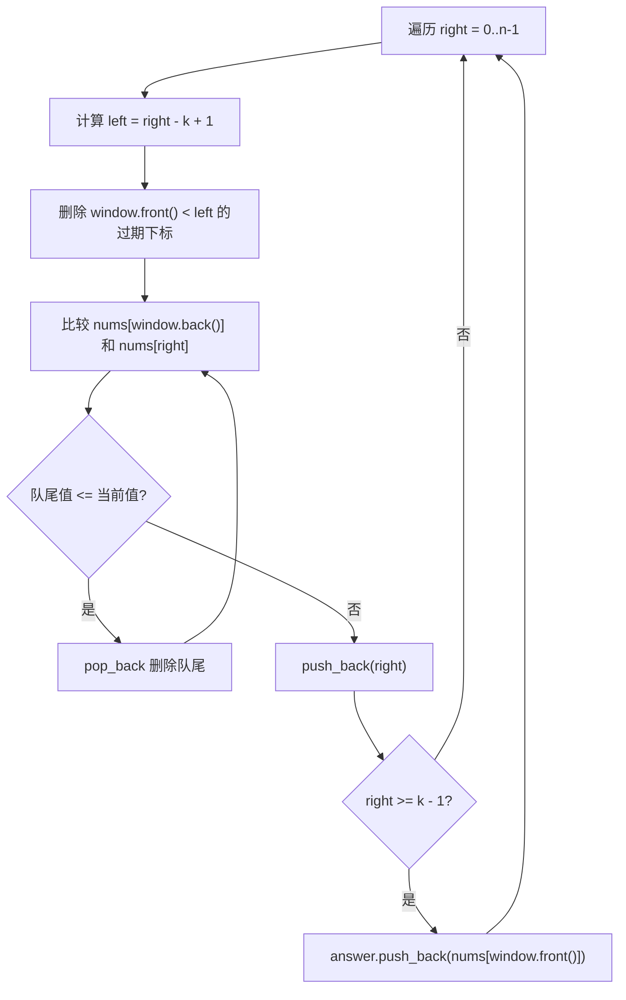

# 239. 滑动窗口最大值

题目链接：[LeetCode 239](https://leetcode.cn/problems/sliding-window-maximum/)

## 题意重述

给定一个整数数组 `nums` 和一个窗口大小 `k`。

窗口从数组最左边开始，每次向右移动一格。每次移动时，需要求出当前窗口中的最大值。

返回所有窗口最大值组成的数组。

例如：

```text
nums = [1, 3, -1, -3, 5, 3, 6, 7]
k = 3

窗口依次是：
[1, 3, -1]        最大值 3
[3, -1, -3]       最大值 3
[-1, -3, 5]       最大值 5
[-3, 5, 3]        最大值 5
[5, 3, 6]         最大值 6
[3, 6, 7]         最大值 7

答案 = [3, 3, 5, 5, 6, 7]
```

## 为什么不能暴力

最直接的做法是：每形成一个窗口，就扫描窗口里的 `k` 个元素，找最大值。

```text
窗口数量 = n - k + 1
每个窗口扫描 k 个数
时间复杂度 = O((n - k + 1) * k)
```

当 `n = 100000` 且 `k` 也很大时，这种做法会超时。

我们需要让每个元素最多进队一次、出队一次，总复杂度达到 `O(n)`。

## 核心思路：单调队列

我们维护一个双端队列 `window`。

注意：`window` 中存的是 **下标**，不是直接存数字。

队列保持两个性质：

1. `window` 中的下标从队头到队尾递增。
2. `nums[window[i]]` 从队头到队尾单调递减。

也就是说：

```text
window 中保存的是一些下标：
[a, b, c]

它们满足：
a < b < c
nums[a] >= nums[b] >= nums[c]
```

这样一来，队头 `window.front()` 对应的数字一定是当前窗口最大值。

## 为什么队列要存下标

如果只存数字，我们无法判断这个数字是否已经滑出窗口。

例如：

```text
nums = [9, 1, 2, 3]
k = 2
```

当窗口移动到 `[1, 2]` 时，数字 `9` 已经不在窗口里了。

如果队列只存数字，就不好判断 `9` 是不是过期。

如果队列存下标：

```text
9 的下标是 0
当前窗口 [left, right] = [1, 2]
0 < left
```

于是可以直接判断：

```cpp
if (!window.empty() && window.front() < left) {
    window.pop_front();
}
```

## 变量说明

| 变量名             | 含义                                         |
| ------------------ | -------------------------------------------- |
| `nums`           | 输入数组                                     |
| `k`              | 滑动窗口大小                                 |
| `n`              | 数组长度                                     |
| `answer`         | 存放每个窗口最大值                           |
| `window`         | 单调队列，存放候选最大值的下标               |
| `right`          | 当前新加入窗口的右边界下标                   |
| `left`           | 当前窗口左边界下标，`left = right - k + 1` |
| `window.front()` | 当前窗口最大值的下标                         |
| `window.back()`  | 当前队尾候选值的下标                         |

## 图解流程



## 单调队列为什么正确

假设当前要加入的新元素是 `nums[right]`。

如果队尾下标是 `last = window.back()`，并且：

```text
nums[last] <= nums[right]
```

那么 `last` 可以直接删除。

原因有两个：

1. `nums[right]` 比 `nums[last]` 大或者相等。
2. `right` 在 `last` 的右边，所以 `right` 会更晚滑出窗口。

也就是说，从现在开始，只要 `last` 和 `right` 同时在窗口里，`last` 都不可能比 `right` 更适合当最大值。

所以可以放心执行：

```cpp
while (!window.empty() && nums[window.back()] <= nums[right]) {
    window.pop_back();
}
```

这个操作会把队尾所有小于等于当前值的下标删掉，从而让队列保持单调递减。

## 例子 1：题目示例完整过程

输入：

```text
nums = [1, 3, -1, -3, 5, 3, 6, 7]
k = 3
```

代码变量初始状态：

```text
n = 8
answer = []
window = []
```

下面表格中，`window` 写成 `下标:值` 的形式，方便同时看见代码里的下标和真实数字。

| 步骤 | `right` | `left = right - k + 1` | 当前值`nums[right]` | 操作后`window`      | 是否记录答案            | `answer`             |
| ---- | --------: | -----------------------: | --------------------: | --------------------- | ----------------------- | ---------------------- |
| 1    |         0 |                       -2 |                     1 | `[0:1]`             | 否，窗口未满            | `[]`                 |
| 2    |         1 |                       -1 |                     3 | `[1:3]`             | 否，窗口未满            | `[]`                 |
| 3    |         2 |                        0 |                    -1 | `[1:3, 2:-1]`       | 是，最大值`nums[1]=3` | `[3]`                |
| 4    |         3 |                        1 |                    -3 | `[1:3, 2:-1, 3:-3]` | 是，最大值`nums[1]=3` | `[3, 3]`             |
| 5    |         4 |                        2 |                     5 | `[4:5]`             | 是，最大值`nums[4]=5` | `[3, 3, 5]`          |
| 6    |         5 |                        3 |                     3 | `[4:5, 5:3]`        | 是，最大值`nums[4]=5` | `[3, 3, 5, 5]`       |
| 7    |         6 |                        4 |                     6 | `[6:6]`             | 是，最大值`nums[6]=6` | `[3, 3, 5, 5, 6]`    |
| 8    |         7 |                        5 |                     7 | `[7:7]`             | 是，最大值`nums[7]=7` | `[3, 3, 5, 5, 6, 7]` |

### 逐步解释

#### `right = 0`

```text
left = 0 - 3 + 1 = -2
nums[right] = nums[0] = 1
window 原来是 []
```

队列为空，直接加入当前下标：

```text
window = [0:1]
```

因为：

```text
right = 0 < k - 1 = 2
```

窗口还没有形成，所以不记录答案。

#### `right = 1`

```text
left = 1 - 3 + 1 = -1
nums[right] = nums[1] = 3
window 原来是 [0:1]
```

维护单调递减：

```text
nums[window.back()] = nums[0] = 1
nums[right] = 3
1 <= 3，所以弹出 0
```

加入当前下标 `1`：

```text
window = [1:3]
```

窗口仍未形成，不记录答案。

#### `right = 2`

```text
left = 2 - 3 + 1 = 0
nums[right] = nums[2] = -1
window 原来是 [1:3]
```

队尾值 `3` 大于当前值 `-1`，不用弹出。

加入当前下标：

```text
window = [1:3, 2:-1]
```

此时：

```text
right = 2 >= k - 1 = 2
```

第一个窗口 `[0, 2]` 形成：

```text
window.front() = 1
nums[window.front()] = nums[1] = 3
answer = [3]
```

#### `right = 3`

```text
left = 3 - 3 + 1 = 1
nums[right] = nums[3] = -3
window 原来是 [1:3, 2:-1]
```

队头下标 `1` 没有过期，因为：

```text
window.front() = 1
left = 1
1 < 1 为假
```

队尾值 `-1` 大于当前值 `-3`，不用弹出。

加入当前下标：

```text
window = [1:3, 2:-1, 3:-3]
```

当前窗口 `[1, 3]` 最大值：

```text
nums[window.front()] = nums[1] = 3
answer = [3, 3]
```

#### `right = 4`

```text
left = 4 - 3 + 1 = 2
nums[right] = nums[4] = 5
window 原来是 [1:3, 2:-1, 3:-3]
```

先删除过期下标：

```text
window.front() = 1
left = 2
1 < 2，所以弹出 1
window = [2:-1, 3:-3]
```

再维护单调递减：

```text
nums[3] = -3 <= 5，弹出 3
nums[2] = -1 <= 5，弹出 2
```

加入当前下标：

```text
window = [4:5]
```

当前窗口 `[2, 4]` 最大值：

```text
nums[window.front()] = nums[4] = 5
answer = [3, 3, 5]
```

后面的步骤同理，最终得到：

```text
answer = [3, 3, 5, 5, 6, 7]
```

## 例子 2：只有一个元素

输入：

```text
nums = [1]
k = 1
```

初始：

```text
n = 1
answer = []
window = []
```

执行唯一一轮：

```text
right = 0
left = right - k + 1 = 0 - 1 + 1 = 0
nums[right] = nums[0] = 1
```

队列为空，直接加入：

```text
window = [0:1]
```

此时窗口已经形成：

```text
right = 0 >= k - 1 = 0
window.front() = 0
nums[window.front()] = nums[0] = 1
answer = [1]
```

最终返回：

```text
[1]
```

## 例子 3：单调递减数组

输入：

```text
nums = [9, 7, 5, 3, 1]
k = 3
```

这个例子中，新来的数总是更小，所以队尾通常不会被弹出。

| `right` | `left` | `nums[right]` | 操作后`window`    | `answer`    |
| --------: | -------: | --------------: | ------------------- | ------------- |
|         0 |       -2 |               9 | `[0:9]`           | `[]`        |
|         1 |       -1 |               7 | `[0:9, 1:7]`      | `[]`        |
|         2 |        0 |               5 | `[0:9, 1:7, 2:5]` | `[9]`       |
|         3 |        1 |               3 | `[1:7, 2:5, 3:3]` | `[9, 7]`    |
|         4 |        2 |               1 | `[2:5, 3:3, 4:1]` | `[9, 7, 5]` |

关键点：

```text
当 right = 3 时：
left = 1
window.front() = 0
0 < 1，说明下标 0 已经滑出窗口，所以弹出。
```

最终返回：

```text
[9, 7, 5]
```

## 例子 4：单调递增数组

输入：

```text
nums = [1, 2, 3, 4, 5]
k = 2
```

这个例子中，新来的数总是更大，所以旧的队尾会不断被弹出。

| `right` | `left` | `nums[right]` | 队尾弹出过程   | 操作后`window` | `answer`       |
| --------: | -------: | --------------: | -------------- | ---------------- | ---------------- |
|         0 |       -1 |               1 | 无             | `[0:1]`        | `[]`           |
|         1 |        0 |               2 | `0:1` 被弹出 | `[1:2]`        | `[2]`          |
|         2 |        1 |               3 | `1:2` 被弹出 | `[2:3]`        | `[2, 3]`       |
|         3 |        2 |               4 | `2:3` 被弹出 | `[3:4]`        | `[2, 3, 4]`    |
|         4 |        3 |               5 | `3:4` 被弹出 | `[4:5]`        | `[2, 3, 4, 5]` |

最终返回：

```text
[2, 3, 4, 5]
```

这个例子可以帮助理解：

```cpp
while (!window.empty() && nums[window.back()] <= nums[right]) {
    window.pop_back();
}
```

为什么要循环弹出，而不是只弹出一次。

## 代码

```cpp
#include <bits/stdc++.h>
using namespace std;

class Solution {
public:
    vector<int> maxSlidingWindow(vector<int>& nums, int k) {
        int n = (int)nums.size();

        // answer 存放每一个长度为 k 的滑动窗口最大值。
        vector<int> answer;
        answer.reserve(n - k + 1);

        // window 存放的是 nums 的下标，不是直接存数字。
        // 队头到队尾对应的 nums 值单调递减。
        deque<int> window;

        for (int right = 0; right < n; ++right) {
            int left = right - k + 1;

            if (!window.empty() && window.front() < left) {
                window.pop_front();
            }

            while (!window.empty() && nums[window.back()] <= nums[right]) {
                window.pop_back();
            }

            window.push_back(right);

            if (right >= k - 1) {
                answer.push_back(nums[window.front()]);
            }
        }

        return answer;
    }
};
```

更详细的逐行注释见同目录下的 `solution.cpp`。

## 正确性证明

### 1. 队列中的下标都属于当前窗口或未来窗口

每一轮都会先计算：

```text
left = right - k + 1
```

然后检查队头：

```cpp
if (!window.empty() && window.front() < left) {
    window.pop_front();
}
```

因为 `window` 中下标递增，最可能过期的下标一定在队头。

删除过期队头后，队列中剩余下标都不会小于 `left`，也就没有滑出当前窗口左侧。

### 2. 队列始终保持单调递减

加入 `right` 之前，代码会执行：

```cpp
while (!window.empty() && nums[window.back()] <= nums[right]) {
    window.pop_back();
}
```

这会删除所有小于等于 `nums[right]` 的队尾元素。

循环结束后，如果队列不为空，就一定有：

```text
nums[window.back()] > nums[right]
```

再把 `right` 加入队尾后，队列仍然满足从队头到队尾的值单调递减。

### 3. 队头就是当前窗口最大值

根据第 1 点，队列中的下标没有过期。

根据第 2 点，队列对应的值单调递减。

因此队头 `window.front()` 对应的值最大，即：

```text
nums[window.front()]
```

就是当前窗口最大值。

### 4. 每个形成的窗口都会记录一次答案

当：

```text
right >= k - 1
```

说明从 `left` 到 `right` 的窗口长度已经达到 `k`。

此时记录：

```cpp
answer.push_back(nums[window.front()]);
```

正好把当前窗口最大值加入答案。

窗口从第一个 `[0, k - 1]` 到最后一个 `[n - k, n - 1]`，每个都会被记录一次，所以最终答案完整且正确。

## 复杂度分析

设 `n = nums.size()`。

时间复杂度：

```text
O(n)
```

原因是每个下标最多：

- 被 `push_back` 一次；
- 被 `pop_back` 一次；
- 被 `pop_front` 一次。

所以总操作次数是线性的。

空间复杂度：

```text
O(k)
```

队列中只会保存当前窗口及其候选下标，最多不会超过 `k` 个。

如果把输出数组也计入空间，则为 `O(n)`。

## 可以学习到什么

通过这道题，你可以重点学到：

1. **滑动窗口思想**：用 `left` 和 `right` 表示当前窗口范围。
2. **单调队列**：维护一个有序候选集合，让最大值可以 `O(1)` 取得。
3. **为什么存下标而不是存值**：下标可以判断元素是否过期。
4. **淘汰无用候选值**：当新元素更大且位置更靠右时，旧元素就没有机会成为最大值。
5. **均摊复杂度**：虽然 `while` 看起来可能弹很多次，但每个元素最多被弹一次，所以整体还是 `O(n)`。
6. **双端队列 `deque` 的使用**：队头删除过期元素，队尾维护单调性。
7. **窗口形成条件**：当 `right >= k - 1` 时，才开始记录答案。
8. **算法设计中的“不变量”**：队列中下标递增、值单调递减，这两个性质是正确性的核心。

## 还能迁移到哪些题

这道题的单调队列思想非常重要，常见迁移方向有：

- 求每个滑动窗口的最小值：把单调递减改成单调递增。
- 带限制的动态规划优化：例如维护某个范围内的最大 `dp` 值。
- 区间内最优候选随窗口移动的问题。
- 需要不断删除过期元素，又要快速取最大值或最小值的问题。
