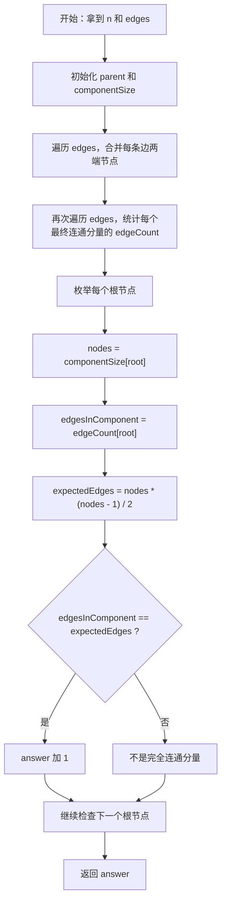

# 2685. 统计完全连通分量的数量

题目链接：[LeetCode 2685](https://leetcode.cn/problems/count-the-number-of-complete-components/)

## 题意重述

给你一个无向图：

- 一共有 `n` 个节点，编号从 `0` 到 `n - 1`。
- `edges[i] = [a, b]` 表示节点 `a` 和节点 `b` 之间有一条无向边。

要求统计有多少个连通分量是“完全连通分量”。

什么叫完全连通分量？

如果一个连通分量里有 `k` 个节点，并且这 `k` 个节点两两之间都有边，那么它就是完全连通分量。

例如节点 `{0, 1, 2}` 是完全连通分量时，必须有这 3 条边：

```text
0 - 1
0 - 2
1 - 2
```

少一条都不行。

## 核心结论

如果一个连通分量中有 `nodes` 个节点，那么它想成为完全图，边数必须是：

```text
nodes * (nodes - 1) / 2
```

原因是：任意两个不同节点之间都要有一条边，也就是从 `nodes` 个节点里任选 2 个节点。

```text
完全图边数 = C(nodes, 2) = nodes * (nodes - 1) / 2
```

所以这道题可以转化为：

1. 找出每个连通分量。
2. 统计每个连通分量有多少个节点。
3. 统计每个连通分量有多少条边。
4. 如果实际边数等于理论完全图边数，就把答案加 1。

## 为什么用并查集

并查集很适合处理“哪些节点属于同一个连通分量”。

对于每条边 `[a, b]`：

- `a` 和 `b` 之间有边。
- 所以 `a` 和 `b` 一定属于同一个连通分量。
- 用并查集把它们合并即可。

处理完所有边之后，根节点相同的节点就在同一个连通分量里。

## 代码变量说明

| 变量                    | 含义                                      |
| ----------------------- | ----------------------------------------- |
| `n`                   | 节点数量                                  |
| `edges`               | 无向边数组                                |
| `parent[x]`           | 并查集中节点`x` 的父节点                |
| `componentSize[root]` | 根节点`root` 所代表连通分量中的节点数量 |
| `findRoot(node)`      | 查找`node` 所在连通分量的根节点         |
| `a`, `b`            | 当前边连接的两个节点                      |
| `rootA`, `rootB`    | `a`、`b` 当前所在连通分量的根节点     |
| `edgeCount[root]`     | 根节点`root` 所代表连通分量中的边数     |
| `answer`              | 完全连通分量的数量                        |
| `nodes`               | 当前连通分量中的节点数                    |
| `edgesInComponent`    | 当前连通分量中的实际边数                  |
| `expectedEdges`       | 当前连通分量成为完全图需要的边数          |

## 解题流程图



## 图解：完全连通分量长什么样

### 3 个点的完全连通分量

```text
0 ----- 1
 \     /
  \   /
    2

节点数 nodes = 3
实际边数 edgesInComponent = 3
理论边数 expectedEdges = 3 * (3 - 1) / 2 = 3

所以它是完全连通分量。
```

### 3 个点但缺一条边

```text
0 ----- 1

      2

或者：

0 ----- 1
       |
       |
       2

节点数 nodes = 3
实际边数 edgesInComponent = 2
理论边数 expectedEdges = 3

实际边数不够，所以不是完全连通分量。
```

### 1 个点也算完全连通分量

```text
5

节点数 nodes = 1
实际边数 edgesInComponent = 0
理论边数 expectedEdges = 1 * (1 - 1) / 2 = 0

实际边数等于理论边数，所以单独一个点也是完全连通分量。
```

## 例子 1：有两个完全连通分量

```text
n = 6
edges = [[0,1],[0,2],[1,2],[3,4]]
```

图如下：

```text
0 ----- 1        3 ----- 4        5
 \     /
  \   /
    2
```

连通分量分别是：

- `{0, 1, 2}`
- `{3, 4}`
- `{5}`

### 第一步：初始化变量

```text
parent        = [0, 1, 2, 3, 4, 5]
componentSize = [1, 1, 1, 1, 1, 1]
answer        = 0
```

含义：

- 每个节点先单独作为一个连通分量。
- 每个连通分量的大小都是 1。

### 第二步：遍历 edges 做合并

#### 处理 edge = [0, 1]

代码变量：

```text
a = 0
b = 1
rootA = findRoot(0) = 0
rootB = findRoot(1) = 1
```

`rootA != rootB`，所以合并。

合并后：

```text
parent        = [0, 0, 2, 3, 4, 5]
componentSize = [2, 1, 1, 1, 1, 1]
```

现在 `{0, 1}` 属于同一个连通分量，根节点是 `0`。

#### 处理 edge = [0, 2]

代码变量：

```text
a = 0
b = 2
rootA = findRoot(0) = 0
rootB = findRoot(2) = 2
```

继续合并。

合并后：

```text
parent        = [0, 0, 0, 3, 4, 5]
componentSize = [3, 1, 1, 1, 1, 1]
```

现在 `{0, 1, 2}` 属于同一个连通分量。

#### 处理 edge = [1, 2]

代码变量：

```text
a = 1
b = 2
rootA = findRoot(1) = 0
rootB = findRoot(2) = 0
```

`rootA == rootB`，说明 `1` 和 `2` 已经在同一个连通分量里，不需要再次合并。

变量保持：

```text
parent        = [0, 0, 0, 3, 4, 5]
componentSize = [3, 1, 1, 1, 1, 1]
```

#### 处理 edge = [3, 4]

代码变量：

```text
a = 3
b = 4
rootA = findRoot(3) = 3
rootB = findRoot(4) = 4
```

合并后：

```text
parent        = [0, 0, 0, 3, 3, 5]
componentSize = [3, 1, 1, 2, 1, 1]
```

### 第三步：统计 edgeCount

再次遍历所有边，用最终根节点统计边数。

| edge      | `a` | `root = findRoot(a)` | 更新后`edgeCount` |
| --------- | ----: | ---------------------: | ------------------- |
| `[0,1]` |     0 |                      0 | `[1,0,0,0,0,0]`   |
| `[0,2]` |     0 |                      0 | `[2,0,0,0,0,0]`   |
| `[1,2]` |     1 |                      0 | `[3,0,0,0,0,0]`   |
| `[3,4]` |     3 |                      3 | `[3,0,0,1,0,0]`   |

最终：

```text
edgeCount = [3, 0, 0, 1, 0, 0]
```

含义：

- 根节点 `0` 的连通分量 `{0,1,2}` 有 3 条边。
- 根节点 `3` 的连通分量 `{3,4}` 有 1 条边。
- 根节点 `5` 的连通分量 `{5}` 有 0 条边。

### 第四步：枚举根节点判断是否完全

| 根节点`node` | `nodes` | `edgesInComponent` | `expectedEdges` | 是否完全 | `answer` |
| -------------: | --------: | -------------------: | ----------------: | -------- | ---------: |
|              0 |         3 |                    3 | `3 * 2 / 2 = 3` | 是       |          1 |
|              3 |         2 |                    1 | `2 * 1 / 2 = 1` | 是       |          2 |
|              5 |         1 |                    0 | `1 * 0 / 2 = 0` | 是       |          3 |

最终答案：

```text
3
```

## 例子 2：连通但不是完全

```text
n = 4
edges = [[0,1],[1,2],[2,3]]
```

图如下：

```text
0 ----- 1 ----- 2 ----- 3
```

这是一个连通分量 `{0,1,2,3}`。

### 合并完成后

可能得到：

```text
parent        = [0, 0, 0, 0]
componentSize = [4, 1, 1, 1]
```

注意：

- `componentSize[0] = 4` 表示根节点 `0` 对应的连通分量有 4 个节点。
- 非根节点位置的 `componentSize[1] / componentSize[2] / componentSize[3]` 不再重要。

### 统计边数

| edge      | `a` | `root = findRoot(a)` | `edgeCount[root]` |
| --------- | ----: | ---------------------: | ------------------: |
| `[0,1]` |     0 |                      0 |                   1 |
| `[1,2]` |     1 |                      0 |                   2 |
| `[2,3]` |     2 |                      0 |                   3 |

最终：

```text
edgeCount = [3, 0, 0, 0]
```

### 判断

代码变量：

```text
node = 0
nodes = componentSize[0] = 4
edgesInComponent = edgeCount[0] = 3
expectedEdges = 4 * (4 - 1) / 2 = 6
```

因为：

```text
edgesInComponent = 3
expectedEdges    = 6
```

实际只有 3 条边，但 4 个点的完全图需要 6 条边，所以不是完全连通分量。

最终答案：

```text
0
```

## 例子 3：多个分量混合出现

```text
n = 8
edges = [[0,1],[1,2],[0,2],[3,4],[5,6]]
```

图如下：

```text
0 ----- 1        3 ----- 4        5 ----- 6        7
 \     /
  \   /
    2
```

连通分量：

- `{0,1,2}`：3 个点，3 条边，是完全连通分量。
- `{3,4}`：2 个点，1 条边，是完全连通分量。
- `{5,6}`：2 个点，1 条边，是完全连通分量。
- `{7}`：1 个点，0 条边，是完全连通分量。

### 关键变量最终状态

一种可能的最终状态是：

```text
parent        = [0, 0, 0, 3, 3, 5, 5, 7]
componentSize = [3, 1, 1, 2, 1, 2, 1, 1]
edgeCount     = [3, 0, 0, 1, 0, 1, 0, 0]
```

逐个根节点判断：

| 根节点 | 连通分量    | `nodes` | `edgesInComponent` | `expectedEdges` | 是否完全 |
| -----: | ----------- | --------: | -------------------: | ----------------: | -------- |
|      0 | `{0,1,2}` |         3 |                    3 |                 3 | 是       |
|      3 | `{3,4}`   |         2 |                    1 |                 1 | 是       |
|      5 | `{5,6}`   |         2 |                    1 |                 1 | 是       |
|      7 | `{7}`     |         1 |                    0 |                 0 | 是       |

最终答案：

```text
4
```

## 例子 4：看清楚“连通”和“完全”的区别

```text
n = 5
edges = [[0,1],[0,2],[1,2],[3,4],[2,3]]
```

图如下：

```text
0 ----- 1
 \     /
  \   /
    2 ----- 3 ----- 4
```

因为有边 `[2,3]`，所以 `{0,1,2}` 和 `{3,4}` 被连成了一个大分量：

```text
{0,1,2,3,4}
```

此时：

```text
nodes = 5
edgesInComponent = 5
expectedEdges = 5 * 4 / 2 = 10
```

虽然图是连通的，但缺少很多边，例如：

```text
0 - 3
0 - 4
1 - 3
1 - 4
2 - 4
```

所以它不是完全连通分量。

最终答案：

```text
0
```

## 为什么不能只看“每个点的度数”

完全图里，如果一个连通分量有 `nodes` 个点，那么每个点的度数都应该是 `nodes - 1`。

所以也可以用度数来判断。

但在这道题里，用“节点数 + 边数”更直接：

```text
实际边数 == nodes * (nodes - 1) / 2
```

只要一个连通分量已经确定，边数等于完全图边数，就能说明它内部没有缺边。

## 为什么统计 edgeCount 要单独再遍历一遍 edges

看这个过程：

```text
edges = [[0,1], [2,3], [1,2]]
```

前两条边处理后：

```text
{0,1} 和 {2,3} 是两个分量
```

第三条边 `[1,2]` 会把两个分量合并成：

```text
{0,1,2,3}
```

如果在合并过程中就直接把边数加到某个旧根节点上，后面根节点变化时还要小心迁移边数，容易写错。

因此代码采用更清晰的两步：

1. 第一遍 `edges`：只负责合并，确定最终连通分量。
2. 第二遍 `edges`：根据最终根节点统计每个连通分量的边数。

这样变量含义更干净：

```text
edgeCount[root] = 最终根节点 root 对应连通分量的边数
```

## 正确性证明

### 1. 并查集能正确找到所有连通分量

每条边 `[a, b]` 都说明 `a` 和 `b` 在同一个连通分量中。

代码对每条边执行合并操作，所以所有通过边直接或间接相连的节点，最终都会拥有同一个根节点。

反过来，如果两个节点没有任何路径相连，就不会通过边链条被合并到一起。

所以并查集得到的每个根节点，正好对应一个连通分量。

### 2. `componentSize[root]` 正确表示连通分量节点数

初始时，每个节点单独成分量，大小是 1。

每当两个不同根节点的分量合并时，代码执行：

```cpp
componentSize[rootA] += componentSize[rootB];
```

这正好把两个分量的节点数相加。

所以最终根节点上的 `componentSize[root]` 就是该连通分量的节点数。

### 3. `edgeCount[root]` 正确表示连通分量边数

所有边都在 `edges` 中出现一次。

第二次遍历 `edges` 时，对每条边 `[a, b]`：

```cpp
root = findRoot(a);
++edgeCount[root];
```

因为 `a` 和 `b` 一定在同一个最终连通分量中，所以用 `a` 的根节点计数即可。

每条边被计数一次，所以 `edgeCount[root]` 就是该连通分量的实际边数。

### 4. 边数公式能正确判断完全连通分量

一个 `nodes` 个点的完全无向图，任意两个点之间都有一条边。

这样的边数是：

```text
C(nodes, 2) = nodes * (nodes - 1) / 2
```

如果一个连通分量的实际边数等于这个数，就说明所有点对之间都有边，所以它是完全连通分量。

如果实际边数小于这个数，就至少缺少一条点对之间的边，所以它不是完全连通分量。

因此代码判断正确。

## 复杂度分析

设节点数为 `n`，边数为 `m = edges.size()`。

### 时间复杂度

```text
O(n + m * alpha(n))
```

其中 `alpha(n)` 是反阿克曼函数，在实际数据范围内可以近似看成常数。

原因：

- 初始化并查集需要 `O(n)`。
- 遍历边做合并需要 `O(m * alpha(n))`。
- 再遍历边统计边数需要 `O(m * alpha(n))`。
- 枚举节点判断根节点需要 `O(n * alpha(n))`。

所以整体可以近似看成：

```text
O(n + m)
```

### 空间复杂度

```text
O(n)
```

主要来自：

- `parent`
- `componentSize`
- `edgeCount`

## 你可以从这道题学到什么

### 1. 学会把图问题拆成“连通分量 + 分量属性”

很多图题不是要你真的画出所有路径，而是先把图拆成一个个连通分量，然后研究每个连通分量自己的性质。

这道题里，每个分量的性质就是：

```text
节点数是多少？
边数是多少？
边数是否等于完全图边数？
```

### 2. 学会使用并查集维护连通关系

并查集常用于：

- 判断两个点是否连通。
- 动态合并集合。
- 统计连通分量数量。
- 在无向图里按边合并节点。

这道题是并查集的经典应用。

### 3. 学会“根节点才存有效信息”

在并查集中，像 `componentSize[root]`、`edgeCount[root]` 这样的信息，通常只在根节点上有意义。

非根节点的位置可能保留旧数据，但不会再被用来判断。

所以代码里有这一句：

```cpp
if (findRoot(node) != node) {
    continue;
}
```

它的意思是：只处理真正的根节点。

### 4. 学会用组合数学简化判断

判断一个分量是不是完全图，不需要枚举每一对点。

直接用公式：

```text
nodes * (nodes - 1) / 2
```

就能知道它理论上应该有多少条边。

这类“用数学公式替代暴力枚举”的思路非常重要。

### 5. 学会两遍遍历让逻辑更清楚

有些题可以一遍完成，但一遍写法会让状态维护很复杂。

本题选择两遍遍历 `edges`：

- 第一遍合并。
- 第二遍统计边数。

这样虽然多走了一遍边，但时间复杂度仍然是线性的，代码更容易理解，也更不容易出错。

## BFS 方法详解

并查集是这道题很适合提交的写法，但这道题也可以用 BFS 来做。

BFS 的核心是：

```text
从一个还没访问过的节点 start 出发，
用队列 queue 把 start 所在的整个连通分量全部找出来。
```

在 BFS 遍历一个连通分量时，同时统计两个变量：

| 变量                 | 含义                                           |
| -------------------- | ---------------------------------------------- |
| `graph`            | 邻接表，`graph[x]` 表示节点 `x` 的所有邻居 |
| `visited[x]`       | 节点`x` 是否已经被访问过                     |
| `nodeQueue`        | BFS 使用的队列                                 |
| `current`          | 当前从队列头部取出的节点                       |
| `next`             | `current` 的某个邻居                         |
| `nodes`            | 当前连通分量中的节点数                         |
| `degreeSum`        | 当前连通分量中所有节点的度数之和               |
| `edgesInComponent` | 当前连通分量的边数，等于`degreeSum / 2`      |
| `expectedEdges`    | 完全图需要的边数                               |

为什么 `edgesInComponent = degreeSum / 2`？

因为这是无向图。每条边 `[a, b]` 会让：

```text
a 的度数 +1
b 的度数 +1
```

所以一条边会在度数和里被统计 2 次。

### BFS 例子过程

```text
n = 6
edges = [[0,1],[0,2],[1,2],[3,4]]
```

邻接表 `graph` 是：

```text
graph[0] = [1, 2]
graph[1] = [0, 2]
graph[2] = [0, 1]
graph[3] = [4]
graph[4] = [3]
graph[5] = []
```

从 `start = 0` 开始：

```text
visited = [false,false,false,false,false,false]
nodeQueue = [0]
visited[0] = true
nodes = 0
degreeSum = 0
```

#### BFS 第 1 轮

```text
current = 0
nodeQueue 弹出 0 后 = []
nodes = 1
degreeSum = 0 + graph[0].size() = 2
```

遍历 `graph[0] = [1,2]`：

```text
next = 1，visited[1] = false，入队
next = 2，visited[2] = false，入队
```

此时：

```text
nodeQueue = [1,2]
visited = [true,true,true,false,false,false]
```

#### BFS 第 2 轮

```text
current = 1
nodeQueue 弹出 1 后 = [2]
nodes = 2
degreeSum = 2 + graph[1].size() = 4
```

遍历 `graph[1] = [0,2]`：

```text
next = 0，已经访问，跳过
next = 2，已经访问，跳过
```

#### BFS 第 3 轮

```text
current = 2
nodeQueue 弹出 2 后 = []
nodes = 3
degreeSum = 4 + graph[2].size() = 6
```

队列为空，分量 `{0,1,2}` 遍历结束。

判断：

```text
edgesInComponent = degreeSum / 2 = 6 / 2 = 3
expectedEdges = nodes * (nodes - 1) / 2 = 3 * 2 / 2 = 3
```

两者相等，所以 `{0,1,2}` 是完全连通分量。

## DFS 方法详解

DFS 和 BFS 的本质目标一样：找到一个完整连通分量。

区别在于：

```text
BFS 使用 queue，先进先出，一层一层扩展。
DFS 使用 stack，后进先出，一条路尽量往深处走。
```

本题中，DFS 也统计：

```text
nodes
degreeSum
edgesInComponent = degreeSum / 2
expectedEdges = nodes * (nodes - 1) / 2
```

### DFS 例子过程

仍然使用：

```text
n = 6
edges = [[0,1],[0,2],[1,2],[3,4]]
```

从 `start = 0` 开始：

```text
nodeStack = [0]
visited[0] = true
nodes = 0
degreeSum = 0
```

#### DFS 第 1 轮

```text
current = 0
nodeStack 弹出 0 后 = []
nodes = 1
degreeSum = 2
```

遍历 `graph[0] = [1,2]`：

```text
next = 1，入栈
next = 2，入栈
```

此时：

```text
nodeStack = [1,2]
visited = [true,true,true,false,false,false]
```

因为栈是后进先出，下一次会先处理 `2`。

#### DFS 第 2 轮

```text
current = 2
nodeStack 弹出 2 后 = [1]
nodes = 2
degreeSum = 2 + graph[2].size() = 4
```

`graph[2] = [0,1]` 都已经访问过，跳过。

#### DFS 第 3 轮

```text
current = 1
nodeStack 弹出 1 后 = []
nodes = 3
degreeSum = 4 + graph[1].size() = 6
```

栈为空，分量 `{0,1,2}` 遍历结束。

判断：

```text
edgesInComponent = 6 / 2 = 3
expectedEdges = 3 * 2 / 2 = 3
```

所以它是完全连通分量。

## 三种方法对比

| 方法   | 怎么找连通分量                     | 怎么统计边数                                 | 适合学习什么             |
| ------ | ---------------------------------- | -------------------------------------------- | ------------------------ |
| 并查集 | 用`union` 合并边两端节点         | 第二遍遍历`edges` 统计 `edgeCount[root]` | 集合合并、根节点信息维护 |
| BFS    | 用`queue` 从起点扩展整个分量     | 遍历时累加`degreeSum / 2`                  | 队列、层序遍历、邻接表   |
| DFS    | 用`stack` 从起点深入遍历整个分量 | 遍历时累加`degreeSum / 2`                  | 栈、深度优先、连通块搜索 |

三种方法的共同点：

```text
最终都要得到当前连通分量的：
1. 节点数 nodes
2. 边数 edgesInComponent
3. 完全图理论边数 expectedEdges
```

然后统一判断：

```text
edgesInComponent == expectedEdges
```

## BFS 和 DFS 可以学到什么

### 1. 学会邻接表建图

对于无向边 `[a, b]`，必须两边都加：

```cpp
graph[a].push_back(b);
graph[b].push_back(a);
```

这样从 `a` 可以走到 `b`，从 `b` 也可以走到 `a`。

### 2. 学会用 `visited` 防止重复访问

图里可能有环，例如：

```text
0 - 1
|   |
2 ---
```

如果没有 `visited`，BFS/DFS 会在节点之间来回走，导致重复统计甚至死循环。

### 3. 学会用度数和统计无向图边数

如果一个分量里所有节点的度数和是 `degreeSum`，那么边数是：

```text
degreeSum / 2
```

这是图论里非常常用的思想。

### 4. 学会比较 BFS 和 DFS

BFS 更像“水波一圈圈扩散”，使用队列。

DFS 更像“先沿一条路走到底”，使用栈或递归。

在这道题里，两者都能正确找出连通分量，只是遍历顺序不同。

## 代码

```cpp
#include <bits/stdc++.h>
using namespace std;

class Solution {
public:
    int countCompleteComponents(int n, vector<vector<int>>& edges) {
        vector<int> parent(n);
        vector<int> componentSize(n, 1);

        for (int node = 0; node < n; ++node) {
            parent[node] = node;
        }

        function<int(int)> findRoot = [&](int node) -> int {
            if (parent[node] != node) {
                parent[node] = findRoot(parent[node]);
            }
            return parent[node];
        };

        for (const auto& edge : edges) {
            int a = edge[0];
            int b = edge[1];

            int rootA = findRoot(a);
            int rootB = findRoot(b);

            if (rootA != rootB) {
                if (componentSize[rootA] < componentSize[rootB]) {
                    swap(rootA, rootB);
                }

                parent[rootB] = rootA;
                componentSize[rootA] += componentSize[rootB];
            }
        }

        vector<int> edgeCount(n, 0);
        for (const auto& edge : edges) {
            int a = edge[0];
            int root = findRoot(a);
            ++edgeCount[root];
        }

        int answer = 0;

        for (int node = 0; node < n; ++node) {
            if (findRoot(node) != node) {
                continue;
            }

            int nodes = componentSize[node];
            int edgesInComponent = edgeCount[node];
            int expectedEdges = nodes * (nodes - 1) / 2;

            if (edgesInComponent == expectedEdges) {
                ++answer;
            }
        }

        return answer;
    }
};
```
