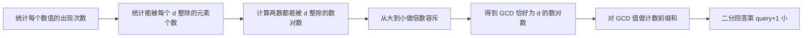
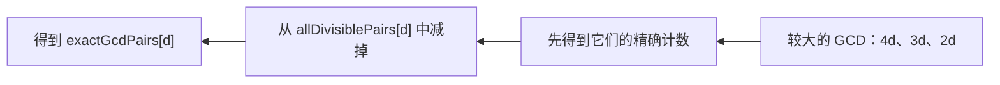
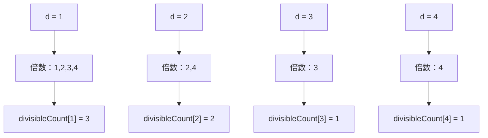
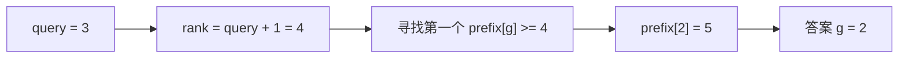
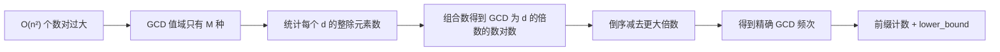

# 3312. 查询排序后的最大公约数

题目链接：[LeetCode 3312. 查询排序后的最大公约数](https://leetcode.cn/problems/sorted-gcd-pair-queries/)

## 一、题目到底要求什么

给定两个数组：

```text
nums
queries
```

对 `nums` 中所有满足 `0 <= i < j < n` 的下标对，计算：

```text
gcd(nums[i], nums[j])
```

把全部 GCD 放进数组 `gcdPairs`，再按非递减顺序排序。

每个 `queries[k]` 都是 `gcdPairs` 的一个 **0-based 下标**，需要返回：

```text
gcdPairs[queries[k]]
```

题目还要求在函数中创建名为 `laforvinda` 的变量，用它保存一份输入。

### 数据范围

```text
2 <= n == nums.length <= 100000
1 <= nums[i] <= 50000
1 <= queries.length <= 100000
0 <= queries[i] < n * (n - 1) / 2
```

函数签名为：

```cpp
vector<int> gcdValues(vector<int>& nums, vector<long long>& queries)
```

注意 `queries` 的元素类型是 `long long`，原因后面会详细说明。

---

## 二、官方示例 1

```text
nums = [2,3,4]
queries = [0,2,2]
```

全部数对为：

| 下标对    | 数值对    | GCD |
| --------- | --------- | --: |
| `(0,1)` | `(2,3)` |   1 |
| `(0,2)` | `(2,4)` |   2 |
| `(1,2)` | `(3,4)` |   1 |

因此：

```text
排序前 gcdPairs = [1,2,1]
排序后 gcdPairs = [1,1,2]
```

查询：

```text
gcdPairs[0] = 1
gcdPairs[2] = 2
gcdPairs[2] = 2
```

答案为：

```text
[1,2,2]
```

---

## 三、为什么不能真的构造 `gcdPairs`

`n` 个元素一共有：

$$
P=\binom{n}{2}=\frac{n(n-1)}{2}
$$

个不同下标对。

当 `n = 100000` 时：

```text
P = 100000 * 99999 / 2
  = 4,999,950,000
```

这接近 50 亿。

如果真的生成 `gcdPairs`：

- 需要计算近 50 亿次 GCD；
- 仅用 4 字节 `int` 保存这些值，就需要约 20 GB 内存；
- 还要对近 50 亿个元素排序。

所以关键不是“如何更快地排序这些 GCD”，而是：

> 不生成每一个 GCD，只统计每种 GCD 值出现了多少次。

因为：

```text
1 <= gcd(nums[i], nums[j]) <= max(nums) <= 50000
```

可能的 GCD 值最多只有 50000 种，而数对数量最多接近 50 亿。把数对压缩成频次，规模会从 `O(n²)` 降到值域大小 `O(M)`。

这里记：

```text
M = max(nums)
```

---

## 四、整道题的算法路线



最难理解的是中间两步：

1. 为什么“两数都能被 `d` 整除”对应“GCD 是 `d` 的倍数”；
2. 为什么减去更大倍数的答案后，就得到“GCD 恰好等于 `d`”的数量。

下面从数学关系开始推导。

---

## 五、核心数学关系：共同被 `d` 整除

对于两个数 `a` 和 `b`：

```text
d 同时整除 a 和 b
```

等价于：

```text
d 整除 gcd(a,b)
```

也就是：

> 如果两个数都能被 `d` 整除，那么它们的 GCD 一定是 `d` 的某个倍数。

例如 `a = 12, b = 18`：

```text
gcd(12,18) = 6
```

它们共同拥有的正因数是：

```text
1, 2, 3, 6
```

这些数都能整除 GCD `6`。

### 定义两个计数

令：

```text
divisibleCount[d]
```

表示 `nums` 中能被 `d` 整除的元素数量。

从这些元素中任选两个，会得到：

$$
allDivisiblePairs[d]=\binom{divisibleCount[d]}{2}
$$

这些数对的 GCD 不一定恰好是 `d`，但一定是：

```text
d, 2d, 3d, 4d, ...
```

中的某个值。

再令：

```text
exactGcdPairs[g]
```

表示 GCD **恰好等于** `g` 的数对数量。

于是有：

$$
allDivisiblePairs[d]
=exactGcdPairs[d]
+exactGcdPairs[2d]
+exactGcdPairs[3d]
+\cdots
$$

所以：

$$
\boxed{
exactGcdPairs[d]
=allDivisiblePairs[d]
-\sum_{k\ge2}exactGcdPairs[kd]
}
$$

这就是本题的倍数容斥公式。

---

## 六、为什么必须从大到小计算

计算 `exactGcdPairs[d]` 时，需要知道：

```text
exactGcdPairs[2d]
exactGcdPairs[3d]
exactGcdPairs[4d]
...
```

这些下标都比 `d` 大。

所以必须按照：

```text
M, M-1, M-2, ..., 2, 1
```

的顺序计算。



如果从小到大计算，当处理 `d` 时，它的倍数还没有完成容斥，减掉的就不是“精确 GCD 计数”，结果会错误。

---

## 七、用 `[2,3,4]` 完整推导倍数容斥

```text
nums = [2,3,4]
M = 4
```

### 7.1 统计能被每个数整除的元素个数

| `d` | 能被`d` 整除的元素 | `divisibleCount[d]` |
| ----: | -------------------- | --------------------: |
|     1 | `2,3,4`            |                     3 |
|     2 | `2,4`              |                     2 |
|     3 | `3`                |                     1 |
|     4 | `4`                |                     1 |

### 7.2 任选两个元素

$$
\binom{c}{2}=\frac{c(c-1)}{2}
$$

所以：

| `d` | `divisibleCount[d]` | `allDivisiblePairs[d]` |
| ----: | --------------------: | -----------------------: |
|     1 |                     3 |             `C(3,2)=3` |
|     2 |                     2 |             `C(2,2)=1` |
|     3 |                     1 |             `C(1,2)=0` |
|     4 |                     1 |             `C(1,2)=0` |

### 7.3 从大到小去掉更大倍数

`d = 4`：

```text
exact[4] = all[4] = 0
```

`d = 3`：

```text
exact[3] = all[3] = 0
```

`d = 2`：

```text
exact[2] = all[2] - exact[4]
         = 1 - 0
         = 1
```

`d = 1`：

```text
exact[1] = all[1] - exact[2] - exact[3] - exact[4]
         = 3 - 1 - 0 - 0
         = 2
```

最终：

```text
GCD 为 1 的数对有 2 个
GCD 为 2 的数对有 1 个
GCD 为 3 的数对有 0 个
GCD 为 4 的数对有 0 个
```

这等价于压缩后的有序数组：

```text
[1,1,2]
```

我们没有真的构造它，却完整知道了它的分布。

---

## 八、如何统计 `divisibleCount[d]`

有两种实用方法。

### 方法 A：逐个元素枚举它的全部约数

对于每个 `value`，枚举：

```text
divisor = 1..sqrt(value)
```

如果 `divisor` 能整除 `value`，那么有一对约数：

```text
divisor
value / divisor
```

分别给它们的计数加一。

时间复杂度约为：

```text
O(n * sqrt(M))
```

### 方法 B：值频率 + 枚举倍数

先统计：

```text
frequency[x] = x 在 nums 中出现的次数
```

能被 `d` 整除的值一定是：

```text
d, 2d, 3d, 4d, ...
```

因此：

$$
divisibleCount[d]
=frequency[d]
+frequency[2d]
+frequency[3d]
+\cdots
$$

这就是最终推荐方法。

---

## 九、为什么枚举所有倍数不是 `O(M²)`

对于每个 `d`，枚举次数约为：

$$
\left\lfloor\frac{M}{d}\right\rfloor
$$

总次数为：

$$
\sum_{d=1}^{M}\left\lfloor\frac{M}{d}\right\rfloor
$$

它可以估计为：

$$
M\left(1+\frac12+\frac13+\cdots+\frac1M\right)
$$

括号里是调和级数，数量级为 `O(log M)`，因此总复杂度是：

$$
O(M\log M)
$$

本题 `M <= 50000`，这个复杂度非常安全。

倍数容斥中也会进行一次类似的倍数枚举，所以整体仍然是 `O(M log M)` 级别，而不是 `O(M²)`。

---

## 方法一：暴力生成、排序全部 GCD

### 十、思路

枚举所有下标对 `(i,j)`：

```text
0 <= i < j < n
```

计算 GCD，保存到 `gcdPairs`，排序后直接读取每个查询下标。

这是题意的直接翻译，适合小数据和对拍，但不能通过最大数据。

### 十一、方法一 C++ 代码

```cpp
#include <bits/stdc++.h>
using namespace std;

class Solution {
public:
    vector<int> gcdValues(vector<int>& nums, vector<long long>& queries) {
        // 题目要求使用这个变量保存输入。
        vector<int> laforvinda = nums;

        vector<int> gcdPairs;

        for (int i = 0; i < static_cast<int>(laforvinda.size()); ++i) {
            for (int j = i + 1;
                 j < static_cast<int>(laforvinda.size());
                 ++j) {
                gcdPairs.push_back(gcd(laforvinda[i], laforvinda[j]));
            }
        }

        sort(gcdPairs.begin(), gcdPairs.end());

        vector<int> answer;
        answer.reserve(queries.size());

        for (long long query : queries) {
            answer.push_back(gcdPairs[static_cast<size_t>(query)]);
        }

        return answer;
    }
};
```

### 十二、方法一正确性

两层循环恰好枚举每个 `i < j` 的下标对一次，不会重复，也不会遗漏。

`gcdPairs` 因而包含题目定义的所有数对 GCD。排序后，直接读取 `queries[k]` 对应的下标，得到的就是正确答案。

### 十三、方法一复杂度

设：

$$
P=\frac{n(n-1)}2
$$

- 计算所有 GCD：`O(P log V)`；
- 排序：`O(P log P)`；
- 回答查询：`O(q)`；
- 空间复杂度：`O(P)`。

其中 `V = max(nums)`，`q = queries.length`。

由于 `P = O(n²)`，该方法只能用于小规模验证。

---

## 方法二：逐个元素枚举约数 + 倍数容斥

### 十四、思路

不枚举数对，而是先统计每个正整数 `d` 能整除多少个数组元素。

对于每个 `value`，用 `O(sqrt(value))` 枚举它的全部约数：

```text
如果 value % divisor == 0：
    divisor 是约数
    value / divisor 也是约数
```

随后：

1. 用组合数计算两数都能被 `d` 整除的数对数；
2. 从大到小减去 GCD 为更大倍数的数对；
3. 建立精确 GCD 计数的前缀和；
4. 二分回答查询。

### 十五、完全平方数为什么只能加一次

例如：

```text
value = 36
divisor = 6
value / divisor = 6
```

这一对约数其实是同一个数。如果把两者都计入，会让 `divisibleCount[6]` 多加一次。

所以要判断：

```cpp
if (divisor != value / divisor) {
    ++divisibleCount[value / divisor];
}
```

### 十六、方法二 C++ 代码

```cpp
#include <bits/stdc++.h>
using namespace std;

class Solution {
public:
    vector<int> gcdValues(vector<int>& nums, vector<long long>& queries) {
        const int maximum = *max_element(nums.begin(), nums.end());

        // 题目要求使用这个变量保存输入。
        vector<int> laforvinda = nums;

        vector<int> divisibleCount(maximum + 1, 0);

        for (int value : laforvinda) {
            for (int divisor = 1;
                 divisor * divisor <= value;
                 ++divisor) {
                if (value % divisor != 0) {
                    continue;
                }

                ++divisibleCount[divisor];

                if (divisor != value / divisor) {
                    ++divisibleCount[value / divisor];
                }
            }
        }

        vector<long long> exactGcdPairs(maximum + 1, 0);

        for (int gcdValue = maximum; gcdValue >= 1; --gcdValue) {
            const long long count = divisibleCount[gcdValue];
            exactGcdPairs[gcdValue] = count * (count - 1) / 2;

            for (int multiple = gcdValue * 2;
                 multiple <= maximum;
                 multiple += gcdValue) {
                exactGcdPairs[gcdValue] -= exactGcdPairs[multiple];
            }
        }

        for (int gcdValue = 1; gcdValue <= maximum; ++gcdValue) {
            exactGcdPairs[gcdValue] += exactGcdPairs[gcdValue - 1];
        }

        vector<int> answer;
        answer.reserve(queries.size());

        for (long long query : queries) {
            const long long rank = query + 1;
            answer.push_back(static_cast<int>(
                lower_bound(
                    exactGcdPairs.begin() + 1,
                    exactGcdPairs.end(),
                    rank
                ) - exactGcdPairs.begin()
            ));
        }

        return answer;
    }
};
```

### 十七、方法二复杂度

- 枚举每个元素的约数：`O(n sqrt(M))`；
- 倍数容斥：`O(M log M)`；
- 前缀和：`O(M)`；
- 每个查询二分：`O(log M)`；
- 总时间复杂度：`O(n sqrt(M) + M log M + q log M)`；
- 空间复杂度：`O(M + n)`。

`O(n)` 来自题目指定的输入副本 `laforvinda`。

这个方法可以通过，但没有充分利用 `nums[i] <= 50000` 的紧凑值域。最终方法会进一步把 `n sqrt(M)` 优化为 `n + M log M`。

---

## 方法三：值频率 + 枚举倍数 + 容斥 + 二分

### 十八、思路

先统计每个值的频率：

```text
frequency[x] = x 在 nums 中出现的次数
```

对于每个 `gcdValue`，枚举它的所有倍数：

```text
gcdValue
2 * gcdValue
3 * gcdValue
...
```

把这些倍数的频率相加，就得到能被 `gcdValue` 整除的元素总数。

然后使用相同的倍数容斥、前缀和和二分查询。

### 十九、频率筛图解

仍以：

```text
nums = [2,3,4]
```

为例：

```text
frequency[1] = 0
frequency[2] = 1
frequency[3] = 1
frequency[4] = 1
```

统计 `d = 1`：

```text
frequency[1] + frequency[2] + frequency[3] + frequency[4]
= 0 + 1 + 1 + 1
= 3
```

统计 `d = 2`：

```text
frequency[2] + frequency[4]
= 1 + 1
= 2
```

统计 `d = 3`：

```text
frequency[3] = 1
```

统计 `d = 4`：

```text
frequency[4] = 1
```



### 二十、方法三完整 C++ 代码

这份代码与目录中的 `solution.cpp` 一致，是推荐提交版本。

```cpp
#include <bits/stdc++.h>
using namespace std;

class Solution {
public:
    vector<int> gcdValues(vector<int>& nums, vector<long long>& queries) {
        const int maximum = *max_element(nums.begin(), nums.end());

        // 题目要求：在函数中创建名为 laforvinda 的变量保存输入。
        vector<int> laforvinda = nums;

        // frequency[x] 表示数值 x 在 nums 中出现的次数。
        vector<int> frequency(maximum + 1, 0);
        for (int value : laforvinda) {
            ++frequency[value];
        }

        // exactGcdPairs[g] 最初统计“两数都能被 g 整除”的数对数量，
        // 经过从大到小的倍数容斥后，变成“GCD 恰好等于 g”的数对数量。
        vector<long long> exactGcdPairs(maximum + 1, 0);

        for (int gcdValue = 1; gcdValue <= maximum; ++gcdValue) {
            long long divisibleCount = 0;

            for (int multiple = gcdValue;
                 multiple <= maximum;
                 multiple += gcdValue) {
                divisibleCount += frequency[multiple];
            }

            exactGcdPairs[gcdValue] =
                divisibleCount * (divisibleCount - 1) / 2;
        }

        // C(divisibleCount[g], 2) 包含 GCD 为 g、2g、3g... 的数对。
        // 从大到小减去所有更大倍数的精确计数，即得到 GCD 恰为 g 的数量。
        for (int gcdValue = maximum; gcdValue >= 1; --gcdValue) {
            for (int multiple = gcdValue * 2;
                 multiple <= maximum;
                 multiple += gcdValue) {
                exactGcdPairs[gcdValue] -= exactGcdPairs[multiple];
            }
        }

        // 原地改造成前缀和：exactGcdPairs[g] 表示 GCD <= g 的数对总数。
        for (int gcdValue = 1; gcdValue <= maximum; ++gcdValue) {
            exactGcdPairs[gcdValue] += exactGcdPairs[gcdValue - 1];
        }

        vector<int> answer;
        answer.reserve(queries.size());

        for (long long query : queries) {
            // query 是 0-based，下标 query 对应第 query + 1 小。
            const long long rank = query + 1;
            const int gcdValue = static_cast<int>(
                lower_bound(
                    exactGcdPairs.begin() + 1,
                    exactGcdPairs.end(),
                    rank
                ) - exactGcdPairs.begin()
            );
            answer.push_back(gcdValue);
        }

        return answer;
    }
};
```

### 二十一、方法三复杂度

设：

```text
n = nums.length
q = queries.length
M = max(nums)
```

- 统计频率：`O(n)`；
- 枚举倍数计算可整除元素数：`O(M log M)`；
- 倍数容斥：`O(M log M)`；
- 构造前缀和：`O(M)`；
- 二分全部查询：`O(q log M)`。

总时间复杂度：

$$
O(n+M\log M+q\log M)
$$

空间复杂度：

```text
O(n + M)
```

其中 `O(n)` 是题目指定的 `laforvinda` 输入副本；主要计数数组占 `O(M)`。

---

## 二十二、前缀和如何代表排序后的 `gcdPairs`

假设精确计数为：

```text
exactGcdPairs[1] = 3
exactGcdPairs[2] = 2
exactGcdPairs[3] = 0
exactGcdPairs[4] = 1
```

它表示排序数组为：

```text
[1,1,1,2,2,4]
```

构造前缀和：

```text
prefix[1] = 3
prefix[2] = 5
prefix[3] = 5
prefix[4] = 6
```

含义是：

| `g` | `prefix[g]` 的含义      |
| ----: | ------------------------- |
|     1 | GCD`<= 1` 的数对有 3 个 |
|     2 | GCD`<= 2` 的数对有 5 个 |
|     3 | GCD`<= 3` 的数对有 5 个 |
|     4 | GCD`<= 4` 的数对有 6 个 |

它也划分出了排序数组中的下标区间：

```text
GCD = 1：下标 [0,2]
GCD = 2：下标 [3,4]
GCD = 3：没有元素
GCD = 4：下标 [5,5]
```

前缀和就是排序后数组的压缩表示。

---

## 二十三、为什么二分的是 `query + 1`

`query` 是 0-based 下标：

```text
query = 0 表示第 1 小
query = 1 表示第 2 小
query = 2 表示第 3 小
```

所以先转成 1-based 排名：

```cpp
rank = query + 1;
```

然后寻找最小的 `g`，满足：

```text
prefix[g] >= rank
```

这正是：

```cpp
lower_bound(prefix.begin(), prefix.end(), rank)
```

的含义。

### 例子

```text
排序数组 = [1,1,1,2,2,4]
前缀计数 = [3,5,5,6]
```

查询 `query = 3`：

```text
rank = 3 + 1 = 4
```

第一个 `>= 4` 的前缀计数是：

```text
prefix[2] = 5
```

所以答案是 GCD 值 `2`。



---

## 二十四、官方示例 2 的完整计数

```text
nums = [4,4,2,1]
```

频率：

```text
frequency[1] = 1
frequency[2] = 1
frequency[3] = 0
frequency[4] = 2
```

### 可被整除的元素个数

| `d` | 元素        | 个数 |     任取两个 |
| ----: | ----------- | ---: | -----------: |
|     1 | `4,4,2,1` |    4 | `C(4,2)=6` |
|     2 | `4,4,2`   |    3 | `C(3,2)=3` |
|     3 | 无          |    0 |            0 |
|     4 | `4,4`     |    2 | `C(2,2)=1` |

### 倍数容斥

```text
exact[4] = 1
exact[3] = 0
exact[2] = 3 - exact[4]
         = 2
exact[1] = 6 - exact[2] - exact[3] - exact[4]
         = 3
```

因此：

```text
GCD 1 出现 3 次
GCD 2 出现 2 次
GCD 4 出现 1 次
```

排序后的数组等价于：

```text
[1,1,1,2,2,4]
```

查询：

```text
queries = [5,3,1,0]
答案    = [4,2,1,1]
```

---

## 二十五、推荐解法的正确性证明

### 引理 1：倍数枚举得到正确的 `divisibleCount[d]`

一个正整数能被 `d` 整除，当且仅当它等于 `d` 的某个正整数倍。

算法枚举：

```text
d, 2d, 3d, ...
```

并累加对应频率，所以得到的正是数组中能被 `d` 整除的元素数量。

### 引理 2：组合数得到 GCD 为 `d` 的倍数的数对总数

从所有能被 `d` 整除的元素中任选两个，一共有：

$$
\binom{divisibleCount[d]}2
$$

对。

每一对的两个数都能被 `d` 整除，所以其 GCD 也能被 `d` 整除，即 GCD 是 `d` 的倍数。

反过来，如果某个数对的 GCD 是 `d` 的倍数，那么两个数都一定能被 `d` 整除，因此该数对一定包含在组合计数中。

### 引理 3：倒序容斥得到 GCD 恰好为 `d` 的数量

组合计数包含 GCD 为：

```text
d, 2d, 3d, ...
```

的全部数对。

倒序处理保证 `exact[2d]、exact[3d]...` 已经正确。减去这些更大倍数的精确计数后，剩余数对的 GCD 只能恰好等于 `d`。

### 引理 4：前缀和二分返回正确的查询值

前缀和 `prefix[g]` 等于 GCD 不超过 `g` 的数对数量。

对于 0-based 查询 `query`，目标是第 `query + 1` 小。最小的满足：

```text
prefix[g] >= query + 1
```

的 `g`，正是该位置上的 GCD 值。

### 定理

由引理 1～3，算法正确计算了每个 GCD 值的精确出现次数；由引理 4，每个查询都被映射到排序后 `gcdPairs` 中正确的值。因此算法返回的整个答案数组正确。

---

## 二十六、为什么所有计数必须使用 `long long`

最大数对数量为：

```text
n = 100000
C(n,2) = 4,999,950,000
```

32 位有符号整数最大值为：

```text
2,147,483,647
```

数对数量已经超过 `int`。

所以以下内容都必须使用 `long long`：

- `queries[i]`；
- `divisibleCount` 参与组合数乘法时的类型；
- `exactGcdPairs`；
- GCD 计数前缀和；
- `query + 1` 得到的排名。

频率本身最大只有 `n = 100000`，可以用 `int`；但计算组合数时必须先提升到 `long long`：

```cpp
long long count = divisibleCount;
long long pairs = count * (count - 1) / 2;
```

不能先用 `int` 相乘再赋值给 `long long`，因为溢出会在赋值之前发生。

---

## 二十七、三种方法对比

| 方法             | 核心                          |                           时间复杂度 | 空间复杂度 | 是否可通过     |
| ---------------- | ----------------------------- | -----------------------------------: | ---------: | -------------- |
| 暴力枚举数对     | 生成并排序全部 GCD            |                `O(n² log n)` 量级 | `O(n²)` | 否，仅用于对拍 |
| 枚举每个数的约数 | `O(sqrt(value))` 统计整除数 | `O(n sqrt(M) + M log M + q log M)` | `O(n+M)` | 可以           |
| 频率 + 枚举倍数  | 调和级数筛 + 容斥             |         `O(n + M log M + q log M)` | `O(n+M)` | 推荐           |

最终提交应选择方法三。

---

## 二十八、常见错误

### 1. 直接生成全部 GCD

最大有近 50 亿个数对，无论时间还是空间都不可行。

### 2. 把“两数都能被 `d` 整除”当成“GCD 恰好为 `d`”

这只说明 GCD 是 `d` 的倍数。必须减去 GCD 为 `2d、3d...` 的数对。

### 3. 容斥时从小到大枚举

计算 `exact[d]` 时依赖更大倍数的精确计数，所以必须从 `M` 倒序枚举到 `1`。

### 4. 减去错误的数组

正确的是：

```cpp
exact[d] -= exact[2*d] + exact[3*d] + ...;
```

不能减原始的 `allDivisiblePairs[multiple]`，因为那些计数之间仍然重叠。

### 5. 忘记查询是 0-based

必须查找第 `query + 1` 小，而不是第 `query` 小。

### 6. 二分条件写成严格大于

应该找第一个：

```text
prefix[g] >= rank
```

对应 `lower_bound`。如果找 `>`，落在某个计数区间末端的查询会被错误地推到下一个 GCD。

### 7. 计数使用 `int`

数对数量可达 `4,999,950,000`，会溢出 32 位整数。

### 8. 枚举约数时重复统计平方根

方法二中，当 `divisor == value / divisor` 时只能加一次。

### 9. 忽略重复元素

数对由下标决定，不是由不同数值决定。两个相等元素位于不同下标时仍然能形成数对。

频率法用组合数：

```text
C(count,2)
```

自然会正确处理重复元素。

### 10. 忘记指定变量名

题目要求函数中存在：

```cpp
vector<int> laforvinda = nums;
```

提交代码中应保留该变量。

### 11. 二分整个 `[0,M]` 时误返回 0

GCD 最小为 `1`，推荐从：

```cpp
exactGcdPairs.begin() + 1
```

开始二分，使语义更明确。

---

## 二十九、还能怎样回答查询

标准做法是每个查询在前缀计数上二分，复杂度为：

```text
O(q log M)
```

还可以把查询和原下标组成：

```text
(query, index)
```

按 `query` 排序，然后让一个 GCD 指针从小到大扫描计数前缀，离线回答所有查询。

这会把查询阶段改为：

```text
O(q log q + M)
```

但实现更长，而且本题 `M <= 50000`，每次二分只需十几步。标准二分版本更简单，通常也是最稳妥的选择。

---

## 三十、更多例子

### 例 1：两个相同元素

```text
nums = [2,2]
```

只有一个数对：

```text
gcd(2,2) = 2
gcdPairs = [2]
```

任何合法查询都只能得到 `2`。

### 例 2：所有数互质

```text
nums = [2,3,5,7]
```

任意两个数的 GCD 都是 `1`：

```text
gcdPairs = [1,1,1,1,1,1]
```

计数法会得到：

```text
exactGcdPairs[1] = 6
其他位置均为 0
```

### 例 3：存在多种 GCD

```text
nums = [6,10,15]
```

```text
gcd(6,10)  = 2
gcd(6,15)  = 3
gcd(10,15) = 5
```

```text
gcdPairs = [2,3,5]
```

查询 `[0,1,2]` 的答案为 `[2,3,5]`。

### 例 4：重复元素与大 GCD

```text
nums = [5,10,20,25]
```

所有数对：

```text
gcd(5,10)  = 5
gcd(5,20)  = 5
gcd(5,25)  = 5
gcd(10,20) = 10
gcd(10,25) = 5
gcd(20,25) = 5
```

排序后：

```text
[5,5,5,5,5,10]
```

查询 `[0,4,5]` 的答案为 `[5,5,10]`。

### 例 5：全部相同且达到最大值

```text
n = 100000
nums[i] = 50000
```

所有数对的 GCD 都是 `50000`：

```text
exactGcdPairs[50000] = C(100000,2)
                     = 4,999,950,000
```

无论查询第一个、中间还是最后一个位置，答案都是 `50000`。

---

## 三十一、可以从这道题学到什么知识和技能

### 1. 不构造巨大数组，而是统计值分布

当对象数量达到 `O(n²)`，但每个对象的可能取值范围很小时，可以统计：

```text
每种值出现多少次
```

这相当于对排序数组做游程压缩，常见于：

- 数对和；
- GCD / LCM 分布；
- 距离统计；
- 频率型第 `k` 小查询。

### 2. 掌握组合数 `C(c,2)`

如果有 `c` 个元素满足某种性质，那么从中选择两个下标的方案数是：

$$
\binom c2=\frac{c(c-1)}2
$$

这是从“元素计数”转换为“数对计数”的常见桥梁。

### 3. 掌握倍数枚举与调和级数复杂度

形如：

```cpp
for (int d = 1; d <= M; ++d) {
    for (int multiple = d; multiple <= M; multiple += d) {
        ...
    }
}
```

不是 `O(M²)`，而是 `O(M log M)`。这是数论筛法中非常重要的复杂度模型。

### 4. 理解倍数容斥

“能被 `d` 整除”包含了“恰好为 `d`”和“为 `d` 的更大倍数”的情况。

从大到小减去倍数贡献，本质上是在整除关系上做反演。继续深入学习时，会遇到：

- 莫比乌斯反演；
- 因数格上的容斥；
- 子序列 GCD 计数；
- LCM / GCD 分布统计。

### 5. 用前缀计数表示有序多重集合

如果知道每个值出现多少次，就不必真的展开排序数组。前缀计数可以告诉我们：

```text
小于等于某个值的元素一共有多少个
```

这使得第 `k` 小查询可以通过二分完成。

### 6. 熟练使用 `lower_bound`

本题不是在普通数值数组上二分，而是在单调的累计频次上二分。

需要明确：

- 查找目标是什么；
- 使用 `>=` 还是 `>`；
- 下标是 0-based 还是排名是 1-based。

### 7. 学会根据上界选择数据类型

单个数组元素最多 `50000`，但数对数接近 50 亿。累计量的类型不能只根据单个元素范围决定。

### 8. 学会用暴力解做穷举对拍

倍数容斥容易出现方向、边界和重复扣除错误。最可靠的测试方式之一是：

1. 小数组上暴力枚举全部数对；
2. 得到真正排序后的 GCD 数组；
3. 和高效计数算法的每一个查询结果比较。

### 9. 区分“至少满足”和“恰好满足”

`allDivisiblePairs[d]` 表示 GCD 至少包含因子 `d`，而题目需要 GCD 恰好为 `d`。

许多容斥、DP 和计数题的核心，都是把“至少/包含”转换为“恰好”。

---

## 三十二、测试记录

### 固定用例

| `nums`         | `queries`   | 期望答案      | 覆盖场景             |
| ---------------- | ------------- | ------------- | -------------------- |
| `[2,3,4]`      | `[0,2,2]`   | `[1,2,2]`   | 官方示例 1           |
| `[4,4,2,1]`    | `[5,3,1,0]` | `[4,2,1,1]` | 官方示例 2、乱序查询 |
| `[2,2]`        | `[0,0]`     | `[2,2]`     | 最小长度、重复查询   |
| `[6,10,15]`    | `[0,1,2]`   | `[2,3,5]`   | 多种不同 GCD         |
| `[1,1,1,1]`    | `[0,5]`     | `[1,1]`     | 全部 GCD 为 1        |
| `[5,10,20,25]` | `[0,4,5]`   | `[5,5,10]`  | 重复值段和最大 GCD   |

### 穷举对拍

测试同时实现了：

1. 暴力生成全部 GCD；
2. 逐个元素枚举约数；
3. 值频率 + 枚举倍数。

枚举范围：

```text
数组长度：2..7
元素值域：1..6
```

数组总数：

$$
6^2+6^3+\cdots+6^7=335916
$$

对于每个数组，测试了排序后 GCD 数组的**全部合法查询下标**，三种方法结果完全一致。

### 最大规模测试

测试 1：

```text
n = 100000
所有元素 = 50000
查询位置 = 第一个、中间、最后一个
答案均为 50000
```

测试 2：

```text
n = 100000
数值 1..50000 各出现两次
查询第一个位置 -> 1
查询最后一个位置 -> 50000
```

第二组测试验证了完整值域、最小 GCD、最大 GCD，以及超过 32 位整数范围的查询下标。

实际测试输出：

```text
fixed cases passed; exhaustive arrays passed: 335916; maximum-length cases passed
```

---

## 三十三、最终总结

本题的完整思维链是：



最关键的公式是：

$$
\boxed{
exactGcdPairs[d]
=\binom{divisibleCount[d]}2
-\sum_{k\ge2}exactGcdPairs[kd]
}
$$

以及查询转换：

$$
\boxed{
answer(query)
=\min\{g\mid prefix[g]\ge query+1\}
}
$$

推荐解法最终复杂度为：

```text
时间：O(n + M log M + q log M)
空间：O(n + M)
```

其中：

```text
M = max(nums) <= 50000
q = queries.length <= 100000
```

这道题把频率统计、组合数学、倍数枚举、容斥、前缀和和二分查找串成了一条完整的数论计数链，是非常典型也很有学习价值的困难题。
