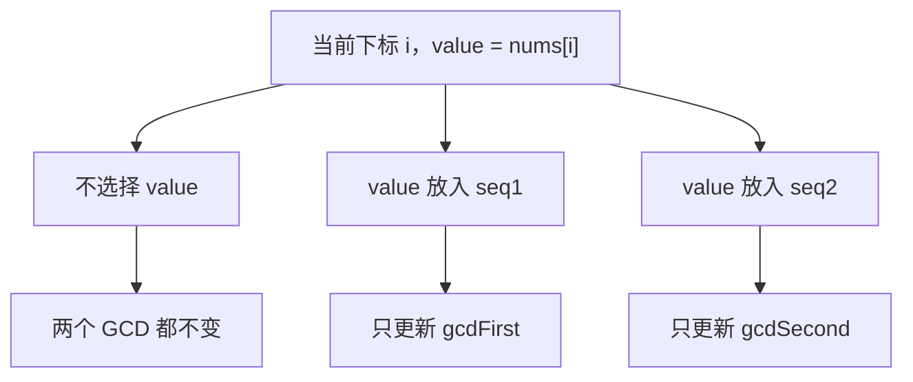
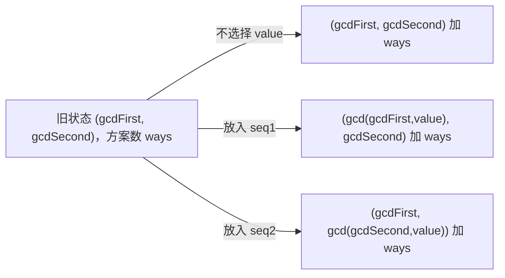
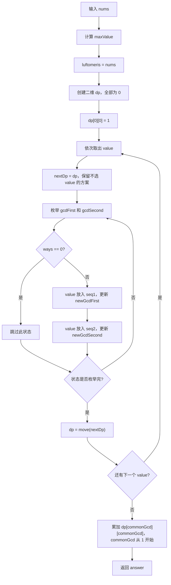

# 3336. 最大公约数相等的子序列数量

题目链接：[LeetCode 3336. 最大公约数相等的子序列数量](https://leetcode.cn/problems/find-the-number-of-subsequences-with-equal-gcd/)

## 一、题目在说什么

给定一个正整数数组 `nums`，需要统计有多少个有序子序列对：

```text
(seq1, seq2)
```

同时满足：

1. `seq1` 非空。
2. `seq2` 非空。
3. 两个子序列下标不相交，即同一个数组下标不能同时属于两个子序列。
4. `gcd(seq1) == gcd(seq2)`。

答案很大，需要对：

```text
10^9 + 7
```

取模。

题目约束：

```text
1 <= nums.length <= 200
1 <= nums[i] <= 200
```

---

## 二、先弄清楚“子序列对”到底怎样计数

### 2.1 子序列不要求连续

子序列只要求保留原数组中的相对顺序。

例如：

```text
nums = [2, 4, 6]
```

下面都是子序列：

```text
[2]
[4]
[6]
[2, 4]
[2, 6]
[4, 6]
[2, 4, 6]
```

其中 `[2, 6]` 虽然不连续，但仍是合法子序列。

### 2.2 不相交说的是“下标”不相交

例如：

```text
nums = [1, 1]
下标 =  0  1
```

可以让：

```text
seq1 使用下标 0
seq2 使用下标 1
```

也可以反过来：

```text
seq1 使用下标 1
seq2 使用下标 0
```

虽然得到的值都写成 `([1], [1])`，但使用的原数组下标不同，因此是两种不同方案。

### 2.3 `(seq1, seq2)` 是有序对

一般情况下：

```text
(seq1, seq2)
```

与：

```text
(seq2, seq1)
```

是两种不同方案。

例如 `nums = [10, 20, 30]`：

```text
seq1 = [10]，seq2 = [20, 30]
```

和：

```text
seq1 = [20, 30]，seq2 = [10]
```

都会被统计。

---

## 三、每个数组下标恰好有三种选择

处理 `nums[i]` 时，这个下标只有三种互斥归属：

```text
选择 0：不放入任何子序列
选择 1：放入第一个子序列 seq1
选择 2：放入第二个子序列 seq2
```

图解：



因为每个下标只有这三种选择，所以长度为 `n` 的数组一共有：

```text
3^n
```

种下标分配方式。

当 `n = 200` 时，直接枚举 `3^200` 完全不可行，因此需要动态规划把具有相同 GCD 结果的分配方式合并起来计数。

---

## 四、为什么 GCD 可以作为动态规划状态

假设一个子序列当前的 GCD 是 `g`，现在加入新元素 `value`，新的 GCD 一定是：

```cpp
gcd(g, value)
```

我们不需要记住子序列中具体选了哪些数，只要知道当前 GCD，就足以计算加入下一个数后的 GCD。

例如：

```text
当前子序列 = [12, 18]
当前 GCD = gcd(12, 18) = 6

加入 value = 15
新 GCD = gcd(6, 15) = 3
```

这说明“当前 GCD”包含了继续转移所需的全部信息，满足动态规划状态的要求。

---

## 五、关键技巧：用 GCD 为 0 表示空子序列

数学和 C++ 的 `std::gcd` 都满足：

```text
gcd(0, x) = x
```

因此可以约定：

```text
gcdFirst = 0  -> seq1 还是空的
gcdSecond = 0 -> seq2 还是空的
```

第一次把 `value` 放入空的 `seq1` 时：

```text
newGcdFirst = gcd(0, value) = value
```

不需要额外写“如果子序列为空”的分支。

例如：

```text
旧状态 = (gcdFirst, gcdSecond) = (0, 0)
value = 6
```

把 `6` 放入第一个子序列：

```text
newGcdFirst = gcd(0, 6) = 6
新状态 = (6, 0)
```

把 `6` 放入第二个子序列：

```text
newGcdSecond = gcd(0, 6) = 6
新状态 = (0, 6)
```

---

## 六、动态规划状态定义

代码中定义：

```cpp
dp[gcdFirst][gcdSecond]
```

准确含义是：

```text
已经处理完当前数组前缀后，
第一个子序列的 GCD 为 gcdFirst，
第二个子序列的 GCD 为 gcdSecond，
并且两个子序列使用的下标不相交，
一共有多少种下标分配方案。
```

两个维度的顺序不能交换：

```text
dp[2][3]
```

表示 `seq1` 的 GCD 是 `2`、`seq2` 的 GCD 是 `3`；而：

```text
dp[3][2]
```

表示 `seq1` 的 GCD 是 `3`、`seq2` 的 GCD 是 `2`。

这两个状态对应有序子序列对的两个不同方向。

---

## 七、为什么状态范围只需要 `0..maxValue`

代码先计算：

```cpp
const int maxValue = *max_element(nums.begin(), nums.end());
```

任意正整数集合的 GCD 都不会大于集合中的任何元素，所以也不会大于数组最大值 `maxValue`。

再加上代表空子序列的 `0`，每个 GCD 维度只需要：

```text
0, 1, 2, ..., maxValue
```

因此二维表大小是：

```text
(maxValue + 1) × (maxValue + 1)
```

题目中 `maxValue <= 200`，所以最多为：

```text
201 × 201 = 40401 个状态
```

这是可以接受的。

---

## 八、初始状态为什么是 `dp[0][0] = 1`

还没有处理任何元素时：

```text
seq1 = []
seq2 = []
```

两个子序列都为空，所以状态是：

```text
(gcdFirst, gcdSecond) = (0, 0)
```

这种“什么都还没选”的构造方式只有一种：

```cpp
dp[0][0] = 1;
```

注意：这只是 DP 的起点，不代表最终答案允许空子序列。最终只统计 `g >= 1` 的 `dp[g][g]`，自然排除空序列。

---

## 九、三种状态转移

设当前正在处理：

```text
value
```

旧状态为：

```text
(gcdFirst, gcdSecond)
```

到达旧状态的方案数为：

```text
ways = dp[gcdFirst][gcdSecond]
```

### 9.1 不选择当前 `value`

两个 GCD 都不变：

```text
(gcdFirst, gcdSecond)
```

代码通过复制整个数组完成：

```cpp
vector<vector<int>> nextDp = dp;
```

复制后的 `nextDp` 已经包含所有“不选当前元素”的方案。

### 9.2 把 `value` 放入第一个子序列

```cpp
const int newGcdFirst = gcd(gcdFirst, value);
```

新状态：

```text
(newGcdFirst, gcdSecond)
```

方案数增加 `ways`：

```cpp
nextDp[newGcdFirst][gcdSecond] += ways;
```

### 9.3 把 `value` 放入第二个子序列

```cpp
const int newGcdSecond = gcd(gcdSecond, value);
```

新状态：

```text
(gcdFirst, newGcdSecond)
```

方案数增加 `ways`：

```cpp
nextDp[gcdFirst][newGcdSecond] += ways;
```

### 9.4 状态转移图



---

## 十、为什么必须使用 `dp` 和 `nextDp` 两张表

当前下标只能使用一次，所以本轮转移必须：

```text
只读取旧 dp
只写入新 nextDp
```

如果直接原地修改 `dp`，刚生成的新状态可能在同一轮再次被遍历，导致同一个数组下标被使用两次。

最小反例：

```text
nums = [1]
初始 dp[0][0] = 1
```

如果原地更新：

1. 从 `(0,0)` 把下标 `0` 放入 `seq1`，得到 `(1,0)`。
2. 后面循环又遇到本轮刚产生的 `(1,0)`。
3. 再把同一个下标 `0` 放入 `seq2`，错误得到 `(1,1)`。

这等于同一个 `nums[0]` 同时出现在两个子序列中，违反不相交要求。

正确做法：

```cpp
vector<vector<int>> nextDp = dp;
```

并且始终让：

```text
ways 来自 dp
所有新增方案写入 nextDp
```

本轮结束后再执行：

```cpp
dp = move(nextDp);
```

---

## 十一、最终为什么只统计主对角线

二维表中：

```text
dp[gcdFirst][gcdSecond]
```

只有满足：

```text
gcdFirst == gcdSecond
```

的状态才符合题目要求。

它们正好位于二维表的主对角线上：

```text
              gcdSecond
             0   1   2   3
gcdFirst  0 [X]  .   .   .
          1  .  [X]  .   .
          2  .   .  [X]  .
          3  .   .   .  [X]
```

但 `dp[0][0]` 表示两个子序列都为空，不能统计。

所以代码从 `1` 开始：

```cpp
for (int commonGcd = 1; commonGcd <= maxValue; ++commonGcd) {
    answer += dp[commonGcd][commonGcd];
}
```

---

## 十二、代码变量一览

| 变量 | 类型 | 与代码完全一致的含义 |
|---|---|---|
| `nums` | `vector<int>&` | 题目输入数组 |
| `MOD` | `int` | 模数 `1,000,000,007` |
| `maxValue` | `int` | `nums` 中最大元素，决定 DP 边长 |
| `luftomeris` | `vector<int>` | 按题面额外要求保存的输入副本 |
| `dp` | `vector<vector<int>>` | 处理当前前缀之前或上一轮结束后的 GCD 状态计数 |
| `nextDp` | `vector<vector<int>>` | 处理当前 `value` 后的新状态计数 |
| `value` | `int` | 当前正在处理的数组元素 |
| `gcdFirst` | `int` | 旧状态中第一个子序列的 GCD |
| `gcdSecond` | `int` | 旧状态中第二个子序列的 GCD |
| `ways` | `int` | 到达旧状态的方案数量 |
| `newGcdFirst` | `int` | 把 `value` 加入 `seq1` 后的新 GCD |
| `newGcdSecond` | `int` | 把 `value` 加入 `seq2` 后的新 GCD |
| `commonGcd` | `int` | 最终枚举的共同正 GCD |
| `answer` | `int` | 所有合法有序子序列对的数量 |

---

## 十三、完整算法流程



---

## 十四、例子 1：`nums = [1, 1]`

这是理解“下标不同”和“有序对”的最小例子。

### 14.1 初始化

```text
maxValue = 1
luftomeris = [1, 1]

dp[0][0] = 1
其他状态 = 0
```

矩阵中行是 `gcdFirst`，列是 `gcdSecond`：

```text
处理 0 个元素：

              gcdSecond
               0   1
gcdFirst  0    1   0
          1    0   0
```

### 14.2 处理第一个 `value = 1`

旧状态只有：

```text
(gcdFirst, gcdSecond) = (0, 0)
ways = dp[0][0] = 1
```

三种选择：

| 选择 | 新状态 | 计算 | 增加方案数 |
|---|---|---|---:|
| 不选择 | `(0,0)` | GCD 都不变 | 1 |
| 放入 `seq1` | `(1,0)` | `newGcdFirst = gcd(0,1) = 1` | 1 |
| 放入 `seq2` | `(0,1)` | `newGcdSecond = gcd(0,1) = 1` | 1 |

第一轮结束：

```text
dp[0][0] = 1
dp[0][1] = 1
dp[1][0] = 1
```

矩阵：

```text
              gcdSecond
               0   1
gcdFirst  0    1   1
          1    1   0
```

此时 `dp[1][1] = 0`，因为只有一个下标，不可能让两个不相交的非空子序列同时得到 GCD `1`。

### 14.3 处理第二个 `value = 1`

开始时：

```text
nextDp = dp
```

所以“不选第二个 1”的方案已经被复制。

逐个旧状态转移：

#### 旧状态 `(0,0)`，`ways = 1`

```text
放入 seq1 -> (1,0) 增加 1
放入 seq2 -> (0,1) 增加 1
```

#### 旧状态 `(0,1)`，`ways = 1`

```text
放入 seq1 -> (1,1) 增加 1
放入 seq2 -> (0,1) 增加 1
```

#### 旧状态 `(1,0)`，`ways = 1`

```text
放入 seq1 -> (1,0) 增加 1
放入 seq2 -> (1,1) 增加 1
```

汇总后：

```text
dp[0][0] = 1
dp[0][1] = 3
dp[1][0] = 3
dp[1][1] = 2
```

矩阵：

```text
              gcdSecond
               0   1
gcdFirst  0    1   3
          1    3   2
```

最终只统计正数主对角线：

```text
answer = dp[1][1] = 2
```

两种方案分别是：

```text
方案 1：下标 0 放 seq1，下标 1 放 seq2
方案 2：下标 1 放 seq1，下标 0 放 seq2
```

---

## 十五、例子 2：`nums = [2, 4, 6]`

### 15.1 初始化变量

```text
maxValue = 6
luftomeris = [2, 4, 6]
dp[0][0] = 1
```

为了避免画出 `7 × 7` 的大量零，本例只列出非零状态。

状态记法：

```text
(gcdFirst, gcdSecond) -> ways
```

### 15.2 处理 `value = 2`

```text
(0,0) -> 1   两个子序列都空
(2,0) -> 1   2 放入 seq1
(0,2) -> 1   2 放入 seq2
```

### 15.3 处理 `value = 4`

完整非零状态：

| `(gcdFirst, gcdSecond)` | `ways` | 一类代表性含义 |
|---|---:|---|
| `(0,0)` | 1 | 两个数都不选 |
| `(0,2)` | 2 | `seq1` 空，`seq2` 的 GCD 为 2 |
| `(0,4)` | 1 | `seq2 = [4]` |
| `(2,0)` | 2 | `seq1` 的 GCD 为 2，`seq2` 空 |
| `(2,4)` | 1 | `seq1 = [2]，seq2 = [4]` |
| `(4,0)` | 1 | `seq1 = [4]` |
| `(4,2)` | 1 | `seq1 = [4]，seq2 = [2]` |

为什么 `(0,2)` 的 `ways = 2`？

```text
方案 1：seq2 = [2]
方案 2：seq2 = [2,4]，gcd(2,4) = 2
```

### 15.4 处理 `value = 6`

完整非零状态：

| 状态 | `ways` | 状态 | `ways` |
|---|---:|---|---:|
| `(0,0)` | 1 | `(0,2)` | 5 |
| `(0,4)` | 1 | `(0,6)` | 1 |
| `(2,0)` | 5 | `(2,2)` | 2 |
| `(2,4)` | 2 | `(2,6)` | 2 |
| `(4,0)` | 1 | `(4,2)` | 2 |
| `(4,6)` | 1 | `(6,0)` | 1 |
| `(6,2)` | 2 | `(6,4)` | 1 |

最终主对角线上正 GCD 状态只有：

```text
dp[2][2] = 2
```

所以：

```text
answer = 2
```

两种合法有序对：

```text
seq1 = [2]，seq2 = [4,6]
gcd(seq1) = 2，gcd(seq2) = gcd(4,6) = 2

seq1 = [4,6]，seq2 = [2]
gcd(seq1) = 2，gcd(seq2) = 2
```

---

## 十六、例子 3：`nums = [10, 20, 30]`

### 16.1 初始化

```text
maxValue = 30
luftomeris = [10, 20, 30]
dp[0][0] = 1
```

### 16.2 每轮非零状态

处理 `value = 10`：

```text
(0,0)=1
(0,10)=1
(10,0)=1
```

处理 `value = 20`：

```text
(0,0)=1
(0,10)=2
(0,20)=1
(10,0)=2
(10,20)=1
(20,0)=1
(20,10)=1
```

处理 `value = 30`：

```text
(0,0)=1
(0,10)=5
(0,20)=1
(0,30)=1
(10,0)=5
(10,10)=2
(10,20)=2
(10,30)=2
(20,0)=1
(20,10)=2
(20,30)=1
(30,0)=1
(30,10)=2
(30,20)=1
```

正数主对角线只有：

```text
dp[10][10] = 2
```

两个方案：

```text
seq1 = [10]，seq2 = [20,30]
seq1 = [20,30]，seq2 = [10]
```

因为：

```text
gcd(10) = 10
gcd(20,30) = 10
```

最终答案：

```text
2
```

---

## 十七、例子 4：`nums = [1, 2, 3, 4]`

这是题目示例，答案为 `10`。

### 17.1 初始化

```text
maxValue = 4
luftomeris = [1, 2, 3, 4]
dp[0][0] = 1
```

### 17.2 处理 `value = 1`

```text
(0,0)=1
(0,1)=1
(1,0)=1
```

### 17.3 处理 `value = 2`

```text
(0,0)=1
(0,1)=2
(0,2)=1
(1,0)=2
(1,2)=1
(2,0)=1
(2,1)=1
```

此时还没有正数主对角线状态，所以还无法构造 GCD 相等的两个非空子序列。

### 17.4 处理 `value = 3`

```text
(0,0)=1
(0,1)=5
(0,2)=1
(0,3)=1
(1,0)=5
(1,1)=2
(1,2)=2
(1,3)=2
(2,0)=1
(2,1)=2
(2,3)=1
(3,0)=1
(3,1)=2
(3,2)=1
```

这时：

```text
dp[1][1] = 2
```

对应：

```text
([1], [2,3])
([2,3], [1])
```

### 17.5 处理 `value = 4`

最终所有非零状态：

| `gcdFirst` | 非零的 `gcdSecond -> ways` |
|---:|---|
| 0 | `0->1, 1->11, 2->2, 3->1, 4->1` |
| 1 | `0->11, 1->10, 2->7, 3->4, 4->5` |
| 2 | `0->2, 1->7, 3->2, 4->1` |
| 3 | `0->1, 1->4, 2->2, 4->1` |
| 4 | `0->1, 1->5, 2->1, 3->1` |

主对角线正数状态：

```text
dp[1][1] = 10
dp[2][2] = 0
dp[3][3] = 0
dp[4][4] = 0
```

因此：

```text
answer = 10
```

十个合法有序对子序列为：

```text
1.  ([2,3],   [1])
2.  ([1],     [2,3])
3.  ([3,4],   [1])
4.  ([2,3,4], [1])
5.  ([3,4],   [1,2])
6.  ([1,4],   [2,3])
7.  ([2,3],   [1,4])
8.  ([1],     [3,4])
9.  ([1,2],   [3,4])
10. ([1],     [2,3,4])
```

每一对中两个子序列的 GCD 都等于 `1`。

---

## 十八、例子 5：`nums = [1, 1, 1, 1]`

所有非空、只包含 `1` 的子序列 GCD 都是 `1`，所以只要两个子序列都非空且下标不相交，就是合法方案。

因为每个下标有三种归属：

```text
不选、放 seq1、放 seq2
```

全部分配方式：

```text
3^4 = 81
```

减去 `seq1` 为空的方案：

```text
2^4 = 16
```

减去 `seq2` 为空的方案：

```text
2^4 = 16
```

两个都为空的方案被减了两次，需要加回一次：

```text
1
```

所以：

```text
81 - 16 - 16 + 1 = 50
```

DP 中四类状态逐轮变化：

| 已处理元素数量 | `dp[0][0]` | `dp[0][1]` | `dp[1][0]` | `dp[1][1]` |
|---:|---:|---:|---:|---:|
| 0 | 1 | 0 | 0 | 0 |
| 1 | 1 | 1 | 1 | 0 |
| 2 | 1 | 3 | 3 | 2 |
| 3 | 1 | 7 | 7 | 12 |
| 4 | 1 | 15 | 15 | 50 |

最终：

```text
answer = dp[1][1] = 50
```

这个例子也能用组合数学独立验证 DP 结果。

---

## 十九、取模过程为什么安全

每个旧状态的 `ways` 会分别加到两个新状态中，方案数很快就会增长到非常大。

代码每次相加都立即取模：

```cpp
nextDp[targetFirst][targetSecond] = static_cast<int>(
    (static_cast<long long>(nextDp[targetFirst][targetSecond]) + ways) % MOD
);
```

先转换为 `long long`，可以保证相加过程不会发生 `int` 溢出。

模运算满足：

```text
(a + b) mod MOD
= ((a mod MOD) + (b mod MOD)) mod MOD
```

所以在每次转移时取模不会影响最终答案的模值。

---

## 二十、正确性证明

### 20.1 状态不变量

处理完前 `i` 个元素后：

```text
dp[gcdFirst][gcdSecond]
```

等于使用这 `i` 个下标构造两个有序、不相交子序列，并使它们的 GCD 分别为 `gcdFirst`、`gcdSecond` 的方案数。

### 20.2 基础情况

当 `i = 0` 时，没有处理任何下标。

唯一方案是两个子序列都为空：

```text
dp[0][0] = 1
```

其他状态没有方案，所以状态定义成立。

### 20.3 归纳转移

假设处理完前 `i` 个元素后状态定义成立。现在处理第 `i + 1` 个元素 `value`。

任何合法的下标分配方案中，当前下标恰好属于以下三类之一：

1. 不属于任何子序列。
2. 只属于 `seq1`。
3. 只属于 `seq2`。

代码分别执行三种转移：

- `nextDp = dp` 保留第一类。
- `nextDp[gcd(gcdFirst,value)][gcdSecond] += ways` 生成第二类。
- `nextDp[gcdFirst][gcd(gcdSecond,value)] += ways` 生成第三类。

三类选择互斥，所以不会重复计数；三类选择覆盖当前下标的全部合法归属，所以不会遗漏。

所有转移只从旧 `dp` 读取，保证当前下标最多使用一次，因此两个子序列始终下标不相交。

所以处理完 `value` 后，`nextDp` 仍满足状态定义。

根据数学归纳法，处理完整个数组后，`dp` 正确统计所有有序、不相交子序列对。

### 20.4 最终筛选正确

题目要求两个 GCD 相等，所以只统计：

```text
dp[g][g]
```

题目还要求两个子序列非空。状态中 GCD 为 `0` 才表示空，因此从 `g = 1` 开始统计，排除了所有空序列情况。

所以最终 `answer` 恰好是题目要求的方案总数。

---

## 二十一、复杂度分析

设：

```text
n = nums.size()
M = maxValue
```

对每个 `value`，代码枚举：

```text
(M + 1) × (M + 1)
```

个 GCD 状态。

每个非零状态执行两次 `gcd`，欧几里得算法复杂度为 `O(log M)`。

所以时间复杂度可以写为：

```text
O(n * M^2 * log M)
```

由于本题 `M <= 200`，`log M` 很小，也常简写为：

```text
O(n * M^2)
```

每轮复制二维表同样需要 `O(M^2)`，已经包含在整体量级中。

空间方面：

- `dp` 需要 `O(M^2)`。
- `nextDp` 需要 `O(M^2)`。
- `luftomeris` 输入副本需要 `O(n)`。

总空间复杂度：

```text
O(M^2 + n)
```

通常以 DP 主体为主，写作 `O(M^2)`。

---

## 二十二、完整代码

```cpp
#include <bits/stdc++.h>
using namespace std;

class Solution {
public:
    int subsequencePairCount(vector<int>& nums) {
        static constexpr int MOD = 1'000'000'007;

        const int maxValue = *max_element(nums.begin(), nums.end());
        vector<int> luftomeris = nums;

        vector<vector<int>> dp(
            maxValue + 1,
            vector<int>(maxValue + 1, 0)
        );

        dp[0][0] = 1;

        for (int value : luftomeris) {
            vector<vector<int>> nextDp = dp;

            for (int gcdFirst = 0; gcdFirst <= maxValue; ++gcdFirst) {
                for (int gcdSecond = 0; gcdSecond <= maxValue; ++gcdSecond) {
                    const int ways = dp[gcdFirst][gcdSecond];

                    if (ways == 0) {
                        continue;
                    }

                    const int newGcdFirst = gcd(gcdFirst, value);
                    nextDp[newGcdFirst][gcdSecond] = static_cast<int>(
                        (
                            static_cast<long long>(nextDp[newGcdFirst][gcdSecond])
                            + ways
                        ) % MOD
                    );

                    const int newGcdSecond = gcd(gcdSecond, value);
                    nextDp[gcdFirst][newGcdSecond] = static_cast<int>(
                        (
                            static_cast<long long>(nextDp[gcdFirst][newGcdSecond])
                            + ways
                        ) % MOD
                    );
                }
            }

            dp = move(nextDp);
        }

        int answer = 0;

        for (int commonGcd = 1; commonGcd <= maxValue; ++commonGcd) {
            answer = static_cast<int>(
                (static_cast<long long>(answer) + dp[commonGcd][commonGcd]) % MOD
            );
        }

        return answer;
    }
};
```

同目录的 `solution.cpp` 包含更详细的逐行中文注释。

---

## 二十三、其他可行方法

### 23.1 三进制暴力枚举

把每个下标的三种选择编码为：

```text
0 = 不选
1 = 放 seq1
2 = 放 seq2
```

枚举所有 `3^n` 个编码，计算两个子序列的 GCD。

优点：

- 最容易写成暴力验证程序。
- 适合在小数组上和 DP 做随机交叉测试。

缺点：

- `n = 200` 时完全无法运行。

### 23.2 记忆化搜索

状态可以写成：

```text
dfs(index, gcdFirst, gcdSecond)
```

每层递归进行三种选择。

它与二维滚动 DP 本质相同，只是增加了 `index` 维度并使用递归。

优点是贴近决策树；缺点是递归和记忆化表开销更大，也不如迭代 DP 直观稳定。

### 23.3 稀疏哈希状态

并不是 `0..M` 的所有 GCD 都一定出现，可以使用：

```text
map<pair<int,int>, count>
```

只保存非零状态。

当值域很大、实际 GCD 种类很少时，这种方法可能更省空间。但本题 `M <= 200`，二维数组访问更快、代码更简单。

---

## 二十四、常见错误

### 错误 1：把两个子序列当成无序对

`(seq1, seq2)` 与 `(seq2, seq1)` 是不同方案。二维状态的两个维度必须保留顺序。

### 错误 2：允许同一个下标进入两个子序列

如果原地更新 `dp`，本轮新状态可能再次使用同一个 `value`。必须读取 `dp`、写入 `nextDp`。

### 错误 3：忘记“不选择当前元素”

每个下标不是必须加入某个子序列。

```cpp
vector<vector<int>> nextDp = dp;
```

这一步就是保留“不选择”的所有方案。

### 错误 4：最终统计 `dp[0][0]`

`0` 表示空子序列。题目要求两个子序列非空，所以 `commonGcd` 必须从 `1` 开始。

### 错误 5：DP 数组只开到 `maxValue`

因为下标需要包含 `maxValue` 本身和特殊状态 `0`，大小必须是：

```text
maxValue + 1
```

### 错误 6：只在最后取模

方案数最多接近 `3^n`，远远超过整数范围。每次相加都要取模，并使用 `long long` 完成中间加法。

### 错误 7：把子序列误认为子数组

子序列不要求连续。DP 按下标决定选或不选，天然能生成所有子序列。

### 错误 8：没有理解 `gcd(0, value)`

若不知道 `gcd(0, value) = value`，容易为“第一次加入元素”写很多特殊分支。使用 `0` 哨兵可以统一所有转移。

---

## 二十五、你可以从这道题学到什么

### 25.1 学会把多个对象的属性组合成 DP 状态

题目同时构造两个子序列，所以状态需要同时记录：

```text
第一个子序列的 GCD
第二个子序列的 GCD
```

这就是二维状态的来源。

### 25.2 学会从“每个元素的选择”设计转移

每个下标有三种归属，就对应三条转移。

设计计数 DP 时，可以先问：

```text
当前元素有哪些互斥且完备的选择？
```

只要选择互斥且覆盖全部情况，就能避免重复和遗漏。

### 25.3 学会使用哨兵状态统一边界

用 `GCD = 0` 表示空子序列，再利用：

```text
gcd(0, x) = x
```

就能让空状态和非空状态使用同一个转移公式。

### 25.4 学会区分“旧状态”和“新状态”

当一个输入元素只能使用一次时，经常需要：

```text
旧 dp -> 新 nextDp
```

类似思想还会出现在：

- 0/1 背包。
- 同步状态更新。
- 分层最短路。
- 多集合分配问题。

### 25.5 学会统计有序方案

如果题目中的两个容器、序列或角色有名字，那么交换后通常会产生不同状态。

本题的 `gcdFirst` 与 `gcdSecond` 不能合并成一个无序集合。

### 25.6 学会用暴力程序验证复杂 DP

对长度很小的随机数组，可以枚举 `3^n` 种分配方式，和 DP 输出比较。

这种“优化算法 + 小规模暴力答案”的交叉验证方式，对检查计数 DP 特别有效。

---

## 二十六、还可以继续学习什么知识

### 26.1 欧几里得算法

C++ 的 `std::gcd` 底层基于欧几里得算法：

```text
gcd(a, b) = gcd(b, a mod b)
```

直到余数变为 `0`。

理解它可以帮助分析 `gcd` 的 `O(log M)` 复杂度。

### 26.2 GCD 的单调变化

向一个非空子序列继续加入元素后，GCD 只可能：

```text
保持不变，或者变小
```

并且新 GCD 一定是旧 GCD 的约数。

这个性质可以用于压缩 GCD 状态集合。

### 26.3 状态压缩和滚动数组

如果定义三维 DP：

```text
dp[index][gcdFirst][gcdSecond]
```

会发现第 `index` 层只依赖前一层，因此可以压缩成 `dp` 和 `nextDp` 两张二维表。

这就是滚动数组思想。

### 26.4 容斥原理

`nums = [1,1,1,1]` 的例子使用了：

```text
全部方案
- seq1 为空
- seq2 为空
+ 两者都为空
```

这就是最基础的容斥原理。

### 26.5 多集合分配 DP

如果题目改成构造三个不相交子序列，那么每个元素有四种选择：

```text
不选、放 seq1、放 seq2、放 seq3
```

状态可能扩展为：

```text
dp[gcd1][gcd2][gcd3]
```

这能帮助理解状态维数为什么会随对象数量增加。

### 26.6 稀疏状态优化

当 `nums[i]` 的值域很大时，无法开完整的 `M × M` 数组。可以只保存实际出现的 GCD 对，并研究：

- `unordered_map` 状态压缩。
- GCD 不同值数量的上界。
- 因数和约数结构。

### 26.7 生成函数与组合计数

本题本质上给每个下标分配三种标签。对于所有元素相同的特殊情况，可以直接使用幂和容斥计数。

进一步学习生成函数后，可以从代数角度描述多类选择的组合数量。

---

## 二十七、复习问题

学完后，尝试不看代码回答：

1. 为什么每个下标恰好有三种选择？
2. 为什么两个子序列是有序的？
3. `dp[gcdFirst][gcdSecond]` 的准确含义是什么？
4. 为什么 GCD 状态需要包含 `0`？
5. `gcd(0, value)` 在第一次加入元素时起什么作用？
6. 为什么 `dp[0][0] = 1`？
7. `nextDp = dp` 对应哪一种选择？
8. 为什么不能直接原地更新 `dp`？
9. 为什么最终只统计主对角线？
10. 为什么主对角线要从 `1` 而不是 `0` 开始？
11. 为什么状态范围只需要到 `maxValue`？
12. 如何用 `3^n` 暴力程序验证 DP？
13. 如果构造三个不相交子序列，状态和选择会怎样变化？

能够完整解释这些问题，就掌握了这道题最重要的内容：多对象属性 DP、三路选择计数、GCD 状态压缩以及下标不相交约束。
