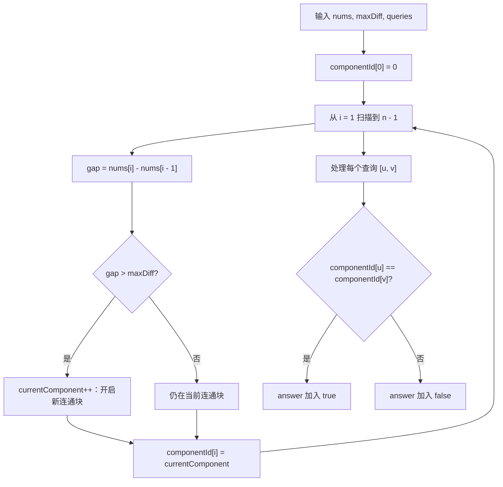
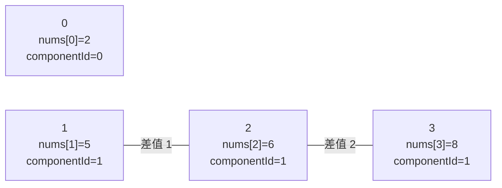
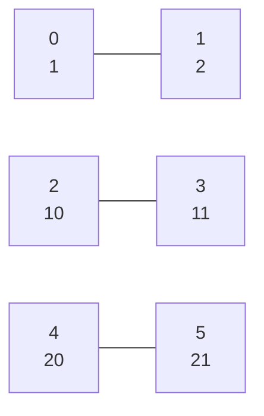

# 3532. 针对图的路径存在性查询 I

题目链接：[LeetCode 3532](https://leetcode.cn/problems/path-existence-queries-in-a-graph-i/)

## 题意重述

给你：

- 一个整数 `n`，表示有 `n` 个节点，编号为 `0` 到 `n - 1`。
- 一个长度为 `n` 的数组 `nums`，并且 `nums` 已经按非递减顺序排序。
- 一个整数 `maxDiff`。
- 多个查询 `queries[i] = [u, v]`。

建图规则是：

如果两个节点 `i` 和 `j` 满足：

```text
|nums[i] - nums[j]| <= maxDiff
```

那么节点 `i` 和节点 `j` 之间有一条无向边。

对每个查询 `[u, v]`，需要判断节点 `u` 和节点 `v` 之间是否存在路径。

## 先看暴力为什么不合适

如果真的把所有边建出来，最坏情况下每两个节点之间都有边。

```text
n = 100000
边数可能接近 n * (n - 1) / 2
```

这个规模太大，不能枚举所有点对建图。

如果每个查询都 BFS 或 DFS，也会在 `queries.length = 100000` 时超时。

这道题的突破口在于：

```text
nums 已经排好序。
```

## 核心观察

因为 `nums` 是非递减的，所以节点下标越靠右，`nums` 值越大或相等。

如果相邻两个位置满足：

```text
nums[i] - nums[i - 1] <= maxDiff
```

那么节点 `i - 1` 和节点 `i` 之间一定有边，它们在同一个连通块里。

如果相邻两个位置满足：

```text
nums[i] - nums[i - 1] > maxDiff
```

那么这里会把图切断。

为什么？

假设切断位置是 `i - 1` 和 `i`：

```text
左边所有节点下标 <= i - 1
右边所有节点下标 >= i
```

因为 `nums` 有序，所以：

```text
左边任意节点 a 的 nums[a] <= nums[i - 1]
右边任意节点 b 的 nums[b] >= nums[i]
```

于是：

```text
nums[b] - nums[a] >= nums[i] - nums[i - 1] > maxDiff
```

所以左边任意点和右边任意点都不可能有边，也就不可能存在跨过这条缝的路径。

因此，图的连通块就是由这些“大于 maxDiff 的相邻差值”切出来的连续区间。

## 变量说明

| 变量名 | 含义 |
|---|---|
| `n` | 节点数量，也是 `nums.size()` |
| `nums` | 已经非递减排序的节点值数组 |
| `maxDiff` | 两点之间能连边的最大允许差值 |
| `queries` | 查询数组，每个查询为 `[u, v]` |
| `componentId[i]` | 节点 `i` 所属的连通块编号 |
| `currentComponent` | 当前扫描到的连通块编号 |
| `i` | 当前扫描的节点下标 |
| `gap` | 相邻两个值的差：`nums[i] - nums[i - 1]` |
| `answer` | 每个查询的布尔答案 |
| `u`, `v` | 当前查询中的两个节点 |

## 图解整体流程



## 例子 1：题目示例

输入：

```text
n = 2
nums = [1, 3]
maxDiff = 1
queries = [[0,0],[0,1]]
```

初始变量：

```text
componentId = [0, 0]
currentComponent = 0
```

扫描相邻位置：

| `i` | `nums[i - 1]` | `nums[i]` | `gap = nums[i] - nums[i - 1]` | `gap > maxDiff` | `currentComponent` | `componentId` |
|---:|---:|---:|---:|---|---:|---|
| 1 | 1 | 3 | 2 | 是，`2 > 1` | 1 | `[0, 1]` |

得到：

```text
componentId[0] = 0
componentId[1] = 1
```

处理查询：

| 查询 | `u` | `v` | `componentId[u]` | `componentId[v]` | 答案 |
|---|---:|---:|---:|---:|---|
| `[0,0]` | 0 | 0 | 0 | 0 | `true` |
| `[0,1]` | 0 | 1 | 0 | 1 | `false` |

最终返回：

```text
[true, false]
```

## 例子 2：题目示例，路径可以经过中间点

输入：

```text
n = 4
nums = [2, 5, 6, 8]
maxDiff = 2
queries = [[0,1],[0,2],[1,3],[2,3]]
```

相邻差值：

```text
nums[1] - nums[0] = 5 - 2 = 3
nums[2] - nums[1] = 6 - 5 = 1
nums[3] - nums[2] = 8 - 6 = 2
```

扫描过程：

| `i` | `gap` | 判断 | `currentComponent` | `componentId` |
|---:|---:|---|---:|---|
| 初始 | - | - | 0 | `[0, 0, 0, 0]` |
| 1 | 3 | `3 > 2`，开启新连通块 | 1 | `[0, 1, 0, 0]` |
| 2 | 1 | `1 <= 2`，仍在当前连通块 | 1 | `[0, 1, 1, 0]` |
| 3 | 2 | `2 <= 2`，仍在当前连通块 | 1 | `[0, 1, 1, 1]` |

最终：

```text
componentId = [0, 1, 1, 1]
```

图可以理解为：



节点 `0` 单独一个连通块，节点 `1, 2, 3` 在同一个连通块。

处理查询：

| 查询 | `u` | `v` | `componentId[u]` | `componentId[v]` | 是否存在路径 | 解释 |
|---|---:|---:|---:|---:|---|---|
| `[0,1]` | 0 | 1 | 0 | 1 | `false` | 不在同一连通块 |
| `[0,2]` | 0 | 2 | 0 | 1 | `false` | 不在同一连通块 |
| `[1,3]` | 1 | 3 | 1 | 1 | `true` | 路径 `1 -> 2 -> 3` |
| `[2,3]` | 2 | 3 | 1 | 1 | `true` | 直接有边 `2 -> 3` |

最终返回：

```text
[false, false, true, true]
```

## 例子 3：所有节点都连通

输入：

```text
n = 5
nums = [1, 2, 4, 6, 7]
maxDiff = 2
queries = [[0,4],[1,3],[2,2]]
```

相邻差值：

```text
2 - 1 = 1 <= 2
4 - 2 = 2 <= 2
6 - 4 = 2 <= 2
7 - 6 = 1 <= 2
```

扫描变量变化：

| `i` | `gap` | `currentComponent` | `componentId` |
|---:|---:|---:|---|
| 初始 | - | 0 | `[0, 0, 0, 0, 0]` |
| 1 | 1 | 0 | `[0, 0, 0, 0, 0]` |
| 2 | 2 | 0 | `[0, 0, 0, 0, 0]` |
| 3 | 2 | 0 | `[0, 0, 0, 0, 0]` |
| 4 | 1 | 0 | `[0, 0, 0, 0, 0]` |

所有节点的 `componentId` 都是 `0`，所以任意两点之间都有路径。

查询过程：

| 查询 | `componentId[u]` | `componentId[v]` | 答案 |
|---|---:|---:|---|
| `[0,4]` | 0 | 0 | `true` |
| `[1,3]` | 0 | 0 | `true` |
| `[2,2]` | 0 | 0 | `true` |

最终返回：

```text
[true, true, true]
```

## 例子 4：有多个连通块

输入：

```text
n = 6
nums = [1, 2, 10, 11, 20, 21]
maxDiff = 1
queries = [[0,1],[1,2],[2,3],[3,5],[4,5]]
```

相邻差值：

```text
2 - 1 = 1 <= 1
10 - 2 = 8 > 1
11 - 10 = 1 <= 1
20 - 11 = 9 > 1
21 - 20 = 1 <= 1
```

扫描过程：

| `i` | `gap` | 判断 | `currentComponent` | `componentId` |
|---:|---:|---|---:|---|
| 初始 | - | - | 0 | `[0, 0, 0, 0, 0, 0]` |
| 1 | 1 | 不切开 | 0 | `[0, 0, 0, 0, 0, 0]` |
| 2 | 8 | 切开，新连通块 | 1 | `[0, 0, 1, 0, 0, 0]` |
| 3 | 1 | 不切开 | 1 | `[0, 0, 1, 1, 0, 0]` |
| 4 | 9 | 切开，新连通块 | 2 | `[0, 0, 1, 1, 2, 0]` |
| 5 | 1 | 不切开 | 2 | `[0, 0, 1, 1, 2, 2]` |

最终连通块：

```text
componentId = [0, 0, 1, 1, 2, 2]
```

图解：



查询过程：

| 查询 | `u` | `v` | `componentId[u]` | `componentId[v]` | 答案 |
|---|---:|---:|---:|---:|---|
| `[0,1]` | 0 | 1 | 0 | 0 | `true` |
| `[1,2]` | 1 | 2 | 0 | 1 | `false` |
| `[2,3]` | 2 | 3 | 1 | 1 | `true` |
| `[3,5]` | 3 | 5 | 1 | 2 | `false` |
| `[4,5]` | 4 | 5 | 2 | 2 | `true` |

最终返回：

```text
[true, false, true, false, true]
```

## 代码

```cpp
#include <bits/stdc++.h>
using namespace std;

class Solution {
public:
    vector<bool> pathExistenceQueries(int n, vector<int>& nums, int maxDiff, vector<vector<int>>& queries) {
        vector<int> componentId(n, 0);
        int currentComponent = 0;

        for (int i = 1; i < n; ++i) {
            int gap = nums[i] - nums[i - 1];

            if (gap > maxDiff) {
                ++currentComponent;
            }

            componentId[i] = currentComponent;
        }

        vector<bool> answer;
        answer.reserve(queries.size());

        for (const auto& query : queries) {
            int u = query[0];
            int v = query[1];
            answer.push_back(componentId[u] == componentId[v]);
        }

        return answer;
    }
};
```

更详细的逐行注释见同目录下的 `solution.cpp`。

## 正确性证明

### 1. 如果相邻差值不超过 `maxDiff`，两个相邻节点连通

当：

```text
nums[i] - nums[i - 1] <= maxDiff
```

因为 `nums[i] >= nums[i - 1]`，所以：

```text
|nums[i] - nums[i - 1]| <= maxDiff
```

根据题目建图规则，节点 `i - 1` 和节点 `i` 之间有边，因此它们在同一个连通块。

代码中这种情况不会增加 `currentComponent`，所以：

```text
componentId[i] = componentId[i - 1]
```

### 2. 如果相邻差值超过 `maxDiff`，这里一定切断

当：

```text
nums[i] - nums[i - 1] > maxDiff
```

对于任意左侧节点 `a <= i - 1` 和任意右侧节点 `b >= i`，由于 `nums` 非递减：

```text
nums[a] <= nums[i - 1]
nums[b] >= nums[i]
```

所以：

```text
nums[b] - nums[a] >= nums[i] - nums[i - 1] > maxDiff
```

左侧任意点和右侧任意点之间都没有边。

因此路径不可能跨过这个位置，必须开启新的连通块。

代码中执行：

```cpp
++currentComponent;
```

正是对应这个切断位置。

### 3. `componentId` 正确表示每个节点的连通块

从左到右扫描时：

- 没有切断的位置保持同一个 `currentComponent`。
- 发生切断的位置让 `currentComponent` 加一。

根据第 1 点和第 2 点，这恰好把所有节点划分成真实的连通块。

所以 `componentId[i]` 正确表示节点 `i` 所在连通块。

### 4. 查询判断正确

两个节点之间存在路径，当且仅当它们在同一个连通块中。

代码对每个查询 `[u, v]` 判断：

```cpp
componentId[u] == componentId[v]
```

如果相等，说明存在路径，返回 `true`。

如果不相等，说明中间至少存在一个无法跨过的切断位置，返回 `false`。

因此每个查询答案都正确。

## 复杂度分析

设：

- `n = nums.size()`
- `q = queries.size()`

预处理 `componentId`：

```text
O(n)
```

回答所有查询：

```text
O(q)
```

总时间复杂度：

```text
O(n + q)
```

空间复杂度：

```text
O(n)
```

其中 `componentId` 占用 `O(n)`，答案数组占用 `O(q)`。

## 可以学习到什么

通过这道题，可以重点学习：

1. **利用有序数组简化图问题**：不需要真的建图，只看相邻差值即可。
2. **连通块编号思想**：先给每个节点标记 `componentId`，查询时 `O(1)` 判断。
3. **切分点思想**：`gap > maxDiff` 的位置就是图的断点。
4. **路径存在性和连通块的关系**：两个点有路径等价于在同一个连通块。
5. **从建图到不建图的优化**：题目看似是图，实际可以转化为数组扫描。
6. **为什么排序条件重要**：如果 `nums` 无序，相邻差值无法代表断点；本题正是依赖 `nums` 已排序。
7. **多查询预处理套路**：先 `O(n)` 预处理，再让每个查询 `O(1)` 回答。

## 还能学到哪些知识

这道题还可以延伸到：

- **并查集**：也可以把相邻差值不超过 `maxDiff` 的节点合并，然后查询是否同属一个集合。
- **图的连通性**：路径存在性问题本质上通常是在问连通块。
- **区间连通块**：当点天然有序时，连通块往往表现为连续区间。
- **差分和断点分析**：很多有序数组问题都可以通过相邻差值找到结构边界。
- **版本区分意识**：本题是 I，查询可以用连通块编号直接回答；更复杂版本可能需要额外数据结构。

