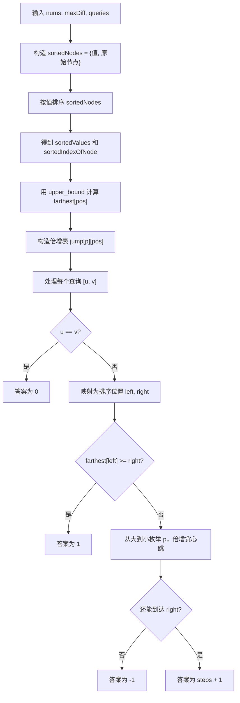
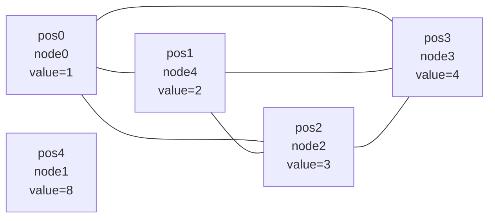
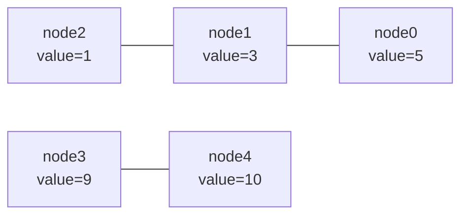

# 3534. 针对图的路径存在性查询 II

题目链接：[LeetCode 3534](https://leetcode.cn/problems/path-existence-queries-in-a-graph-ii/)

## 题意重述

给你：

- `n` 个节点，编号从 `0` 到 `n - 1`。
- 一个数组 `nums`，其中 `nums[i]` 是节点 `i` 的值。
- 一个整数 `maxDiff`。
- 多个查询 `queries[i] = [u, v]`。

建图规则：

如果两个节点 `i` 和 `j` 满足：

```text
|nums[i] - nums[j]| <= maxDiff
```

那么节点 `i` 和节点 `j` 之间有一条无向边。

每个查询 `[u, v]` 要求：

```text
返回节点 u 到节点 v 的最短距离。
如果不存在路径，返回 -1。
```

注意：边是无权边，所以一条边的距离就是 `1`。

## 和第 I 题的区别

第 I 题只问：

```text
u 和 v 是否存在路径？
```

第 II 题问：

```text
u 和 v 的最短距离是多少？
```

所以只知道两个点是否在同一个连通块不够，还要知道最少要走几条边。

## 为什么不能直接建图 BFS

如果枚举任意两个点 `i, j`，判断是否有边，最坏需要：

```text
O(n^2)
```

而 `n` 最大是 `100000`，不能这么做。

如果每个查询都 BFS，也会超时，因为 `queries.length` 也可以达到 `100000`。

我们需要预处理后快速回答每个查询。

## 核心观察

虽然 `nums` 原本不一定有序，但边只和 `nums` 的值有关。

所以我们可以先把节点按 `nums` 值排序。

例如：

```text
原始：
node:  0  1  2  3  4
nums:  5  3  1  9 10

排序后：
sortedValues:       [1, 3, 5, 9, 10]
对应原始节点:        [2, 1, 0, 3, 4]
排序位置 pos:        0  1  2  3   4
```

在排序后的数组里，如果从某个位置 `pos` 出发，一步能直接到达的右侧节点一定是一段连续区间：

```text
sortedValues[next] - sortedValues[pos] <= maxDiff
```

也就是说，从 `pos` 一步能跳到最右的位置可以预处理出来，记为：

```text
farthest[pos]
```

然后问题变成：

```text
在排序后的下标线上，每一步最多从 pos 跳到 farthest[pos]，
问从 left 到 right 最少需要几步。
```

## 为什么每一步跳到最远是正确的

假设你当前在排序位置 `pos`。

一条边能到达的所有位置都在：

```text
[pos, farthest[pos]]
```

如果目标在右边，那么跳得越远，之后的选择只会更多，不会更少。

因此求最少步数时，每一步都选择能到达的最右位置，是最优策略。

但是一个一个跳可能还是太慢，所以我们用二进制倍增加速。

## 变量说明

| 变量名                      | 含义                                          |
| --------------------------- | --------------------------------------------- |
| `n`                       | 节点数量                                      |
| `nums`                    | 每个节点的值                                  |
| `maxDiff`                 | 两个节点可以连边的最大值差                    |
| `queries`                 | 查询数组                                      |
| `sortedNodes`             | `{nums[node], node}` 排序后的数组           |
| `sortedValues[pos]`       | 排序位置`pos` 对应的值                      |
| `sortedIndexOfNode[node]` | 原始节点`node` 在排序数组中的位置           |
| `farthest[pos]`           | 从`pos` 走 1 条边最多能到达的最右排序位置   |
| `LOG`                     | 倍增层数                                      |
| `jump[p][pos]`            | 从`pos` 贪心走 `2^p` 步后能到达的最右位置 |
| `answer`                  | 所有查询的答案                                |
| `u`, `v`                | 当前查询中的两个原始节点                      |
| `left`, `right`         | `u`, `v` 映射到排序数组后的左右位置       |
| `currentPosition`         | 倍增过程中当前所在排序位置                    |
| `steps`                   | 已经确定使用的步数                            |
| `nextPosition`            | 尝试跳`2^p` 步后的位置                      |

## 整体流程图



## 例子 1：题目示例

输入：

```text
n = 5
nums = [1, 8, 3, 4, 2]
maxDiff = 3
queries = [[0,3],[2,4]]
```

### 排序预处理

构造 `sortedNodes`：

```text
原始节点和值：
node 0 -> nums[0] = 1
node 1 -> nums[1] = 8
node 2 -> nums[2] = 3
node 3 -> nums[3] = 4
node 4 -> nums[4] = 2
```

排序后：

| `pos` | `sortedValues[pos]` | 原始节点 |
| ------: | --------------------: | -------: |
|       0 |                     1 |        0 |
|       1 |                     2 |        4 |
|       2 |                     3 |        2 |
|       3 |                     4 |        3 |
|       4 |                     8 |        1 |

所以：

```text
sortedValues = [1, 2, 3, 4, 8]
sortedIndexOfNode[0] = 0
sortedIndexOfNode[1] = 4
sortedIndexOfNode[2] = 2
sortedIndexOfNode[3] = 3
sortedIndexOfNode[4] = 1
```

### 计算 `farthest`

`maxDiff = 3`。

| `pos` | `sortedValues[pos]` | `limitValue = sortedValues[pos] + maxDiff` | 一步最远能到   | `farthest[pos]` |
| ------: | --------------------: | -------------------------------------------: | -------------- | ----------------: |
|       0 |                     1 |                                            4 | 值`4` 的位置 |                 3 |
|       1 |                     2 |                                            5 | 值`4` 的位置 |                 3 |
|       2 |                     3 |                                            6 | 值`4` 的位置 |                 3 |
|       3 |                     4 |                                            7 | 值`4` 的位置 |                 3 |
|       4 |                     8 |                                           11 | 值`8` 的位置 |                 4 |

```text
farthest = [3, 3, 3, 3, 4]
```

图解：



节点 `1` 的值是 `8`，和前面任意值的差都大于 `3`，所以它单独一块。

### 查询 `[0, 3]`

代码变量：

```text
u = 0
v = 3
left = sortedIndexOfNode[0] = 0
right = sortedIndexOfNode[3] = 3
```

判断一条边是否可达：

```text
farthest[left] = farthest[0] = 3
right = 3
farthest[left] >= right
```

所以：

```text
answer = 1
```

路径是：

```text
0 -> 3
```

因为：

```text
|nums[0] - nums[3]| = |1 - 4| = 3 <= maxDiff
```

### 查询 `[2, 4]`

代码变量：

```text
u = 2
v = 4
left = sortedIndexOfNode[2] = 2
right = sortedIndexOfNode[4] = 1
```

因为 `left > right`，代码会交换：

```text
left = 1
right = 2
```

判断：

```text
farthest[1] = 3
3 >= 2
```

所以答案是：

```text
1
```

最终返回：

```text
[1, 1]
```

## 例子 2：需要走多步，并且存在不可达

输入：

```text
n = 5
nums = [5, 3, 1, 9, 10]
maxDiff = 2
queries = [[0,1],[0,2],[2,3],[4,3]]
```

### 排序预处理

| `pos` | `sortedValues[pos]` | 原始节点 |
| ------: | --------------------: | -------: |
|       0 |                     1 |        2 |
|       1 |                     3 |        1 |
|       2 |                     5 |        0 |
|       3 |                     9 |        3 |
|       4 |                    10 |        4 |

```text
sortedValues = [1, 3, 5, 9, 10]
sortedIndexOfNode[0] = 2
sortedIndexOfNode[1] = 1
sortedIndexOfNode[2] = 0
sortedIndexOfNode[3] = 3
sortedIndexOfNode[4] = 4
```

### `farthest`

`maxDiff = 2`：

| `pos` | 值 | 一步最远值 | `farthest[pos]` |
| ------: | -: | ---------: | ----------------: |
|       0 |  1 |          3 |                 1 |
|       1 |  3 |          5 |                 2 |
|       2 |  5 |          5 |                 2 |
|       3 |  9 |         10 |                 4 |
|       4 | 10 |         10 |                 4 |

```text
farthest = [1, 2, 2, 4, 4]
```

图解：



可以看到有两个连通块：

```text
值 [1, 3, 5] 一块
值 [9, 10] 一块
```

### 查询 `[0, 1]`

```text
u = 0, v = 1
left = sortedIndexOfNode[0] = 2
right = sortedIndexOfNode[1] = 1
交换后 left = 1, right = 2
farthest[1] = 2 >= right
```

答案：

```text
1
```

### 查询 `[0, 2]`

```text
u = 0, v = 2
left = sortedIndexOfNode[0] = 2
right = sortedIndexOfNode[2] = 0
交换后 left = 0, right = 2
```

一条边不够：

```text
farthest[0] = 1 < right = 2
```

倍增过程：

```text
currentPosition = 0
steps = 0
```

用普通跳跃理解：

```text
第 1 步：0 -> farthest[0] = 1
第 2 步：1 -> farthest[1] = 2
```

所以答案：

```text
2
```

对应原图路径：

```text
node 2(value=1) -> node 1(value=3) -> node 0(value=5)
```

查询是 `[0,2]`，无向图距离一样是 `2`。

### 查询 `[2, 3]`

```text
u = 2, v = 3
left = sortedIndexOfNode[2] = 0
right = sortedIndexOfNode[3] = 3
```

从 `pos 0` 最多能这样走：

```text
pos 0 -> pos 1 -> pos 2
```

到 `pos 2` 后：

```text
farthest[2] = 2
```

无法继续向右推进到 `pos 3`。

所以答案：

```text
-1
```

### 查询 `[4, 3]`

```text
u = 4, v = 3
left = sortedIndexOfNode[4] = 4
right = sortedIndexOfNode[3] = 3
交换后 left = 3, right = 4
farthest[3] = 4 >= right
```

答案：

```text
1
```

最终返回：

```text
[1, 2, -1, 1]
```

## 例子 3：完全没有边

输入：

```text
n = 3
nums = [3, 6, 1]
maxDiff = 1
queries = [[0,0],[0,1],[1,2]]
```

排序后：

```text
sortedValues = [1, 3, 6]
对应原始节点 = [2, 0, 1]
```

计算：

```text
farthest = [0, 1, 2]
```

每个位置只能到自己，无法到别的位置。

查询：

| 查询      | 变量过程                                                                 | 答案 |
| --------- | ------------------------------------------------------------------------ | ---: |
| `[0,0]` | `u == v`                                                               |    0 |
| `[0,1]` | 位置`1` 到 `2`，`farthest[1] = 1`，无法推进                        |   -1 |
| `[1,2]` | 位置`2` 到 `0`，交换为 `0` 到 `2`，`farthest[0] = 0`，无法推进 |   -1 |

最终返回：

```text
[0, -1, -1]
```

## 例子 4：展示倍增表的作用

输入：

```text
n = 6
nums = [0, 2, 4, 6, 8, 10]
maxDiff = 2
queries = [[0,5],[1,4],[2,5]]
```

数组已经有序：

```text
sortedValues = [0, 2, 4, 6, 8, 10]
sortedIndexOfNode = [0, 1, 2, 3, 4, 5]
```

每一步只能向右走一个位置：

```text
farthest = [1, 2, 3, 4, 5, 5]
```

倍增表的一部分：

| `pos` | `jump[0][pos]` 走 1 步 | `jump[1][pos]` 走 2 步 | `jump[2][pos]` 走 4 步 |
| ------: | -----------------------: | -----------------------: | -----------------------: |
|       0 |                        1 |                        2 |                        4 |
|       1 |                        2 |                        3 |                        5 |
|       2 |                        3 |                        4 |                        5 |
|       3 |                        4 |                        5 |                        5 |
|       4 |                        5 |                        5 |                        5 |
|       5 |                        5 |                        5 |                        5 |

### 查询 `[0, 5]`

```text
left = 0
right = 5
currentPosition = 0
steps = 0
```

从大到小尝试：

```text
尝试 jump[2][0] = 4 < 5
可以先走 4 步：
currentPosition = 4
steps = 4
```

再补一步：

```text
farthest[4] = 5
steps + 1 = 5
```

答案是 `5`。

这等价于路径：

```text
0 -> 1 -> 2 -> 3 -> 4 -> 5
```

## 代码

```cpp
#include <bits/stdc++.h>
using namespace std;

class Solution {
public:
    vector<int> pathExistenceQueries(int n, vector<int>& nums, int maxDiff, vector<vector<int>>& queries) {
        vector<pair<int, int>> sortedNodes;
        sortedNodes.reserve(n);
        for (int node = 0; node < n; ++node) {
            sortedNodes.push_back({nums[node], node});
        }
        sort(sortedNodes.begin(), sortedNodes.end());

        vector<int> sortedValues(n);
        vector<int> sortedIndexOfNode(n);
        for (int pos = 0; pos < n; ++pos) {
            sortedValues[pos] = sortedNodes[pos].first;
            sortedIndexOfNode[sortedNodes[pos].second] = pos;
        }

        vector<int> farthest(n);
        for (int pos = 0; pos < n; ++pos) {
            int limitValue = sortedValues[pos] + maxDiff;
            int firstGreater = (int)(upper_bound(sortedValues.begin(), sortedValues.end(), limitValue) - sortedValues.begin());
            farthest[pos] = firstGreater - 1;
        }

        int LOG = 1;
        while ((1 << LOG) <= n) {
            ++LOG;
        }

        vector<vector<int>> jump(LOG, vector<int>(n));
        jump[0] = farthest;
        for (int p = 1; p < LOG; ++p) {
            for (int pos = 0; pos < n; ++pos) {
                jump[p][pos] = jump[p - 1][jump[p - 1][pos]];
            }
        }

        vector<int> answer;
        answer.reserve(queries.size());

        for (const auto& query : queries) {
            int u = query[0];
            int v = query[1];

            if (u == v) {
                answer.push_back(0);
                continue;
            }

            int left = sortedIndexOfNode[u];
            int right = sortedIndexOfNode[v];
            if (left > right) {
                swap(left, right);
            }

            if (farthest[left] >= right) {
                answer.push_back(1);
                continue;
            }

            int currentPosition = left;
            int steps = 0;

            for (int p = LOG - 1; p >= 0; --p) {
                int nextPosition = jump[p][currentPosition];
                if (nextPosition < right) {
                    currentPosition = nextPosition;
                    steps += (1 << p);
                }
            }

            if (farthest[currentPosition] == currentPosition) {
                answer.push_back(-1);
            } else {
                answer.push_back(steps + 1);
            }
        }

        return answer;
    }
};
```

更详细的逐行注释见同目录下的 `solution.cpp`。

## 正确性证明

### 1. 排序后，一步可达范围是连续区间

对排序位置 `pos`，如果某个右侧位置 `x` 满足：

```text
sortedValues[x] - sortedValues[pos] <= maxDiff
```

那么所有 `pos` 到 `x` 之间的位置 `y` 都满足：

```text
sortedValues[y] <= sortedValues[x]
```

所以：

```text
sortedValues[y] - sortedValues[pos] <= maxDiff
```

因此右侧一步可达位置一定是连续区间 `[pos, farthest[pos]]`。

### 2. 每一步跳到 `farthest[pos]` 不会变差

从 `pos` 出发，如果一步可以跳到任意位置 `x <= farthest[pos]`，那么跳到 `farthest[pos]` 至少不比跳到 `x` 差。

原因是目标在右侧时，更靠右的位置能覆盖更多后续可能性。

所以最短路可以用“每一步尽量跳最远”的贪心表示。

### 3. `jump[p][pos]` 正确表示走 `2^p` 步后的最远位置

当 `p = 0` 时：

```text
jump[0][pos] = farthest[pos]
```

这正是走 `1` 步后的最远位置。

假设 `jump[p - 1][pos]` 正确表示走 `2^(p-1)` 步后的最远位置。

再从这个位置继续走 `2^(p-1)` 步：

```cpp
jump[p][pos] = jump[p - 1][jump[p - 1][pos]]
```

就得到走 `2^p` 步后的最远位置。

所以倍增表正确。

### 4. 查询时的倍增贪心能得到最少步数

查询中，我们从大的 `p` 到小的 `p` 尝试。

如果：

```text
jump[p][currentPosition] < right
```

说明即使多走 `2^p` 步，仍然到不了目标 `right`，这些步数一定是必要前缀，可以安全加入。

循环结束后，`steps` 是“还到不了 `right` 的最大步数”。

因此如果再走一步可以到达，那么最短距离就是：

```text
steps + 1
```

如果再走一步也不能推进，说明不连通，答案是 `-1`。

## 复杂度分析

设：

- `n = nums.size()`
- `q = queries.size()`

排序：

```text
O(n log n)
```

计算 `farthest`：

```text
O(n log n)
```

构造倍增表：

```text
O(n log n)
```

每个查询：

```text
O(log n)
```

总时间复杂度：

```text
O((n + q) log n)
```

空间复杂度：

```text
O(n log n)
```

主要来自 `jump` 倍增表。

## 可以学习到什么

通过这道题，可以重点学习：

1. **把图问题转成有序数组问题**：边只和数值差有关，所以按值排序。
2. **最远可达预处理**：`farthest[pos]` 表示一条边能覆盖到哪里。
3. **贪心最短跳跃**：每次跳到最远位置可以得到最少步数。
4. **二进制倍增**：把一步一步跳优化成按 `2^p` 跳。
5. **原始下标和排序下标的映射**：用 `sortedIndexOfNode` 连接题目节点和排序数组。
6. **不可达判断**：如果某个位置 `farthest[pos] == pos` 且目标还在右边，就无法继续推进。
7. **无权图最短路的新视角**：不一定只能 BFS，利用结构可以更快。

## 还能学到哪些知识

这题还能迁移到：

- **跳跃游戏类问题**：每个位置有一个最远可达范围，问最少跳几步。
- **区间覆盖问题**：用最少区间覆盖到目标点。
- **倍增求祖先/跳跃**：树上倍增、函数图倍增都和这里类似。
- **离线预处理多查询**：先构造结构，再快速回答大量查询。
- **连通块和最短距离的区别**：能到达只是第一层，最短距离需要更多信息。
