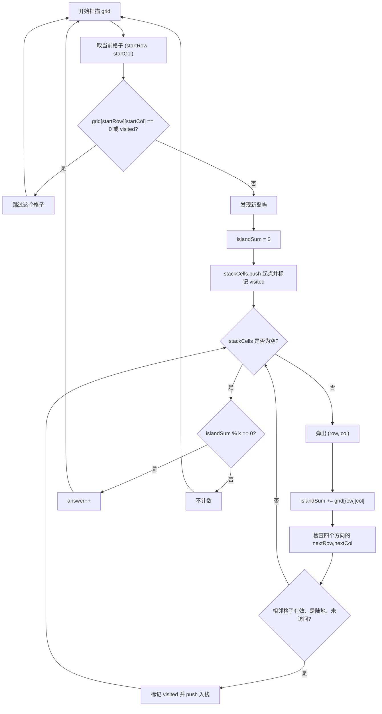
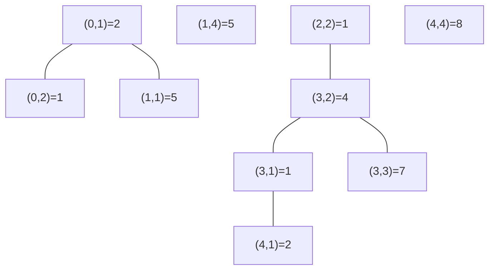
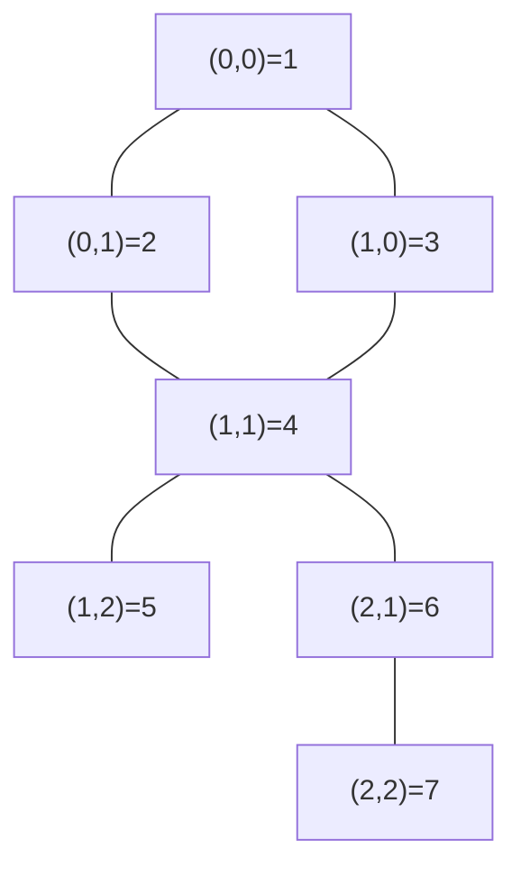

# 3619. 总价值可以被 K 整除的岛屿数目

题目链接：[LeetCode 3619](https://leetcode.cn/problems/count-islands-with-total-value-divisible-by-k/)

## 题意重述

给你一个 `m x n` 的矩阵 `grid` 和一个正整数 `k`。

矩阵中：

- `grid[row][col] > 0` 表示陆地，格子的数值就是这块陆地的价值。
- `grid[row][col] == 0` 表示水。

一个岛屿由若干个正数格子组成，并且这些格子之间通过上下左右四个方向连通。

一个岛屿的总价值，就是岛屿中所有格子的值之和。

要求返回：

```text
总价值可以被 k 整除的岛屿数量
```

## 核心思路

这是一道标准的网格连通块问题。

我们从左到右、从上到下扫描每个格子：

1. 如果当前格子是水 `0`，跳过。
2. 如果当前格子已经访问过，说明它已经属于之前找到的某个岛屿，跳过。
3. 如果当前格子是没有访问过的正数，说明发现了一个新岛屿。
4. 从这个格子开始做 DFS，把整个岛屿都找出来，同时累加岛屿总价值 `islandSum`。
5. DFS 结束后，判断 `islandSum % k == 0`，如果成立，答案 `answer++`。

这里使用 **迭代 DFS**，也就是用 `stackCells` 手动模拟递归。

原因是：

```text
m * n <= 100000
```

如果岛屿非常大，递归 DFS 可能因为递归层数太深导致栈溢出。迭代 DFS 更稳。

## 变量说明

| 变量名 | 含义 |
|---|---|
| `grid` | 输入矩阵，正数是陆地，`0` 是水 |
| `k` | 判断岛屿总价值能否整除的数 |
| `m` | 矩阵行数 |
| `n` | 矩阵列数 |
| `visited[row][col]` | 格子 `(row, col)` 是否已经访问过 |
| `directions` | 四方向数组，用来计算上下左右相邻格子 |
| `answer` | 满足总价值能被 `k` 整除的岛屿数量 |
| `startRow` | 外层扫描时当前格子的行号 |
| `startCol` | 外层扫描时当前格子的列号 |
| `islandSum` | 当前岛屿的总价值 |
| `stackCells` | 迭代 DFS 使用的栈，保存待处理的陆地格子 |
| `row`, `col` | DFS 当前弹出的格子坐标 |
| `dir` | 当前枚举的方向编号 |
| `nextRow`, `nextCol` | 相邻格子的坐标 |

## 四方向图解

对当前格子 `(row, col)`，只看上下左右，不看斜对角。

```text
              (row - 1, col)
                    上
                    |
(row, col - 1) 左 - 当前 - 右 (row, col + 1)
                    |
                    下
              (row + 1, col)
```

代码中使用：

```cpp
vector<int> directions = {1, 0, -1, 0, 1};
```

四个方向对应：

| `dir` | `nextRow = row + directions[dir]` | `nextCol = col + directions[dir + 1]` | 方向 |
|---:|---|---|---|
| 0 | `row + 1` | `col + 0` | 下 |
| 1 | `row + 0` | `col - 1` | 左 |
| 2 | `row - 1` | `col + 0` | 上 |
| 3 | `row + 0` | `col + 1` | 右 |

方向顺序不影响答案，只要四个方向都检查即可。

## 整体流程图



## 例子 1：题目示例完整拆解

输入：

```text
grid =
[
  [0,2,1,0,0],
  [0,5,0,0,5],
  [0,0,1,0,0],
  [0,1,4,7,0],
  [0,2,0,0,8]
]
k = 5
```

为了方便观察，给每个正数格子写上坐标和值：

```text
(0,1)=2  (0,2)=1
(1,1)=5              (1,4)=5
          (2,2)=1
   (3,1)=1 (3,2)=4 (3,3)=7
   (4,1)=2                   (4,4)=8
```

可以分成 4 个岛屿：

```text
岛屿 A: (0,1)=2, (0,2)=1, (1,1)=5
岛屿 B: (1,4)=5
岛屿 C: (2,2)=1, (3,2)=4, (3,1)=1, (3,3)=7, (4,1)=2
岛屿 D: (4,4)=8
```

图解：



### 外层扫描变量过程

| 发现起点 | `startRow` | `startCol` | `islandSum` 计算过程 | `islandSum % k` | 是否计入 `answer` |
|---|---:|---:|---|---:|---|
| 岛屿 A | 0 | 1 | `2 + 5 + 1 = 8` | `8 % 5 = 3` | 否 |
| 岛屿 B | 1 | 4 | `5` | `5 % 5 = 0` | 是 |
| 岛屿 C | 2 | 2 | `1 + 4 + 7 + 1 + 2 = 15` | `15 % 5 = 0` | 是 |
| 岛屿 D | 4 | 4 | `8` | `8 % 5 = 3` | 否 |

最终：

```text
answer = 2
```

### 岛屿 A 的 DFS 过程，对应代码变量

从 `(0,1)` 开始：

```text
startRow = 0
startCol = 1
islandSum = 0
stackCells = [(0,1)]
visited[0][1] = true
```

下面表格中，`stackCells` 只表示“当前轮结束后栈中还待处理的格子”。

| 步骤 | 弹出 `(row,col)` | 加入值 | `islandSum` | 新发现并入栈的格子 | 本轮后 `stackCells` |
|---:|---|---:|---:|---|---|
| 1 | `(0,1)` | `grid[0][1]=2` | 2 | `(1,1)`, `(0,2)` | `[(1,1),(0,2)]` |
| 2 | `(0,2)` | `grid[0][2]=1` | 3 | 无 | `[(1,1)]` |
| 3 | `(1,1)` | `grid[1][1]=5` | 8 | 无 | `[]` |

DFS 结束：

```text
islandSum = 8
islandSum % k = 8 % 5 = 3
answer 不增加
```

注意：由于 `stack` 后进先出，具体弹出顺序可能和你手画岛屿时不同，但岛屿总和一定相同。

## 例子 2：每个陆地都是单独岛屿

输入：

```text
grid =
[
  [3,0,3,0],
  [0,3,0,3],
  [3,0,3,0]
]
k = 3
```

这里所有正数格子互不四方向相邻，所以每个 `3` 都是一个单独岛屿。

共有 6 个岛屿：

| 起点 `(startRow,startCol)` | `islandSum` | `islandSum % k` | `answer` 变化 |
|---|---:|---:|---|
| `(0,0)` | 3 | 0 | `0 -> 1` |
| `(0,2)` | 3 | 0 | `1 -> 2` |
| `(1,1)` | 3 | 0 | `2 -> 3` |
| `(1,3)` | 3 | 0 | `3 -> 4` |
| `(2,0)` | 3 | 0 | `4 -> 5` |
| `(2,2)` | 3 | 0 | `5 -> 6` |

最终：

```text
answer = 6
```

## 例子 3：一个大岛屿

输入：

```text
grid =
[
  [1,2,0],
  [3,4,5],
  [0,6,7]
]
k = 4
```

所有正数通过四方向连成一个岛屿：



变量过程：

```text
startRow = 0
startCol = 0
islandSum = 1 + 2 + 3 + 4 + 5 + 6 + 7 = 28
k = 4
islandSum % k = 28 % 4 = 0
answer = 1
```

最终返回：

```text
1
```

## 例子 4：没有满足条件的岛屿

输入：

```text
grid =
[
  [2,0,4],
  [0,0,0],
  [6,0,8]
]
k = 5
```

每个正数都是一个单独岛屿：

| 起点 | `islandSum` | `islandSum % k` | 是否计数 |
|---|---:|---:|---|
| `(0,0)` | 2 | 2 | 否 |
| `(0,2)` | 4 | 4 | 否 |
| `(2,0)` | 6 | 1 | 否 |
| `(2,2)` | 8 | 3 | 否 |

最终：

```text
answer = 0
```

## 代码

```cpp
#include <bits/stdc++.h>
using namespace std;

class Solution {
public:
    int countIslands(vector<vector<int>>& grid, int k) {
        int m = (int)grid.size();
        int n = (int)grid[0].size();

        vector<vector<bool>> visited(m, vector<bool>(n, false));
        vector<int> directions = {1, 0, -1, 0, 1};
        int answer = 0;

        for (int startRow = 0; startRow < m; ++startRow) {
            for (int startCol = 0; startCol < n; ++startCol) {
                if (grid[startRow][startCol] == 0 || visited[startRow][startCol]) {
                    continue;
                }

                long long islandSum = 0;
                stack<pair<int, int>> stackCells;
                stackCells.push({startRow, startCol});
                visited[startRow][startCol] = true;

                while (!stackCells.empty()) {
                    auto [row, col] = stackCells.top();
                    stackCells.pop();
                    islandSum += grid[row][col];

                    for (int dir = 0; dir < 4; ++dir) {
                        int nextRow = row + directions[dir];
                        int nextCol = col + directions[dir + 1];

                        if (nextRow < 0 || nextRow >= m || nextCol < 0 || nextCol >= n) {
                            continue;
                        }

                        if (grid[nextRow][nextCol] == 0 || visited[nextRow][nextCol]) {
                            continue;
                        }

                        visited[nextRow][nextCol] = true;
                        stackCells.push({nextRow, nextCol});
                    }
                }

                if (islandSum % k == 0) {
                    ++answer;
                }
            }
        }

        return answer;
    }
};
```

更详细的逐行注释见同目录下的 `solution.cpp`。

## 正确性证明

### 1. 每个岛屿都会被发现

外层双重循环会扫描每个格子 `(startRow, startCol)`。

如果某个岛屿还没有被访问，那么这个岛屿中必然存在一个最先被外层循环扫描到的陆地格子。

当扫描到这个格子时：

```text
grid[startRow][startCol] > 0
visited[startRow][startCol] == false
```

代码会从这里启动一次 DFS，因此这个岛屿一定会被发现。

### 2. 一次 DFS 恰好遍历一个完整岛屿

DFS 从一个陆地格子出发，只会把满足以下条件的相邻格子加入 `stackCells`：

```text
在矩阵范围内
grid[nextRow][nextCol] > 0
visited[nextRow][nextCol] == false
```

这说明 DFS 只会沿着上下左右方向走到陆地格子，所以不会走到水里，也不会跨到另一个不连通的岛屿。

同时，同一个岛屿中的任意陆地格子，都可以通过若干次上下左右移动从起点到达。

因此 DFS 会访问当前岛屿中的所有格子，并且只访问这个岛屿中的格子。

### 3. 每个陆地格子只会被统计一次

当一个陆地格子被加入 `stackCells` 时，代码立刻执行：

```cpp
visited[nextRow][nextCol] = true;
```

起点也会在入栈时标记：

```cpp
visited[startRow][startCol] = true;
```

所以同一个格子不会被重复入栈，也不会被重复加入 `islandSum`。

外层循环之后再次遇到这个格子时，也会因为 `visited == true` 而跳过。

### 4. `islandSum` 正确表示当前岛屿总价值

根据第 2 点，一次 DFS 恰好遍历当前岛屿所有格子。

根据第 3 点，每个格子恰好被统计一次。

所以 DFS 中累加的：

```cpp
islandSum += grid[row][col];
```

最终正好等于当前岛屿所有格子的价值之和。

### 5. `answer` 统计正确

每完成一个岛屿的 DFS，代码判断：

```cpp
if (islandSum % k == 0) {
    ++answer;
}
```

这与题目要求“统计总价值可以被 `k` 整除的岛屿数量”完全一致。

由于每个岛屿都会被发现一次，且只会被发现一次，所以最终 `answer` 正确。

## 复杂度分析

设矩阵共有 `m * n` 个格子。

时间复杂度：

```text
O(m * n)
```

原因是每个格子最多被扫描一次，每个陆地格子最多入栈一次、出栈一次。

空间复杂度：

```text
O(m * n)
```

主要来自：

- `visited` 数组。
- 最坏情况下 `stackCells` 可能存下一个很大的岛屿中的许多格子。

## 可以学习到什么

通过这道题，可以重点学习：

1. **网格 DFS/BFS 模板**：从一个起点出发，访问同一个连通块。
2. **岛屿问题建模**：正数是陆地，`0` 是水，四方向连通组成岛屿。
3. **访问标记 `visited` 的作用**：防止重复访问和重复计数。
4. **迭代 DFS**：用 `stack` 代替递归，避免深递归风险。
5. **四方向数组技巧**：用 `directions = {1,0,-1,0,1}` 简洁枚举上下左右。
6. **连通块求和**：遍历一个连通块时顺便累加 `islandSum`。
7. **整除判断**：用 `islandSum % k == 0` 判断是否满足条件。
8. **大数意识**：格子数量和值都不小，岛屿总和要用 `long long`。

## 还能学到哪些知识

这道题还能迁移到很多类似问题：

- **岛屿数量**：只统计岛屿个数，不关心总和。
- **岛屿最大面积**：DFS 时累加格子数量。
- **岛屿最大价值**：DFS 时累加格子值并取最大。
- **封闭岛屿问题**：DFS 时额外判断是否碰到边界。
- **多源 BFS**：从多个起点同时扩散，常用于最短距离问题。
- **图的连通块**：网格本质上也是图，格子是点，相邻关系是边。

