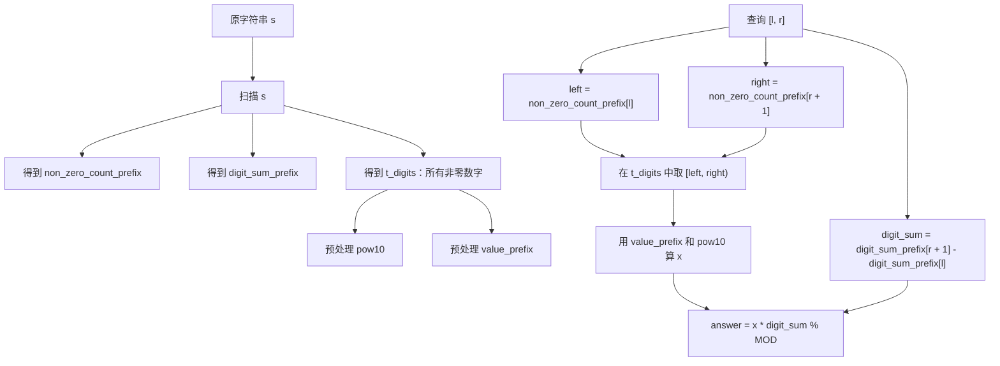

# 3756. 连接非零数字并乘以其数字和 II

题目链接：[LeetCode 3756](https://leetcode.cn/problems/concatenate-non-zero-digits-and-multiply-by-sum-ii/)

## 题意重述

给定一个只包含数字的字符串 `s`，以及很多个查询 `queries[i] = [l, r]`。

对每个查询：

1. 取出子串 `s[l..r]`。
2. 按原顺序保留其中所有非零数字，连接成整数 `x`。
3. 计算 `x` 的数字和 `sum`。
4. 返回 `x * sum % (10^9 + 7)`。

例如：

```text
s = "10203004"
query = [0, 7]
s[0..7] = "10203004"
去掉 0 后得到 x = 1234
sum = 1 + 2 + 3 + 4 = 10
answer = 1234 * 10 = 12340
```

## 为什么不能暴力

如果每个查询都重新扫描 `s[l..r]`：

```text
最坏情况下：
s.length = 100000
queries.length = 100000
每次查询可能扫描 100000 个字符
总复杂度 = 100000 * 100000 = 10^10
```

`10^10` 级别会超时，所以必须预处理，让每个查询接近 `O(1)` 完成。

## 核心观察

查询中真正参与组成 `x` 的，只有非零数字。

所以可以把原字符串 `s` 中所有非零数字单独拿出来，形成一个压缩数组：

```text
s        = "10203004"
下标      0 1 2 3 4 5 6 7
字符      1 0 2 0 3 0 0 4

t_digits = [1, 2, 3, 4]
下标        0  1  2  3
```

那么原串中的任意查询 `[l, r]`，都可以映射成 `t_digits` 中的一段连续区间。

以 `query = [1, 6]` 为例：

```text
s[1..6] = "020300"
非零数字是 2、3

它们在 t_digits = [1, 2, 3, 4] 中对应下标 [1, 3)
也就是 t_digits[1..2] = [2, 3]
连接后 x = 23
```

## 需要预处理哪些变量

代码中的主要变量如下。

| 变量名                       | 含义                                               |
| ---------------------------- | -------------------------------------------------- |
| `MOD`                      | 取模值`10^9 + 7`                                 |
| `non_zero_count_prefix[i]` | `s[0..i-1]` 中非零数字的数量                     |
| `digit_sum_prefix[i]`      | `s[0..i-1]` 的数字和                             |
| `t_digits`                 | `s` 中所有非零数字组成的数组                     |
| `pow10[len]`               | `10^len % MOD`                                   |
| `value_prefix[i]`          | `t_digits[0..i-1]` 连接成的整数，对 `MOD` 取余 |
| `left`                     | 查询区间在`t_digits` 中的左边界                  |
| `right`                    | 查询区间在`t_digits` 中的右边界，半开区间        |
| `non_zero_len`             | 查询区间内非零数字个数，也就是`x` 的位数         |
| `digit_sum`                | 查询区间内数字和，也就是`x` 的数字和             |
| `x`                        | 查询区间内非零数字连接成的整数，已取模             |
| `answer`                   | 所有查询的答案                                     |

## 图解整体流程



## 前缀数量如何映射区间

仍然看：

```text
s = "10203004"
```

逐位统计非零数字个数：

| i | 看过的前缀`s[0..i-1]` | `non_zero_count_prefix[i]` |
| - | ----------------------- | ---------------------------- |
| 0 | `""`                  | 0                            |
| 1 | `"1"`                 | 1                            |
| 2 | `"10"`                | 1                            |
| 3 | `"102"`               | 2                            |
| 4 | `"1020"`              | 2                            |
| 5 | `"10203"`             | 3                            |
| 6 | `"102030"`            | 3                            |
| 7 | `"1020300"`           | 3                            |
| 8 | `"10203004"`          | 4                            |

对于查询 `[l, r]`：

```python
left = non_zero_count_prefix[l]
right = non_zero_count_prefix[r + 1]
```

含义是：

- `left`：在 `s[l]` 之前已经有多少个非零数字。
- `right`：到 `s[r]` 为止一共有多少个非零数字。
- 所以当前区间在 `t_digits` 中就是 `[left, right)`。

## 如何用前缀值计算 x

假设：

```text
t_digits = [1, 2, 3, 4]
value_prefix = [0, 1, 12, 123, 1234]
```

现在想取 `t_digits[1..3)`，也就是 `[2, 3]`，连接成 `x = 23`。

如果只看前缀：

```text
value_prefix[right] = value_prefix[3] = 123
value_prefix[left]  = value_prefix[1] = 1
non_zero_len = right - left = 2
```

左边多出来的前缀是 `1`。

因为真正要保留的区间长度是 `2` 位，所以要把左边前缀移动到同样的位数上：

```text
1 * 10^2 = 100
123 - 100 = 23
```

对应代码：

```python
x = (value_prefix[right] - value_prefix[left] * pow10[non_zero_len]) % MOD
```

这和普通数组前缀和很像，只是这里前缀不是加法，而是十进制拼接。

## 例子 1：题目示例完整走一遍

输入：

```text
s = "10203004"
queries = [[0,7],[1,3],[4,6]]
```

预处理结果：

```text
t_digits = [1, 2, 3, 4]

non_zero_count_prefix = [0, 1, 1, 2, 2, 3, 3, 3, 4]
digit_sum_prefix       = [0, 1, 1, 3, 3, 6, 6, 6, 10]
pow10                  = [1, 10, 100, 1000, 10000]
value_prefix           = [0, 1, 12, 123, 1234]
```

### 查询 `[0, 7]`

对应代码变量：

```text
l = 0
r = 7
left = non_zero_count_prefix[0] = 0
right = non_zero_count_prefix[8] = 4
non_zero_len = right - left = 4
digit_sum = digit_sum_prefix[8] - digit_sum_prefix[0] = 10 - 0 = 10
```

计算 `x`：

```text
x = value_prefix[4] - value_prefix[0] * pow10[4]
  = 1234 - 0 * 10000
  = 1234
```

答案：

```text
answer = x * digit_sum % MOD
       = 1234 * 10
       = 12340
```

### 查询 `[1, 3]`

```text
s[1..3] = "020"
```

对应代码变量：

```text
l = 1
r = 3
left = non_zero_count_prefix[1] = 1
right = non_zero_count_prefix[4] = 2
non_zero_len = right - left = 1
digit_sum = digit_sum_prefix[4] - digit_sum_prefix[1] = 3 - 1 = 2
```

计算 `x`：

```text
x = value_prefix[2] - value_prefix[1] * pow10[1]
  = 12 - 1 * 10
  = 2
```

答案：

```text
answer = 2 * 2 = 4
```

### 查询 `[4, 6]`

```text
s[4..6] = "300"
```

对应代码变量：

```text
l = 4
r = 6
left = non_zero_count_prefix[4] = 2
right = non_zero_count_prefix[7] = 3
non_zero_len = 1
digit_sum = digit_sum_prefix[7] - digit_sum_prefix[4] = 6 - 3 = 3
```

计算 `x`：

```text
x = value_prefix[3] - value_prefix[2] * pow10[1]
  = 123 - 12 * 10
  = 3
```

答案：

```text
answer = 3 * 3 = 9
```

最终：

```text
[12340, 4, 9]
```

## 例子 2：区间里全是 0

输入：

```text
s = "1000"
queries = [[0,3],[1,1]]
```

预处理：

```text
t_digits = [1]
non_zero_count_prefix = [0, 1, 1, 1, 1]
digit_sum_prefix       = [0, 1, 1, 1, 1]
pow10                  = [1, 10]
value_prefix           = [0, 1]
```

### 查询 `[0, 3]`

```text
l = 0
r = 3
left = non_zero_count_prefix[0] = 0
right = non_zero_count_prefix[4] = 1
non_zero_len = 1
digit_sum = digit_sum_prefix[4] - digit_sum_prefix[0] = 1
x = value_prefix[1] - value_prefix[0] * pow10[1] = 1
answer = 1 * 1 = 1
```

### 查询 `[1, 1]`

```text
s[1..1] = "0"
```

对应代码变量：

```text
l = 1
r = 1
left = non_zero_count_prefix[1] = 1
right = non_zero_count_prefix[2] = 1
non_zero_len = 0
digit_sum = digit_sum_prefix[2] - digit_sum_prefix[1] = 1 - 1 = 0
```

计算 `x`：

```text
x = value_prefix[1] - value_prefix[1] * pow10[0]
  = 1 - 1 * 1
  = 0
```

答案：

```text
answer = 0 * 0 = 0
```

这里可以看到：当区间中没有非零数字时，`left == right`，`non_zero_len == 0`，公式自然得到 `x = 0`，不需要额外特判。

## 例子 3：需要取模

输入：

```text
s = "9876543210"
queries = [[0,9]]
```

预处理中的关键变量：

```text
t_digits = [9, 8, 7, 6, 5, 4, 3, 2, 1]
value_prefix[9] = 987654321
digit_sum_prefix[10] = 45
```

查询 `[0, 9]`：

```text
l = 0
r = 9
left = 0
right = 9
non_zero_len = 9
digit_sum = 45
x = 987654321
answer = 987654321 * 45 % 1000000007
       = 44444444445 % 1000000007
       = 444444137
```

## 自己补充一个例子：中间区间截取

输入：

```text
s = "7050608"
queries = [[0,6],[1,5],[2,6]]
输出：[196768, 616, 10792]
```

预处理：

```text
t_digits = [7, 5, 6, 8]
non_zero_count_prefix = [0, 1, 1, 2, 2, 3, 3, 4]
digit_sum_prefix       = [0, 7, 7, 12, 12, 18, 18, 26]
value_prefix           = [0, 7, 75, 756, 7568]
```

### 查询 `[0, 6]`

```text
s[0..6] = "7050608"
```

对应代码变量：

```text
l = 0
r = 6
left = non_zero_count_prefix[0] = 0
right = non_zero_count_prefix[7] = 4
non_zero_len = 4
digit_sum = digit_sum_prefix[7] - digit_sum_prefix[0] = 26 - 0 = 26
```

计算：

```text
x = value_prefix[4] - value_prefix[0] * pow10[4]
  = 7568 - 0 * 10000
  = 7568

answer = 7568 * 26 = 196768
```

### 查询 `[1, 5]`

```text
s[1..5] = "05060"
```

对应代码变量：

```text
l = 1
r = 5
left = non_zero_count_prefix[1] = 1
right = non_zero_count_prefix[6] = 3
non_zero_len = 2
digit_sum = digit_sum_prefix[6] - digit_sum_prefix[1] = 18 - 7 = 11
```

计算：

```text
x = value_prefix[3] - value_prefix[1] * pow10[2]
  = 756 - 7 * 100
  = 56

answer = 56 * 11 = 616
```

### 查询 `[2, 6]`

```text
s[2..6] = "50608"
```

对应代码变量：

```text
l = 2
r = 6
left = non_zero_count_prefix[2] = 1
right = non_zero_count_prefix[7] = 4
non_zero_len = 3
digit_sum = digit_sum_prefix[7] - digit_sum_prefix[2] = 26 - 7 = 19
```

计算：

```text
x = value_prefix[4] - value_prefix[1] * pow10[3]
  = 7568 - 7 * 1000
  = 568

answer = 568 * 19 = 10792
```

这个例子说明：即使原区间中夹杂很多 `0`，只要用 `non_zero_count_prefix` 映射到 `t_digits`，就能直接得到非零数字段。

## 代码

```python
from typing import List


class Solution:
    def sumAndMultiply(self, s: str, queries: List[List[int]]) -> List[int]:
        MOD = 10 ** 9 + 7
        n = len(s)

        non_zero_count_prefix = [0] * (n + 1)
        digit_sum_prefix = [0] * (n + 1)
        t_digits = []

        for i, ch in enumerate(s):
            digit = ord(ch) - ord("0")
            non_zero_count_prefix[i + 1] = non_zero_count_prefix[i]
            digit_sum_prefix[i + 1] = digit_sum_prefix[i] + digit

            if digit != 0:
                non_zero_count_prefix[i + 1] += 1
                t_digits.append(digit)

        k = len(t_digits)

        pow10 = [1] * (k + 1)
        for length in range(1, k + 1):
            pow10[length] = pow10[length - 1] * 10 % MOD

        value_prefix = [0] * (k + 1)
        for i, digit in enumerate(t_digits):
            value_prefix[i + 1] = (value_prefix[i] * 10 + digit) % MOD

        answer = []

        for l, r in queries:
            left = non_zero_count_prefix[l]
            right = non_zero_count_prefix[r + 1]
            non_zero_len = right - left
            digit_sum = digit_sum_prefix[r + 1] - digit_sum_prefix[l]

            x = (value_prefix[right] - value_prefix[left] * pow10[non_zero_len]) % MOD
            answer.append(x * digit_sum % MOD)

        return answer
```

## 正确性证明

### 1. `digit_sum` 的正确性

`digit_sum_prefix[i]` 表示 `s[0..i-1]` 的数字和。

因此：

```text
digit_sum_prefix[r + 1] - digit_sum_prefix[l]
```

正好是 `s[l..r]` 的数字和。

由于 `0` 对数字和没有贡献，所以它也等于 `s[l..r]` 中所有非零数字的数字和，也就是 `x` 的数字和。

### 2. `[left, right)` 的正确性

`non_zero_count_prefix[l]` 表示 `s[l]` 之前的非零数字数量。

所以 `s[l..r]` 中第一个非零数字如果存在，它在 `t_digits` 中的下标就是：

```text
left = non_zero_count_prefix[l]
```

`non_zero_count_prefix[r + 1]` 表示 `s[0..r]` 中非零数字数量。

所以 `s[l..r]` 中的非零数字在 `t_digits` 里的右边界是：

```text
right = non_zero_count_prefix[r + 1]
```

因此查询区间对应 `t_digits[left..right-1]`，也就是半开区间 `[left, right)`。

### 3. `x` 的正确性

`value_prefix[right]` 是 `t_digits[0..right-1]` 连接成的整数。

`value_prefix[left]` 是 `t_digits[0..left-1]` 连接成的整数。

要从 `value_prefix[right]` 中去掉左侧 `left` 个数字，需要把 `value_prefix[left]` 乘上 `10^(right-left)` 对齐位数。

所以：

```text
x = value_prefix[right] - value_prefix[left] * 10^(right-left)
```

代码中用 `pow10[non_zero_len]` 表示 `10^(right-left)`，并对 `MOD` 取余。

### 4. 最终答案正确

题目要求每个查询返回：

```text
x * sum % MOD
```

代码中的 `digit_sum` 就是 `sum`，`x` 是连接出的非零数字整数，所以：

```python
answer.append(x * digit_sum % MOD)
```

正好是题目要求的答案。

## 复杂度分析

设：

- `n = len(s)`
- `q = len(queries)`
- `k = s` 中非零数字个数，显然 `k <= n`

预处理：

- 扫描 `s`：`O(n)`
- 预处理 `pow10`：`O(k)`
- 预处理 `value_prefix`：`O(k)`

每个查询：

- 只做常数次数组访问和计算：`O(1)`

总时间复杂度：

```text
O(n + q)
```

空间复杂度：

```text
O(n)
```

## 可以学习到什么

通过这道题，可以重点学习这些知识：

1. **前缀和思想**：用 `digit_sum_prefix` 快速得到任意区间的数字和。
2. **前缀计数思想**：用 `non_zero_count_prefix` 把原字符串区间映射到压缩数组区间。
3. **字符串压缩建模**：把无用的 `0` 去掉，形成只包含有效数字的 `t_digits`。
4. **十进制前缀值**：不仅数组和可以做前缀，十进制拼接也可以做前缀。
5. **区间数值截取公式**：`value(l, r) = prefix[r] - prefix[l] * 10^(r-l)`。
6. **取模计算**：大整数可能非常大，要在构造过程中不断 `% MOD`。
7. **半开区间 `[left, right)`**：这是算法题中非常常用、也很稳定的区间表达方式。
8. **从暴力到预处理优化**：把每次查询的重复工作提前做掉，是处理多查询题目的关键套路。

## 类似题型的迁移

以后遇到这些题，可以联想到本题的做法：

- 多次询问区间和、区间数量：优先考虑前缀和。
- 多次询问某种字符过滤后的结果：考虑建立压缩数组。
- 查询子串对应的数字、哈希值：考虑前缀值和幂数组。
- 数据范围中 `n` 和 `q` 都很大：通常不能每个查询重新扫描区间。
