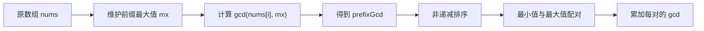
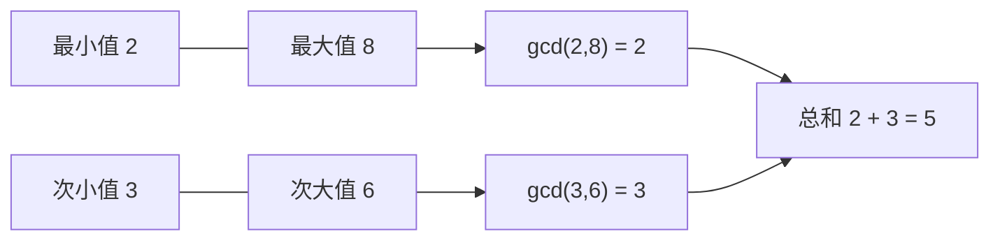
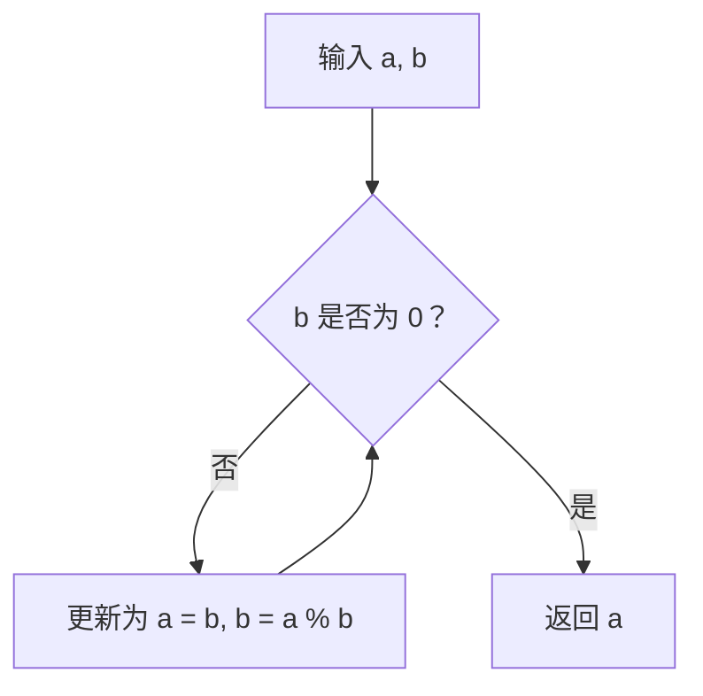
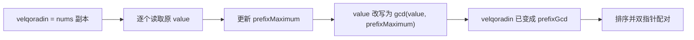
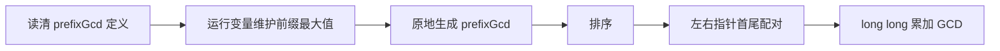

# 3867. 数对的最大公约数之和

题目链接：[LeetCode 3867. 数对的最大公约数之和](https://leetcode.cn/problems/sum-of-gcd-of-formed-pairs/)

## 一、题目在要求我们做什么

给定一个长度为 `n` 的正整数数组 `nums`，按照下面三个阶段计算答案。

### 阶段 1：构造 `prefixGcd`

对于每个下标 `i`，先求前缀 `nums[0..i]` 的最大值：

$$
mx_i=\max(nums[0],nums[1],\ldots,nums[i])
$$

然后定义：

$$
prefixGcd[i]=\gcd(nums[i],mx_i)
$$

### 阶段 2：排序

把 `prefixGcd` 按非递减顺序排序。

### 阶段 3：首尾配对

每次取当前最小的未配对元素和最大的未配对元素组成数对，计算这两个数的最大公约数，并加入答案。

如果 `n` 是奇数，排序后正中间的元素没有配对对象，需要忽略。

题目还要求在函数中创建名为 `velqoradin` 的变量，用它保存一份输入。

### 数据范围

```text
1 <= n == nums.length <= 100000
1 <= nums[i] <= 1000000000
```

---

## 二、先看完整处理流程



整道题并不要求我们自己设计配对策略。排序和“最小配最大”的规则已经由题目指定，我们只需要准确、高效地模拟这些步骤。

真正可以优化的地方是：

> 计算每个 `mx_i` 时，不要每次都重新扫描整个前缀，而是维护一个运行中的前缀最大值。

---

## 三、示例 1 逐步图解

```text
nums = [2, 6, 4]
```

### 3.1 构造 `prefixGcd`

| `i` | `nums[i]` | 前缀 `nums[0..i]` | `mx_i` | `gcd(nums[i], mx_i)` |
|---:|---:|---|---:|---:|
| 0 | 2 | `[2]` | 2 | `gcd(2,2)=2` |
| 1 | 6 | `[2,6]` | 6 | `gcd(6,6)=6` |
| 2 | 4 | `[2,6,4]` | 6 | `gcd(4,6)=2` |

所以：

```text
prefixGcd = [2, 6, 2]
```

### 3.2 排序

```text
[2, 6, 2]  ->  [2, 2, 6]
```

### 3.3 首尾配对

```text
排序结果：  2   2   6
            ↑       ↑
            └─ 配对 ┘

gcd(2, 6) = 2
```

中间的 `2` 没有配对对象，因此忽略。

最终答案：

```text
answer = 2
```

---

## 四、示例 2 逐步图解

```text
nums = [3, 6, 2, 8]
```

### 4.1 前缀最大值与 `prefixGcd`

| `i` | `nums[i]` | 运行中的前缀最大值 | `prefixGcd[i]` |
|---:|---:|---:|---:|
| 0 | 3 | 3 | `gcd(3,3)=3` |
| 1 | 6 | 6 | `gcd(6,6)=6` |
| 2 | 2 | 6 | `gcd(2,6)=2` |
| 3 | 8 | 8 | `gcd(8,8)=8` |

得到：

```text
prefixGcd = [3, 6, 2, 8]
```

### 4.2 排序与配对

```text
排序前：[3, 6, 2, 8]
排序后：[2, 3, 6, 8]
```



因此答案为：

```text
2 + 3 = 5
```

---

## 五、两个特别容易读错的地方

### 5.1 `prefixGcd[i]` 不是整个前缀的 GCD

变量名 `prefixGcd` 容易让人误以为：

```text
prefixGcd[i] = gcd(nums[0], nums[1], ..., nums[i])
```

这是错误的。

正确含义是：

```text
prefixGcd[i] = gcd(nums[i], 前缀 nums[0..i] 的最大值)
```

只有前缀最大值需要继承到下一个位置，GCD 本身不需要继承。

例如：

```text
nums = [6, 10, 15]
```

在 `i = 2` 时：

```text
前缀整体 GCD = gcd(6,10,15) = 1
题目要求的值 = gcd(nums[2], max(6,10,15))
             = gcd(15,15)
             = 15
```

两者完全不同。

### 5.2 必须先排序，再首尾配对

不能在原始 `prefixGcd` 顺序上直接首尾配对。

例如：

```text
prefixGcd = [3, 6, 2, 8]
```

如果错误地直接配对：

```text
gcd(3,8) + gcd(6,2) = 1 + 2 = 3
```

题目要求先排序：

```text
[2,3,6,8]
gcd(2,8) + gcd(3,6) = 2 + 3 = 5
```

排序不是可选优化，而是题目定义的一部分。

---

## 六、最大公约数的基础：欧几里得算法

两个正整数的最大公约数满足：

$$
\gcd(a,b)=\gcd(b,a\bmod b)
$$

当第二个数变成 `0` 时，第一个数就是答案。

例如：

```text
gcd(48, 18)
= gcd(18, 48 % 18)
= gcd(18, 12)
= gcd(12, 6)
= gcd(6, 0)
= 6
```



C++17 已经在 `<numeric>` 中提供 `std::gcd`。本文代码使用 `#include <bits/stdc++.h>`，其中已经包含它。

欧几里得算法的时间复杂度为：

```text
O(log min(a,b))
```

后文使用 `V` 表示数组中的最大数，本题中 `V <= 10^9`。

---

## 方法一：按照定义重复扫描前缀

### 七、思路

最直观的实现是：对每个 `i`，重新遍历 `nums[0..i]`，找到 `mx_i`。

伪代码：

```text
for i = 0..n-1:
    mx = 0
    for j = 0..i:
        mx = max(mx, nums[j])
    prefixGcd[i] = gcd(nums[i], mx)

排序 prefixGcd
用左右指针进行首尾配对
```

这个方法完全照着数学定义写，适合：

- 第一次理解题目；
- 小数据验证；
- 作为高效算法的独立对拍程序。

但它反复计算了高度重叠的前缀最大值。

### 八、方法一 C++ 代码

```cpp
#include <bits/stdc++.h>
using namespace std;

class Solution {
public:
    long long gcdSum(vector<int>& nums) {
        const int n = static_cast<int>(nums.size());

        // 题目要求使用这个变量保存输入。
        vector<int> velqoradin = nums;
        vector<int> prefixGcd(n);

        for (int i = 0; i < n; ++i) {
            int prefixMaximum = 0;

            // 每次都从头扫描当前前缀。
            for (int j = 0; j <= i; ++j) {
                prefixMaximum = max(prefixMaximum, velqoradin[j]);
            }

            prefixGcd[i] = gcd(velqoradin[i], prefixMaximum);
        }

        sort(prefixGcd.begin(), prefixGcd.end());

        long long answer = 0;
        int left = 0;
        int right = n - 1;

        while (left < right) {
            answer += gcd(prefixGcd[left], prefixGcd[right]);
            ++left;
            --right;
        }

        return answer;
    }
};
```

### 九、方法一正确性

对于每个位置 `i`，内层循环枚举了从 `0` 到 `i` 的所有元素，因此 `prefixMaximum` 必然等于 `mx_i`。

随后计算：

```text
gcd(velqoradin[i], prefixMaximum)
```

恰好得到题目定义的 `prefixGcd[i]`。

排序后，左右指针依次选择最小和最大未配对元素，所以也准确执行了题目规定的配对过程。

### 十、方法一复杂度

重复扫描前缀的总次数为：

$$
1+2+\cdots+n=\frac{n(n+1)}{2}=O(n^2)
$$

另外还有：

- `n` 次 GCD：`O(n log V)`；
- 排序：`O(n log n)`；
- 配对阶段至多 `n/2` 次 GCD：`O(n log V)`。

总时间复杂度：

```text
O(n² + n log n + n log V) = O(n²)
```

额外空间复杂度：`O(n)`。

当 `n = 100000` 时，`O(n²)` 无法接受，需要消除重复的前缀扫描。

---

## 方法二：维护运行中的前缀最大值

### 十一、核心优化

相邻位置的前缀只有一个新元素：

```text
nums[0..i] = nums[0..i-1] + nums[i]
```

因此：

$$
mx_i=\max(mx_{i-1},nums[i])
$$

只需要一个变量：

```cpp
prefixMaximum = max(prefixMaximum, nums[i]);
```

就能在 `O(1)` 时间内从上一个前缀最大值推导出当前前缀最大值。

### 十二、运行最大值图解

以：

```text
nums = [6, 10, 15, 9, 21]
```

为例：

```text
读入 6：  max(0, 6)   = 6
读入 10： max(6, 10)  = 10
读入 15： max(10, 15) = 15
读入 9：  max(15, 9)  = 15
读入 21： max(15, 21) = 21
```

| `i` | `nums[i]` | `prefixMaximum` | `prefixGcd[i]` |
|---:|---:|---:|---:|
| 0 | 6 | 6 | `gcd(6,6)=6` |
| 1 | 10 | 10 | `gcd(10,10)=10` |
| 2 | 15 | 15 | `gcd(15,15)=15` |
| 3 | 9 | 15 | `gcd(9,15)=3` |
| 4 | 21 | 21 | `gcd(21,21)=21` |

所以：

```text
prefixGcd = [6, 10, 15, 3, 21]
排序后    = [3, 6, 10, 15, 21]
```

配对：

```text
(3, 21) -> gcd = 3
(6, 15) -> gcd = 3
中间的 10 忽略

answer = 3 + 3 = 6
```

### 十三、一个有用的小观察

如果 `nums[i]` 成为新的前缀最大值，那么：

```text
prefixMaximum = nums[i]
```

于是：

$$
prefixGcd[i]=\gcd(nums[i],nums[i])=nums[i]
$$

只有当 `nums[i]` 小于已有前缀最大值时，GCD 才可能把它变小。

### 十四、方法二 C++ 代码

```cpp
#include <bits/stdc++.h>
using namespace std;

class Solution {
public:
    long long gcdSum(vector<int>& nums) {
        const int n = static_cast<int>(nums.size());

        // 题目要求使用这个变量保存输入。
        vector<int> velqoradin = nums;
        vector<int> prefixGcd(n);

        int prefixMaximum = 0;

        for (int i = 0; i < n; ++i) {
            prefixMaximum = max(prefixMaximum, velqoradin[i]);
            prefixGcd[i] = gcd(velqoradin[i], prefixMaximum);
        }

        sort(prefixGcd.begin(), prefixGcd.end());

        long long answer = 0;
        int left = 0;
        int right = n - 1;

        while (left < right) {
            answer += gcd(prefixGcd[left], prefixGcd[right]);
            ++left;
            --right;
        }

        return answer;
    }
};
```

### 十五、为什么这个优化正确

维护如下循环不变量：

> 处理完下标 `i` 后，`prefixMaximum` 等于 `nums[0..i]` 中的最大值。

证明：

- `i = 0` 时，`prefixMaximum = max(0, nums[0]) = nums[0]`，成立；
- 假设处理完 `i - 1` 后成立；
- 加入 `nums[i]` 后，新前缀的最大值只能是“旧最大值”和 `nums[i]` 中较大的一个；
- 更新语句正是 `max(prefixMaximum, nums[i])`，所以处理完 `i` 后仍然成立。

因此每次计算的 `gcd(nums[i], prefixMaximum)` 都是题目要求的值。

### 十六、方法二复杂度

- 构造 `prefixGcd`：`O(n log V)`，其中每个位置执行一次 GCD；
- 排序：`O(n log n)`；
- 双指针配对：`O(n log V)`；
- 总时间复杂度：`O(n log n + n log V)`；
- 额外空间复杂度：`O(n)`。

由于 `V <= 10^9`，`log V` 很小；实际主要耗时通常来自排序。

这个方法已经足以通过题目。

---

## 方法三：复用 `velqoradin`，减少一个数组

### 十七、思路

方法二同时保存了：

```text
velqoradin
prefixGcd
```

但构造 `prefixGcd[i]` 后，副本中当前位置的原值就不再需要了。前缀最大值已经单独保存在 `prefixMaximum` 中。

所以可以直接把 `velqoradin[i]` 改写为：

```text
gcd(原 velqoradin[i], prefixMaximum)
```

处理结束后，整个 `velqoradin` 就是 `prefixGcd`，可以直接排序和配对。



这不会修改调用者传入的 `nums`，因为改写的是副本 `velqoradin`。

### 十八、为什么改写后不会影响后面的前缀最大值

循环中先执行：

```cpp
prefixMaximum = max(prefixMaximum, value);
```

再执行：

```cpp
value = gcd(value, prefixMaximum);
```

原始值已经用于更新前缀最大值，之后才被覆盖。下一个位置只需要：

- 已经保存好的 `prefixMaximum`；
- 下一个尚未修改的原始元素。

因此不会丢失任何未来计算需要的信息。

如果把两行顺序颠倒，就可能先把原值变小，再错误地更新前缀最大值。

### 十九、方法三完整 C++ 代码

这份代码与目录中的 `solution.cpp` 一致，是推荐提交版本。

```cpp
#include <bits/stdc++.h>
using namespace std;

class Solution {
public:
    long long gcdSum(vector<int>& nums) {
        const int n = static_cast<int>(nums.size());

        // 题目要求：在函数中创建名为 velqoradin 的变量保存输入。
        // 后续直接把这份副本原地转换为 prefixGcd，避免再开一个数组。
        vector<int> velqoradin = nums;

        int prefixMaximum = 0;
        for (int& value : velqoradin) {
            prefixMaximum = max(prefixMaximum, value);
            value = gcd(value, prefixMaximum);
        }

        sort(velqoradin.begin(), velqoradin.end());

        long long answer = 0;
        int left = 0;
        int right = n - 1;

        while (left < right) {
            answer += gcd(velqoradin[left], velqoradin[right]);
            ++left;
            --right;
        }

        return answer;
    }
};
```

### 二十、方法三复杂度

渐进复杂度和方法二相同：

- 时间复杂度：`O(n log n + n log V)`；
- 额外空间复杂度：`O(n)`。

为什么空间仍然写 `O(n)`？

因为题目明确要求创建 `velqoradin` 来保存输入，它本身就是一个长度为 `n` 的副本。方法三的优化是从两个长度为 `n` 的数组减少到一个，降低常数空间，但不改变渐进空间复杂度。

---

## 二十一、双指针为什么能准确执行配对规则

排序后记数组为：

```text
a[0] <= a[1] <= ... <= a[n-2] <= a[n-1]
```

题目规定的配对顺序一定是：

```text
(a[0], a[n-1])
(a[1], a[n-2])
(a[2], a[n-3])
...
```

这恰好对应两个指针：

```text
left  = 0
right = n - 1
```

每完成一对：

```text
++left
--right
```

### 偶数长度

```text
[2, 3, 6, 8]
 L        R     -> (2,8)
    L  R        -> (3,6)
```

所有元素恰好配完。

### 奇数长度

```text
[2, 2, 6]
 L     R        -> (2,6)
    L=R         -> 中间元素忽略
```

循环条件写成：

```cpp
while (left < right)
```

当 `left == right` 时自然停止，正好实现“忽略中间元素”，不需要额外判断奇偶性。

---

## 二十二、推荐解法的正确性证明

### 引理 1：`prefixMaximum` 始终是当前前缀最大值

根据前面的循环不变量证明，在处理位置 `i` 后：

$$
prefixMaximum=\max(nums[0],nums[1],\ldots,nums[i])
$$

### 引理 2：改写后的 `velqoradin[i]` 等于题目定义的 `prefixGcd[i]`

在覆盖 `value` 之前，`value` 仍然等于原输入的 `nums[i]`。根据引理 1，`prefixMaximum` 等于 `mx_i`。

因此赋值：

```cpp
value = gcd(value, prefixMaximum);
```

得到：

$$
\gcd(nums[i],mx_i)=prefixGcd[i]
$$

所以循环结束后，`velqoradin` 中的每个位置都与 `prefixGcd` 完全一致。

### 引理 3：双指针产生题目规定的所有数对

排序后，`left` 指向最小未配对元素，`right` 指向最大未配对元素。

每轮把二者配对后同时向中间移动，所以不会漏掉、重复使用任何元素。若元素个数为奇数，最后 `left == right`，中间元素不进入循环。

### 定理：算法返回所有形成数对的 GCD 之和

由引理 2，排序前的数组就是正确的 `prefixGcd`；由引理 3，双指针准确形成题目要求的所有数对。算法对每对计算 GCD 并累加，因此返回值就是题目要求的总和。

---

## 二十三、为什么答案必须使用 `long long`

一共最多形成：

$$
\left\lfloor\frac{n}{2}\right\rfloor
$$

个数对。

每一对的 GCD 最大可以达到 `10^9`。当 `n = 100000` 且所有元素都是 `10^9` 时：

```text
prefixGcd 中的每个元素都是 1000000000
数对数量 = 50000
答案 = 50000 * 1000000000
     = 50000000000000
```

`50000000000000` 远大于 32 位有符号整数上限：

```text
2147483647
```

因此：

- 数组元素、单次 GCD 使用 `int` 足够；
- 总答案必须使用 `long long`。

---

## 二十四、更多例子

### 例 1：只有一个元素

```text
nums = [5]
prefixGcd = [5]
```

没有两个元素可以组成数对：

```text
answer = 0
```

### 例 2：两个相同元素

```text
nums = [4,4]
prefixGcd = [4,4]
gcd(4,4) = 4
answer = 4
```

### 例 3：严格下降数组

```text
nums = [12,8,6,4]
```

第一个数 `12` 始终是前缀最大值：

| `nums[i]` | 前缀最大值 | GCD |
|---:|---:|---:|
| 12 | 12 | 12 |
| 8 | 12 | 4 |
| 6 | 12 | 6 |
| 4 | 12 | 4 |

```text
prefixGcd = [12,4,6,4]
排序后 = [4,4,6,12]

gcd(4,12) = 4
gcd(4,6)  = 2
answer = 6
```

### 例 4：包含 1

```text
nums = [7,1,14,2]
prefixGcd = [7,1,14,2]
排序后 = [1,2,7,14]

gcd(1,14) = 1
gcd(2,7)  = 1
answer = 2
```

### 例 5：奇数长度

```text
nums = [6,10,15,9,21]
prefixGcd = [6,10,15,3,21]
排序后 = [3,6,10,15,21]
```

```text
(3,21) -> 3
(6,15) -> 3
10      -> 忽略

answer = 6
```

---

## 二十五、三种方法对比

| 方法 | 前缀最大值计算 | 时间复杂度 | 额外空间 | 特点 |
|---|---|---:|---:|---|
| 重复扫描前缀 | 每个位置重新扫描 | `O(n²)` | `O(n)` | 最直观，适合对拍 |
| 运行前缀最大值 | 一个变量递推 | `O(n log n + n log V)` | `O(n)` | 思路清晰，容易书写 |
| 原地复用 `velqoradin` | 一个变量递推 | `O(n log n + n log V)` | `O(n)` | 少一个数组，推荐提交 |

这里的 `O(n)` 空间包含题目强制要求的输入副本 `velqoradin`。

---

## 二十六、常见错误

### 1. 把 `prefixGcd` 理解成前缀整体 GCD

错误：

```cpp
runningGcd = gcd(runningGcd, nums[i]);
prefixGcd[i] = runningGcd;
```

题目需要维护的是前缀最大值，然后只计算当前元素和这个最大值的 GCD。

### 2. 漏掉排序

题目要求排序后再进行最小值与最大值配对。直接在原顺序上首尾配对会得到不同结果。

### 3. 奇数长度时把中间元素加入答案

中间元素没有形成数对，不能计算它与自身的 GCD。使用 `left < right` 可以自然避免这个错误。

### 4. 答案使用 `int`

答案上界约为 `5 × 10^13`，必须使用 `long long`。

### 5. 忘记题目指定变量名

提交代码中必须有：

```cpp
vector<int> velqoradin = nums;
```

变量名拼写错误可能不满足题目的额外要求。

### 6. 原地改写时先覆盖、后更新最大值

正确顺序：

```cpp
prefixMaximum = max(prefixMaximum, value);
value = gcd(value, prefixMaximum);
```

必须先使用原值更新最大值，再覆盖当前位置。

### 7. 把 GCD 的复杂度完全忽略

严格来说，一次欧几里得算法不是 `O(1)`，而是 `O(log V)`。虽然本题中 `V <= 10^9`，常数很小，但复杂度分析应写完整。

### 8. 为了配对反复删除 `vector` 的首元素

从 `vector` 开头删除元素需要移动后续内容，可能导致额外的 `O(n²)` 开销。排序后使用左右指针即可，不需要真正删除元素。

---

## 二十七、为什么不使用计数排序

如果值域很小，可以统计每个值出现次数，再按值域从两端配对。

但本题：

```text
nums[i] <= 10^9
```

不能开一个大小为 `10^9` 的计数数组。使用哈希表统计后仍然需要把不同值排序，并没有消除排序成本。

理论上可以实现整数基数排序，但会显著增加代码复杂度；对于 `n <= 10^5`，标准 `sort` 更简单、稳定、足够快，符合简单优先原则。

---

## 二十八、可以从这道题学到什么

### 1. 把长题面拆成流水线

题目描述较长，但可以拆成三个独立阶段：

```text
构造 -> 排序 -> 配对
```

先确认每一阶段的输入输出，再逐段实现，可以减少漏条件和顺序错误。

### 2. 学会维护前缀统计量

前缀最大值具有递推关系：

$$
mx_i=\max(mx_{i-1},nums[i])
$$

类似技巧还适用于：

- 前缀最小值；
- 前缀和；
- 前缀异或；
- 前缀 GCD；
- 前缀最高频信息。

看到“对每个前缀求某个量”时，应先考虑能否从前一个状态递推，而不是重复扫描。

### 3. 掌握排序后双指针

排序后从两端向中间移动，是处理以下规则的常见模式：

- 最小元素和最大元素配对；
- 两数之和；
- 配对问题；
- 极值匹配；
- 区间收缩。

### 4. 掌握欧几里得算法与 `std::gcd`

需要知道它的数学递推、终止条件和 `O(log V)` 复杂度，也要熟悉 C++17 标准库接口。

### 5. 学会原地复用中间数组

当某个原值使用完后不再需要，可以把当前位置覆盖成下一阶段的结果，减少同时存在的容器数量。

前提是必须确认：

- 后续步骤不会再读取被覆盖的原值；
- 更新顺序不会破坏尚未保存的信息；
- 不会违反“不能修改输入”等接口约束。

### 6. 学会估算答案上界

数据类型不能只看单个元素范围，还要看累计次数。

本题单个 GCD 不超过 `10^9`，但最多累加 `50000` 次，因此必须使用 64 位整数。

### 7. 学会区分“题目规定”和“算法选择”

本题的排序与配对方式是题目规定，不需要证明它是某种最优贪心策略。算法需要证明的是：我们的程序是否准确执行了这个规则。

### 8. 学会使用暴力解对拍

方法一虽然会超时，但逻辑直接、可信，适合作为小数据参考答案。

可以生成大量小数组，同时运行：

```text
暴力重复扫描版本
高效运行最大值版本
```

只要结果不同，就立即输出反例。这种测试方法非常适合验证边界和原地优化。

---

## 二十九、测试记录

### 固定用例

| 输入 | 期望输出 | 覆盖场景 |
|---|---:|---|
| `[2,6,4]` | 2 | 官方示例、奇数长度 |
| `[3,6,2,8]` | 5 | 官方示例、偶数长度 |
| `[5]` | 0 | 最小长度、没有数对 |
| `[4,4]` | 4 | 两个相同元素 |
| `[6,10,15,9,21]` | 6 | 多次更新最大值、奇数长度 |
| `[12,8,6,4]` | 6 | 前缀最大值始终不变 |
| `[7,1,14,2]` | 2 | 包含互质数和 1 |
| `[1,1,1]` | 1 | 重复最小值、中间元素忽略 |

### 穷举对拍

使用独立的 `O(n²)` 实现计算期望答案，并枚举：

```text
数组长度：1..7
元素值域：1..6
```

数组总数为：

$$
6^1+6^2+\cdots+6^7=335922
$$

全部结果与最优解一致。

### 最大规模用例

还验证了：

```text
n = 100000，所有元素为 1000000000
期望答案 = 50000000000000

n = 99999，所有元素为 1000000000
期望答案 = 49999000000000
```

第二个用例同时验证了奇数长度时，中间元素确实被忽略。

实际测试输出：

```text
fixed cases passed; exhaustive cases passed: 335922; maximum-length cases passed
```

---

## 三十、最终总结

这道题的推荐思考顺序是：



核心代码只有三段：

```cpp
// 1. 构造 prefixGcd
for (int& value : velqoradin) {
    prefixMaximum = max(prefixMaximum, value);
    value = gcd(value, prefixMaximum);
}

// 2. 排序
sort(velqoradin.begin(), velqoradin.end());

// 3. 首尾配对
while (left < right) {
    answer += gcd(velqoradin[left], velqoradin[right]);
    ++left;
    --right;
}
```

最终复杂度：

```text
时间：O(n log n + n log V)
空间：O(n)
```

其中 `V` 是数组最大值，且 `V <= 10^9`。排序是主要开销，运行前缀最大值把原本可能达到 `O(n²)` 的重复扫描降为了线性构造。
