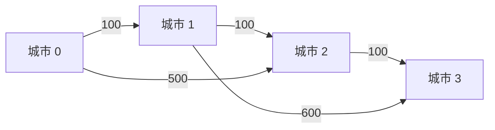
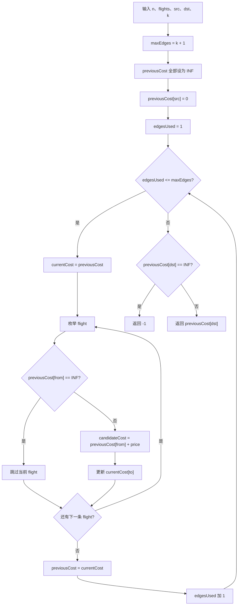

# 787. K 站中转内最便宜的航班

题目链接：[LeetCode 787. K 站中转内最便宜的航班](https://leetcode.cn/problems/cheapest-flights-within-k-stops/)

## 一、题目在说什么

有 `n` 座城市，编号为 `0` 到 `n - 1`。

数组 `flights` 中的每个元素：

```text
[from, to, price]
```

表示有一趟从城市 `from` 飞往城市 `to` 的航班，票价为 `price`。

给定：

- 出发城市 `src`。
- 目标城市 `dst`。
- 最多允许经过的中转站数量 `k`。

要求找出从 `src` 到 `dst` 的最低费用，并且途中最多只能经过 `k` 个中转站。如果无法在限制内到达，返回 `-1`。

例如：

```text
路线：0 -> 1 -> 3
```

- `0` 是出发城市，不算中转站。
- `3` 是目标城市，不算中转站。
- 中间的城市 `1` 才是中转站。

所以这条路线经过了 `1` 个中转站，乘坐了 `2` 趟航班。

---

## 二、最关键的换算：`k` 个中转站等于 `k + 1` 条边

这道题最容易出错的地方，是把“中转站数量”和“航线数量”混为一谈。

在图中：

- 城市是顶点。
- 航班是有向边。
- 票价是边权。

观察不同路线：

| 路线 | 中转站数量 | 使用的航班数量 | 使用的边数 |
|---|---:|---:|---:|
| `src -> dst` | 0 | 1 | 1 |
| `src -> A -> dst` | 1 | 2 | 2 |
| `src -> A -> B -> dst` | 2 | 3 | 3 |
| `src -> ... -> dst` | `k` | `k + 1` | `k + 1` |

因此代码中要写：

```cpp
const int maxEdges = k + 1;
```

题目限制“最多经过 `k` 个中转站”，等价于：

```text
从 src 到 dst 的路线最多使用 k + 1 条有向边。
```

后面的整个算法都围绕这个边数限制展开。

---

## 三、为什么普通最短路思路还不够

如果没有中转站限制，这就是普通的单源最短路问题：找到从 `src` 到 `dst` 的最低费用。

但是本题多了一项约束：

```text
路线费用要尽量小，同时使用的边数不能超过 k + 1。
```

最便宜的路线可能经过太多中转站，因而不合法。

例如：

```text
0 -> 1 -> 2 -> 3
每条边价格都是 100，总费用是 300

0 -> 3
价格是 500
```

如果 `k = 1`，最多只能使用 `2` 条边：

- `0 -> 1 -> 2 -> 3` 使用了 `3` 条边，虽然便宜，但不合法。
- `0 -> 3` 使用了 `1` 条边，费用 `500`，是合法答案。

所以只记录“到达某个城市的最低费用”还不够，还必须把“最多使用多少条边”纳入状态。

---

## 四、可选方法对比

| 方法 | 状态核心 | 时间复杂度 | 特点 |
|---|---|---|---|
| 分层 Bellman-Ford | 最多使用若干条边时到每座城市的最低费用 | `O((k + 1) * (n + E))` | 最直观，边数限制天然对应循环轮数 |
| 二维动态规划 | `dp[edges][city]` | `O((k + 1) * (n + E))` | 状态最完整，但空间更多 |
| 带边数状态的 Dijkstra | `(费用, 城市, 已用边数)` | 依赖状态数量和堆操作 | 适合练习优先队列，但去重规则更复杂 |
| 按层 BFS + 松弛 | 每一层代表多使用一条边 | `O((k + 1) * E)` 左右 | 容易理解“层”，但仍需维护最小费用 |

本文主代码采用“分层 Bellman-Ford + 滚动数组”。

原因是它把题目限制直接翻译为：

```text
第 1 轮最多使用 1 条边
第 2 轮最多使用 2 条边
...
第 k + 1 轮最多使用 k + 1 条边
```

---

## 五、核心状态设计

主代码使用两个一维数组：

```cpp
vector<int> previousCost(n, INF);
vector<int> currentCost = previousCost;
```

### `previousCost[city]`

表示在上一轮允许的最大边数内，从 `src` 到 `city` 的最低费用。

如果上一轮是第 `edgesUsed - 1` 轮，那么：

```text
previousCost[city]
= 最多使用 edgesUsed - 1 条边到达 city 的最低费用
```

### `currentCost[city]`

表示当前轮处理完成后，从 `src` 到 `city` 的最低费用。

```text
currentCost[city]
= 最多使用 edgesUsed 条边到达 city 的最低费用
```

### 为什么需要两个数组

当前轮只能在上一轮的合法路线后面再接一条边。

所以松弛 `from -> to` 时，候选费用必须是：

```cpp
previousCost[from] + price
```

不能写成：

```cpp
currentCost[from] + price
```

否则同一轮刚更新出的城市可能马上被继续使用，一轮内就会串联多条边，从而突破 `k + 1` 条边的限制。

---

## 六、变量与代码一一对应

| 变量 | 类型 | 准确含义 |
|---|---|---|
| `n` | `int` | 城市数量，城市编号为 `0` 到 `n - 1` |
| `flights` | `vector<vector<int>>` | 所有有向航班，每项为 `[from, to, price]` |
| `src` | `int` | 出发城市 |
| `dst` | `int` | 目标城市 |
| `k` | `int` | 最多允许的中转站数量 |
| `INF` | `int` | 表示当前限制下无法到达，代码中为 `1e9` |
| `maxEdges` | `int` | 最多允许使用的航线条数，等于 `k + 1` |
| `previousCost` | `vector<int>` | 上一轮各城市的最低费用 |
| `currentCost` | `vector<int>` | 当前轮各城市的最低费用 |
| `edgesUsed` | `int` | 当前轮最多允许使用的边数 |
| `flight` | `const vector<int>&` | 当前正在处理的一趟航班 |
| `from` | `int` | 当前航班的出发城市 |
| `to` | `int` | 当前航班的到达城市 |
| `price` | `int` | 当前航班的票价 |
| `candidateCost` | `int` | 经 `from -> to` 到达 `to` 的候选总费用 |

后面的例子会完全使用这些变量名，不另外发明一套符号。

---

## 七、图模型

以航班数组为例：

```text
flights = [
    [0, 1, 100],
    [1, 2, 100],
    [2, 3, 100],
    [0, 2, 500],
    [1, 3, 600]
]
```

对应有向带权图：



文字图：

```text
          100             100             100
城市 0 ----------> 城市 1 ----------> 城市 2 ----------> 城市 3
   |                  |
   | 500              | 600
   +----------------->+------------------------------> 城市 3
                      城市 2
```

需要注意：航班是有方向的。`[0, 1, 100]` 只表示 `0 -> 1`，不自动表示 `1 -> 0`。

---

## 八、动态规划转移公式

先用二维状态理解：

```text
dp[t][city]
= 最多使用 t 条边，从 src 到 city 的最低费用
```

对于一条航班：

```text
from -> to，票价 price
```

转移是：

```text
dp[t][to] = min(
    dp[t][to],
    dp[t - 1][from] + price
)
```

第一项表示：

```text
不使用这条航班，保留原来的最优费用。
```

第二项表示：

```text
先用最多 t - 1 条边到达 from，
再乘坐 from -> to，
总边数最多为 t。
```

因为第 `t` 轮只依赖第 `t - 1` 轮，所以不需要保存整个二维表，只需滚动保存两行：

```text
dp[t - 1] -> previousCost
dp[t]     -> currentCost
```

---

## 九、算法步骤

1. 令 `INF = 1e9`。
2. 计算 `maxEdges = k + 1`。
3. 创建 `previousCost`，全部初始化为 `INF`。
4. 设置 `previousCost[src] = 0`。
5. 让 `edgesUsed` 从 `1` 枚举到 `maxEdges`。
6. 每轮开始时令 `currentCost = previousCost`。
7. 枚举每一条 `flight`，拆出 `from`、`to`、`price`。
8. 如果 `previousCost[from] == INF`，说明上一轮到不了 `from`，跳过。
9. 计算 `candidateCost = previousCost[from] + price`。
10. 更新 `currentCost[to] = min(currentCost[to], candidateCost)`。
11. 本轮全部航班处理完后，执行 `previousCost = move(currentCost)`。
12. 完成 `k + 1` 轮后，检查 `previousCost[dst]`。
13. 如果仍为 `INF`，返回 `-1`；否则返回最低费用。

---

## 十、算法流程图



---

## 十一、例子 1：`k = 1`，最多使用两条航线

输入：

```text
n = 4
flights = [
    [0, 1, 100],
    [1, 2, 100],
    [2, 3, 100],
    [0, 2, 500],
    [1, 3, 600]
]
src = 0
dst = 3
k = 1
```

### 11.1 初始化

```text
INF = 1000000000
maxEdges = k + 1 = 2

previousCost = [0, INF, INF, INF]
```

数组下标就是城市编号：

| 城市 `city` | 0 | 1 | 2 | 3 |
|---:|---:|---:|---:|---:|
| `previousCost[city]` | 0 | INF | INF | INF |

还没有使用任何航线时，只能以费用 `0` 留在 `src = 0`。

### 11.2 第 1 轮：`edgesUsed = 1`

本轮最多使用一条航线。

先复制：

```text
previousCost = [0, INF, INF, INF]
currentCost  = [0, INF, INF, INF]
```

按 `flights` 中的顺序逐条处理：

| `flight` | `from` | `to` | `price` | `previousCost[from]` | `candidateCost` | 操作后的 `currentCost` |
|---|---:|---:|---:|---:|---:|---|
| `[0,1,100]` | 0 | 1 | 100 | 0 | `0 + 100 = 100` | `[0, 100, INF, INF]` |
| `[1,2,100]` | 1 | 2 | 100 | INF | 不计算，`continue` | `[0, 100, INF, INF]` |
| `[2,3,100]` | 2 | 3 | 100 | INF | 不计算，`continue` | `[0, 100, INF, INF]` |
| `[0,2,500]` | 0 | 2 | 500 | 0 | `0 + 500 = 500` | `[0, 100, 500, INF]` |
| `[1,3,600]` | 1 | 3 | 600 | INF | 不计算，`continue` | `[0, 100, 500, INF]` |

这里有一个极其关键的瞬间：

```text
处理完 [0,1,100] 后：
currentCost[1]  = 100
previousCost[1] = INF
```

接着处理 `[1,2,100]` 时，代码必须读取：

```cpp
previousCost[1]
```

它仍然是 `INF`，所以本轮不能继续从城市 `1` 飞到城市 `2`。

原因是本轮只允许使用一条航线。如果立刻使用刚更新的 `currentCost[1] = 100`，就相当于在同一轮连续乘坐了 `0 -> 1` 和 `1 -> 2` 两趟航班。

第 1 轮结束：

```text
currentCost  = [0, 100, 500, INF]
previousCost = move(currentCost)

新的 previousCost = [0, 100, 500, INF]
```

含义：最多使用一条边时，可以到达城市 `1` 和城市 `2`，还不能到达城市 `3`。

### 11.3 第 2 轮：`edgesUsed = 2`

本轮最多使用两条航线。

开始时：

```text
previousCost = [0, 100, 500, INF]
currentCost  = [0, 100, 500, INF]
```

逐条处理：

| `flight` | `previousCost[from]` | `candidateCost` | 更新说明 | `currentCost` |
|---|---:|---:|---|---|
| `[0,1,100]` | 0 | 100 | 城市 1 原本就是 100，不变 | `[0, 100, 500, INF]` |
| `[1,2,100]` | 100 | 200 | `min(500, 200) = 200` | `[0, 100, 200, INF]` |
| `[2,3,100]` | 500 | 600 | `min(INF, 600) = 600` | `[0, 100, 200, 600]` |
| `[0,2,500]` | 0 | 500 | `min(200, 500) = 200`，不变 | `[0, 100, 200, 600]` |
| `[1,3,600]` | 100 | 700 | `min(600, 700) = 600`，不变 | `[0, 100, 200, 600]` |

注意处理 `[2,3,100]` 时，用的是本轮开始前的：

```text
previousCost[2] = 500
```

而不是刚通过 `0 -> 1 -> 2` 得到的：

```text
currentCost[2] = 200
```

所以这一轮得到的城市 `3` 费用是：

```text
0 -> 2 -> 3
500 + 100 = 600
```

不能在本轮使用三条边的路线 `0 -> 1 -> 2 -> 3`。

第 2 轮结束：

```text
previousCost = [0, 100, 200, 600]
```

最终：

```text
previousCost[dst]
= previousCost[3]
= 600
```

答案是：

```text
600
```

---

## 十二、例子 2：同一张图，`k = 2`

仍然使用例子 1 的图，但现在：

```text
k = 2
maxEdges = k + 1 = 3
```

前两轮结束后：

```text
previousCost = [0, 100, 200, 600]
```

### 第 3 轮：`edgesUsed = 3`

先复制：

```text
currentCost = [0, 100, 200, 600]
```

| `flight` | `previousCost[from]` | `candidateCost` | 更新后的相关费用 |
|---|---:|---:|---|
| `[0,1,100]` | 0 | 100 | `currentCost[1] = 100` |
| `[1,2,100]` | 100 | 200 | `currentCost[2] = 200` |
| `[2,3,100]` | 200 | 300 | `currentCost[3] = min(600, 300) = 300` |
| `[0,2,500]` | 0 | 500 | `currentCost[2]` 保持 200 |
| `[1,3,600]` | 100 | 700 | `currentCost[3]` 保持 300 |

第 3 轮结束：

```text
previousCost = [0, 100, 200, 300]
```

现在路线：

```text
0 -> 1 -> 2 -> 3
```

使用了 `3` 条边，经过城市 `1、2` 两个中转站，正好满足 `k = 2`。

答案变为：

```text
300
```

这个例子清楚展示了：多执行一轮，等于多允许使用一条航线。

---

## 十三、例子 3：直达航班反而最便宜

输入：

```text
n = 3
flights = [
    [0, 1, 100],
    [1, 2, 100],
    [0, 2, 50]
]
src = 0
dst = 2
k = 1
```

初始化：

```text
maxEdges = 2
previousCost = [0, INF, INF]
```

### 第 1 轮

```text
[0,1,100] -> currentCost[1] = 100
[1,2,100] -> previousCost[1] 是 INF，跳过
[0,2,50]  -> currentCost[2] = 50

previousCost = [0, 100, 50]
```

### 第 2 轮

```text
[1,2,100] 可以产生 candidateCost = 100 + 100 = 200
```

但是：

```text
currentCost[2] 已经是 50
min(50, 200) = 50
```

最终：

```text
previousCost = [0, 100, 50]
answer = 50
```

`currentCost = previousCost` 的复制动作保证了“少用边但更便宜”的路线不会在后续轮次丢失。

---

## 十四、例子 4：限制内无法到达

输入：

```text
n = 3
flights = [
    [0, 1, 100]
]
src = 0
dst = 2
k = 1
```

初始化：

```text
maxEdges = 2
previousCost = [0, INF, INF]
```

第 1 轮：

```text
previousCost = [0, 100, INF]
```

第 2 轮没有任何航班能到城市 `2`：

```text
previousCost = [0, 100, INF]
```

最终：

```text
previousCost[dst] = previousCost[2] = INF
```

所以执行：

```cpp
return -1;
```

---

## 十五、例子 5：更便宜的路线因为中转太多而不合法

输入：

```text
n = 5
flights = [
    [0, 1, 10],
    [1, 2, 10],
    [2, 3, 10],
    [3, 4, 10],
    [0, 4, 100]
]
src = 0
dst = 4
k = 2
```

两条候选路线：

```text
路线 A：0 -> 1 -> 2 -> 3 -> 4
费用 = 40
边数 = 4
中转站 = 3

路线 B：0 -> 4
费用 = 100
边数 = 1
中转站 = 0
```

因为：

```text
k = 2
maxEdges = 3
```

路线 A 需要 `4` 条边，超过限制。

逐轮费用：

| `edgesUsed` | `previousCost` | 含义 |
|---:|---|---|
| 0 | `[0, INF, INF, INF, INF]` | 还没乘航班 |
| 1 | `[0, 10, INF, INF, 100]` | 到达城市 1 或直接到城市 4 |
| 2 | `[0, 10, 20, INF, 100]` | 可以到达城市 2 |
| 3 | `[0, 10, 20, 30, 100]` | 可以到达城市 3，但不能再飞到城市 4 |

如果允许第 4 轮，城市 `4` 才会被更新为 `40`。但代码只执行 `maxEdges = 3` 轮。

因此正确答案是：

```text
100
```

---

## 十六、最重要的反例：为什么不能原地更新

假设：

```text
n = 4
flights = [
    [0, 1, 100],
    [1, 2, 100],
    [2, 3, 100],
    [0, 3, 1000]
]
src = 0
dst = 3
k = 0
```

`k = 0` 表示不允许中转，所以最多只能使用一条边。

正确答案只能是直达航班：

```text
0 -> 3，费用 1000
```

### 错误写法：只使用一个数组

```cpp
cost[to] = min(cost[to], cost[from] + price);
```

假设初始：

```text
cost = [0, INF, INF, INF]
```

按照给定顺序原地处理：

| 当前航班 | 原地更新后的 `cost` | 实际已经偷偷用了多少条边 |
|---|---|---:|
| `[0,1,100]` | `[0, 100, INF, INF]` | 1 |
| `[1,2,100]` | `[0, 100, 200, INF]` | 2 |
| `[2,3,100]` | `[0, 100, 200, 300]` | 3 |
| `[0,3,1000]` | `[0, 100, 200, 300]` | 仍保留错误的 300 |

一轮本应只允许增加一条边，却得到三条边路线的费用 `300`。

### 正确写法：从旧数组更新新数组

```cpp
candidateCost = previousCost[from] + price;
currentCost[to] = min(currentCost[to], candidateCost);
```

整个第一轮中：

```text
previousCost 始终是 [0, INF, INF, INF]
```

因此：

- `0 -> 1` 可以更新。
- `1 -> 2` 因 `previousCost[1] == INF` 被跳过。
- `2 -> 3` 因 `previousCost[2] == INF` 被跳过。
- `0 -> 3` 更新为 `1000`。

最终得到正确答案 `1000`。

---

## 十七、代码逐段解释

### 17.1 定义无穷大和最大边数

```cpp
const int INF = 1'000'000'000;
const int maxEdges = k + 1;
```

`INF` 用于标记无法到达，`maxEdges` 完成中转站数到边数的转换。

### 17.2 初始化第 0 轮

```cpp
vector<int> previousCost(n, INF);
previousCost[src] = 0;
```

第 0 轮最多使用 `0` 条边，所以只能到达出发城市自身。

### 17.3 枚举允许的边数

```cpp
for (int edgesUsed = 1; edgesUsed <= maxEdges; ++edgesUsed) {
```

每多执行一轮，就多允许使用一条边。

### 17.4 继承上一轮结果

```cpp
vector<int> currentCost = previousCost;
```

这一步让状态含义成为“最多使用 `edgesUsed` 条边”，而不是“必须使用恰好 `edgesUsed` 条边”。

### 17.5 松弛每条航班

```cpp
if (previousCost[from] == INF) {
    continue;
}

const int candidateCost = previousCost[from] + price;
currentCost[to] = min(currentCost[to], candidateCost);
```

只有上一轮能够到达 `from`，本轮才能通过一条新航班到达 `to`。

### 17.6 滚动到下一轮

```cpp
previousCost = move(currentCost);
```

`currentCost` 已完成当前轮计算，把它作为下一轮的 `previousCost`。

### 17.7 返回结果

```cpp
return previousCost[dst] == INF ? -1 : previousCost[dst];
```

若 `dst` 仍为 `INF`，说明在最多 `k + 1` 条边的限制内不可达。

---

## 十八、正确性证明

我们证明：第 `edgesUsed` 轮结束后，`previousCost[city]` 等于从 `src` 出发，最多使用 `edgesUsed` 条边到达 `city` 的最低费用。

### 18.1 基础情况：第 0 轮

还没有执行循环时：

```text
previousCost[src] = 0
其他城市 = INF
```

最多使用 `0` 条边时，只能以费用 `0` 到达 `src`，不能到达其他城市，所以命题成立。

### 18.2 归纳假设

假设第 `edgesUsed - 1` 轮结束后：

```text
previousCost[city]
```

正确表示最多使用 `edgesUsed - 1` 条边到达 `city` 的最低费用。

### 18.3 第 `edgesUsed` 轮的转移

到达城市 `to` 且最多使用 `edgesUsed` 条边的最优路线只有两种可能：

1. 实际使用不超过 `edgesUsed - 1` 条边。这种路线的费用已经在 `previousCost[to]` 中，通过复制被保留到 `currentCost[to]`。
2. 最后一条边是某个 `from -> to`。去掉最后一条边后，前半段最多使用 `edgesUsed - 1` 条边，其最低费用由归纳假设给出为 `previousCost[from]`，总费用为 `previousCost[from] + price`。

代码枚举所有航班，并对这两类可能取最小值，所以得到的 `currentCost[to]` 是最多使用 `edgesUsed` 条边的最低费用。

因此归纳命题对第 `edgesUsed` 轮成立。

### 18.4 最终结论

循环共执行：

```text
maxEdges = k + 1
```

轮，所以最终 `previousCost[dst]` 是最多使用 `k + 1` 条边，也就是最多经过 `k` 个中转站时的最低费用。

如果值为 `INF`，说明不存在合法路线，返回 `-1`。因此算法正确。

---

## 十九、复杂度分析

设：

```text
n = 城市数量
E = flights.size()，航班数量
```

循环执行 `k + 1` 轮。

每一轮：

- 复制 `previousCost` 到 `currentCost` 需要 `O(n)`。
- 遍历所有航班需要 `O(E)`。

所以精确的时间复杂度是：

```text
O((k + 1) * (n + E))
```

很多题解会简写为：

```text
O(kE)
```

这是忽略常数、`+1` 和数组复制成本后的常见表达。本文保留更完整的形式。

空间中只保存两个长度为 `n` 的费用数组：

```text
O(n)
```

`previousCost = move(currentCost)` 会转移容器内部资源，不会再完整复制一遍数组。

---

## 二十、完整代码

```cpp
#include <bits/stdc++.h>
using namespace std;

class Solution {
public:
    int findCheapestPrice(
        int n,
        vector<vector<int>>& flights,
        int src,
        int dst,
        int k
    ) {
        const int INF = 1'000'000'000;
        const int maxEdges = k + 1;

        vector<int> previousCost(n, INF);
        previousCost[src] = 0;

        for (int edgesUsed = 1; edgesUsed <= maxEdges; ++edgesUsed) {
            vector<int> currentCost = previousCost;

            for (const vector<int>& flight : flights) {
                const int from = flight[0];
                const int to = flight[1];
                const int price = flight[2];

                if (previousCost[from] == INF) {
                    continue;
                }

                const int candidateCost = previousCost[from] + price;
                currentCost[to] = min(currentCost[to], candidateCost);
            }

            previousCost = move(currentCost);
        }

        return previousCost[dst] == INF ? -1 : previousCost[dst];
    }
};
```

同目录的 `solution.cpp` 中包含更详细的行内注释。

---

## 二十一、其他方法与进一步理解

### 21.1 完整二维 DP

可以直接定义：

```text
dp[edges][city]
```

这样能够查看每一轮的所有历史状态，也方便恢复路径，但空间复杂度会从 `O(n)` 增加到：

```text
O((k + 1) * n)
```

主代码的两个数组，就是把二维 DP 压缩成只保留相邻两行。

### 21.2 带状态的 Dijkstra

普通 Dijkstra 只把城市作为状态，本题需要把已用边数也加入状态：

```text
(totalCost, city, edgesUsed)
```

同一城市可能出现多次：

```text
费用更低，但已经用了很多边；
费用更高，但剩余可用边数更多。
```

这两种状态不能简单互相替代，因此访问标记不能只写成 `visited[city]`。

### 21.3 BFS 按层处理

也可以从 `src` 开始做 BFS：

```text
第 0 层：使用 0 条边
第 1 层：使用 1 条边
第 2 层：使用 2 条边
...
第 k + 1 层：使用 k + 1 条边
```

但图的边权不同，不能像无权图那样“第一次到达就是最优”，仍然要维护到每个城市的最低费用并进行松弛。

### 21.4 Bellman-Ford 的本质

标准 Bellman-Ford 每轮允许最短路多使用一条边。执行 `n - 1` 轮后，可以覆盖不含重复顶点的最短路径。

本题不需要完整执行 `n - 1` 轮，因为题目直接给出了更严格的边数上限 `k + 1`。所以只执行 `k + 1` 轮即可。

---

## 二十二、常见错误

### 错误 1：把循环轮数写成 `k`

```cpp
for (int edgesUsed = 1; edgesUsed <= k; ++edgesUsed)
```

这会少允许一趟航班。`k` 是中转站数，最大边数应是 `k + 1`。

### 错误 2：原地更新费用数组

```cpp
cost[to] = min(cost[to], cost[from] + price);
```

这可能在同一轮串联多条边，突破中转限制。必须分开使用 `previousCost` 和 `currentCost`。

### 错误 3：把 `currentCost` 每轮全部重置为 `INF`

如果不从 `previousCost` 复制，状态就会变成“恰好使用当前边数”，而不是“最多使用当前边数”。虽然可以用另一套 DP 设计解决，但返回和转移都要相应改变，不能混用两种定义。

### 错误 4：没有判断 `previousCost[from] == INF`

如果直接计算：

```cpp
INF + price
```

可能得到没有意义的候选费用；若 `INF` 取 `INT_MAX`，还可能整数溢出。

### 错误 5：普通 BFS 第一次到达就返回

航班票价不同，先到达 `dst` 的路线不一定最便宜。只有无权图或所有边权相同时，普通 BFS 的首次到达性质才成立。

### 错误 6：普通 Dijkstra 只记录 `dist[city]`

边数限制会让“费用”和“剩余可用边数”共同决定状态。忽略已用边数可能错误剪掉后来真正有用的路线。

---

## 二十三、你可以从这道题学到什么

### 23.1 学会把自然语言限制转换成图上的资源限制

```text
k 个中转站 -> k + 1 条边
```

这种转换是解决题目的第一步。类似的限制还有：

- 最多经过若干个节点。
- 最多进行若干次操作。
- 最多使用若干张优惠券。
- 最多跨越若干层。

### 23.2 学会设计带“次数”的动态规划状态

单纯的 `cost[city]` 无法表达边数限制，因此加入轮次：

```text
dp[edges][city]
```

这是“位置 + 已使用资源”类 DP 的典型模型。

### 23.3 学会滚动数组优化空间

当第 `t` 层只依赖第 `t - 1` 层时，可以把二维数组压缩成：

```text
previousCost
currentCost
```

这种技巧广泛用于：

- 0/1 背包。
- 编辑距离。
- 网格动态规划。
- 序列动态规划。

### 23.4 理解“旧状态更新新状态”

本题不能原地更新，是因为同一轮状态不能依赖同一轮刚产生的状态。

这个思想也出现在：

- 0/1 背包中容量必须倒序枚举。
- 多轮扩散问题中需要保存上一层边界。
- 同步更新的元胞状态中要区分旧网格和新网格。

### 23.5 学会用单元测试攻击边界

这道题至少应测试：

- `k = 0`，只能直达。
- 最便宜路线恰好使用 `k + 1` 条边。
- 更便宜路线因为边数太多而非法。
- 目标城市不可达。
- 直达航班比中转更便宜。
- 航班输入顺序会诱发原地更新错误。

---

## 二十四、还可以继续学习什么知识

### 24.1 Bellman-Ford 与负权边

Bellman-Ford 可以处理负权边，而普通 Dijkstra 不适合存在负权边的图。本题票价为正数，但分层松弛仍然非常适合处理边数限制。

### 24.2 最短路算法的适用条件

可以进一步比较：

| 算法 | 典型适用场景 |
|---|---|
| BFS | 无权图或所有边权相同 |
| 0-1 BFS | 边权只有 0 和 1 |
| Dijkstra | 非负边权 |
| Bellman-Ford | 可有负权边，或需要按边数分层 |
| Floyd-Warshall | 多源最短路，顶点数量较小 |

### 24.3 多约束最短路

现实问题常常不只限制价格，还可能限制：

- 飞行总时间。
- 中转次数。
- 等待时间。
- 必须或禁止经过某些城市。

当约束增加时，一个城市可能需要保存多个不可互相支配的状态，这会联系到多目标最短路和 Pareto 最优状态。

### 24.4 路径恢复

本题只要求最低费用。如果还要输出具体路线，可以保存：

```text
parent[edgesUsed][city]
```

记录某一轮到达 `city` 的最优路线来自哪个 `from`，最后从 `dst` 反向恢复路径。

### 24.5 有限状态图与资源维度扩展

可以把状态 `(city, edgesUsed)` 看成一张新的分层图：

```text
(城市 0, 第 0 层)
(城市 0, 第 1 层)
(城市 0, 第 2 层)
...
```

原图中的一条边 `from -> to`，会变成：

```text
(from, edges) -> (to, edges + 1)
```

这叫做“给状态增加一个资源维度”，是处理次数、容量、剩余机会等约束的通用技巧。

---

## 二十五、复习问题

学完后，可以尝试不看代码回答：

1. 为什么 `k` 个中转站对应 `k + 1` 条边？
2. `previousCost[city]` 的准确含义是什么？
3. 为什么每轮先执行 `currentCost = previousCost`？
4. 为什么候选费用必须使用 `previousCost[from]`？
5. 原地更新会怎样突破边数限制？
6. 为什么第 `edgesUsed` 轮结束后表示“最多使用 `edgesUsed` 条边”？
7. 为什么普通 BFS 不能第一次到达 `dst` 就返回？
8. 如果使用 Dijkstra，为什么状态中还要包含 `edgesUsed`？
9. 如何把二维 DP 压缩成两个一维数组？
10. 如果还要返回具体航班路线，需要增加什么信息？

能够独立解释这些问题，就不仅掌握了这道题，也掌握了“有限步数最短路”的通用模型。
